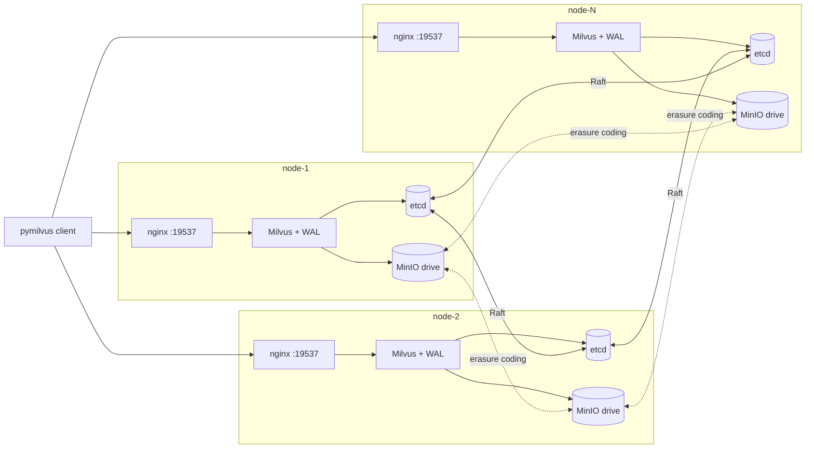
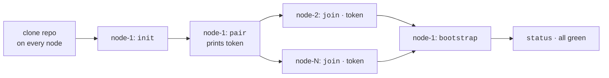

# milvus-onprem

**High-availability Milvus 2.6 across N Linux VMs — no Kubernetes required.**

> Status: **alpha**. The CLI is feature-complete for v0 but hasn't been
> verified end-to-end on real multi-VM hardware yet. PRs and bug reports
> welcome.

## The problem

Milvus today gives you two deployment options and a gap between them:

- **Standalone** — single host, single binary. Easy to deploy, no HA at all.
- **Kubernetes Operator / Helm chart** — proper HA, but requires a
  Kubernetes cluster, an Operator install, cert-manager, and (on
  OpenShift) a tangle of SCC bindings.

Many on-prem environments — banks, government, defense, telcos —
have a fleet of plain Linux VMs and no Kubernetes. The official path
asks them to either run a single host (no HA) or stand up Kubernetes
(huge undertaking). `milvus-onprem` is the missing rung.

## What it is



A CLI plus modular bash that deploys a redundant Milvus 2.6 cluster
across plain Linux VMs (3, 5, 7, …). Components per node:

- **etcd** — joins an N-node Raft cluster. Tolerates `(N-1)/2` failures.
- **MinIO** — distributed mode, erasure-coded across all peers.
- **Milvus 2.6** with embedded **Woodpecker** WAL. No separate Pulsar /
  Kafka cluster.
- **nginx** — TCP load balancer in front of all peer Milvus instances.

Single binary CLI: `milvus-onprem`. Run `init` once per node, `bootstrap`
to deploy, `pair`/`join` to distribute config across N peers in one step.

## Quick start (3 nodes)

The deploy lifecycle:



```bash
# on every node — one-time setup:
git clone https://github.com/codeadeel/milvus-onprem.git ~/milvus-onprem
cd ~/milvus-onprem

# on node-1 (the bootstrap node):
./milvus-onprem init --peer-ips=10.0.0.10,10.0.0.11,10.0.0.12
./milvus-onprem pair          # prints a token; keeps running
# copy the printed `./milvus-onprem join ...` line

# on each other node:
./milvus-onprem join 10.0.0.10:19500 <TOKEN>
# auto-fetches cluster.env, runs init + bootstrap

# back on node-1, after pair has exited (after all peers fetched):
./milvus-onprem bootstrap     # render + up + bucket create
./milvus-onprem status        # all green = ready
```

That's a working 3-node Milvus cluster. Clients connect to any node's
`:19537`.

Optional — drop the CLI on PATH so you can call it from any directory:

```bash
./milvus-onprem install        # /usr/local/bin/milvus-onprem + bash completion
# or, per-user without sudo:
./milvus-onprem install --prefix=$HOME/.local/bin --completion-dir=$HOME/.bash_completion.d
```

For the full walkthrough with diagrams, see [docs/DEPLOYMENT.md](docs/DEPLOYMENT.md).

## What you get

- **One CLI**, ~20 commands covering the full lifecycle: deploy
  (`init` / `pair` / `join` / `bootstrap`), day-2 (`status` / `wait` /
  `up` / `down` / `ps` / `logs` / `urls` / `version` / `smoke`), backup
  (`create-backup` / `export-backup` / `restore-backup` / `backup-etcd`),
  scale-out (`add-node` / `update-peers`), version upgrades
  (`upgrade --milvus-version=…`), node removal (`remove-node`), job
  inspection (`jobs list/show/cancel`), system install / uninstall,
  and `teardown`.
- **N-node from day 1** — 1 (standalone), 3, 5, 7, 9. Even sizes are
  rejected (no Raft quorum).
- **Auto-failover for single-VM loss** — etcd Raft handles it, no
  operator intervention needed if you have proper quorum.
- **Online scale-out** — `add-node` adds a new peer to a running
  cluster (etcd member-add + cluster.env propagation +
  `join --existing`). MinIO server-list change is operator-coordinated
  rolling restart; the rest is automated.
- **Built-in watchdog** — runs inside the control-plane daemon (no
  extra install step). Auto-restarts unhealthy local `milvus-*`
  containers (loop-guarded so a stuck container doesn't get hammered)
  and emits structured `PEER_DOWN_ALERT` / `PEER_UP_ALERT` /
  `COMPONENT_RESTART` / `COMPONENT_RESTART_LOOP` lines greppable from
  `docker logs milvus-onprem-cp`. See [docs/CONFIG.md § Watchdog](docs/CONFIG.md#watchdog).
- **Multi-version Milvus** — ships templates for 2.6.x (default,
  Woodpecker WAL) and 2.5.x (coord-mode-cluster + Pulsar singleton).
  Switch by changing `MILVUS_IMAGE_TAG` in cluster.env. Future versions
  = drop in `templates/X.Y/`.
- **Backup integration** — wraps the official `milvus-backup` CLI for
  create/restore. Designed around the "100GB-from-developer" import case.
  Cross-version restore (2.5 backup → 2.6 cluster) validated.
- **Per-port + per-image customisation** — every port and every
  container image repo is configurable in `cluster.env` (override
  `*_IMAGE_REPO` for air-gapped registries).
- **No Kubernetes** — runs on any Linux VM with Docker.

## What it's not

- A Kubernetes alternative for general workloads. It does one thing:
  HA Milvus on plain VMs.
- A managed service. You operate it.
- For Milvus 1.x. We target 2.5 and 2.6 today; future majors land as
  templates.

## Supported environments

**milvus-onprem is cloud-agnostic.** It runs on any Linux VM with
Docker, regardless of where that VM lives:

- **Cloud:** AWS / GCP / Azure / OCI / DigitalOcean / Linode / Vultr / etc.
- **On-prem:** VMware / Proxmox / KVM / Xen / OpenStack / Nutanix
- **Bare metal:** any Linux server you can SSH into
- **Hybrid:** any mix of the above, as long as nodes can reach each
  other on the cluster ports
- **Disconnected / air-gapped:** mirror the four container images into
  your private registry; no internet access required at runtime
- **Local dev:** VirtualBox / Multipass / lima / WSL2 / a fleet of
  Raspberry Pis on your home lab

**Requirements:**

- Linux, kernel 4.x or newer (any distro — Debian, Ubuntu, RHEL,
  Rocky, Alma, openSUSE, Arch, etc.)
- Docker Engine ≥ 24.x with the Compose plugin
- Network reachability between every peer on the cluster ports
  (see [docs/DEPLOYMENT.md](docs/DEPLOYMENT.md#network-ports-between-nodes))
- Image-pull access to `milvusdb/milvus`, `quay.io/coreos/etcd`,
  `minio/minio`, `nginx`, `apachepulsar/pulsar` (or a private mirror
  with these images for air-gapped environments)

**Not required:**

- Kubernetes
- Cloud-provider APIs (no `gcloud` / `aws` / `az` calls anywhere)
- Cloud-specific DNS / metadata services
- A specific Linux distro
- A specific architecture — works on `amd64` and `arm64`

The CLI uses **direct IP addresses**, not cloud DNS. As long as your
nodes can `nc -zv <peer-ip> 2379` each other, you're good.

## Documentation

| Doc | Read this when |
|---|---|
| [docs/ARCHITECTURE.md](docs/ARCHITECTURE.md) | You want to understand how the components fit together. |
| [docs/DEPLOYMENT.md](docs/DEPLOYMENT.md) | First-time deploy. Step-by-step with diagrams. |
| [docs/CONFIG.md](docs/CONFIG.md) | `cluster.env` reference — every variable, every default. |
| [docs/OPERATIONS.md](docs/OPERATIONS.md) | Day-2: status, smoke, backup, restore, scale-out. |
| [docs/FAILOVER.md](docs/FAILOVER.md) | What happens when a node dies — 2.5 vs 2.6 behavior, retry pattern, recovery tunings. |
| [docs/TROUBLESHOOTING.md](docs/TROUBLESHOOTING.md) | Symptom → fix table. Things people have actually hit, including permanently-lost-node recovery. |
| [test/tutorial/README.md](test/tutorial/README.md) | 10-step pymilvus walkthrough for the dev team. |
| [templates/2.5/README.md](templates/2.5/README.md) · [templates/2.6/README.md](templates/2.6/README.md) | Per-version topology notes. |

## Versioning

- Milvus version is selected via `MILVUS_IMAGE_TAG` in cluster.env.
- The CLI auto-routes to `templates/<major.minor>/` based on that tag.
- Currently shipping templates: **2.6**.
- Adding 2.5 (or future 2.7+) means contributing three template files
  in a new `templates/X.Y/` directory — no engine changes needed.

## License

Apache 2.0. See [LICENSE](LICENSE).

## Contributing

PRs welcome, especially:
- `templates/2.5/` (Pulsar singleton or external Pulsar)
- New backup integrations
- Real-world deploy reports + bug fixes
