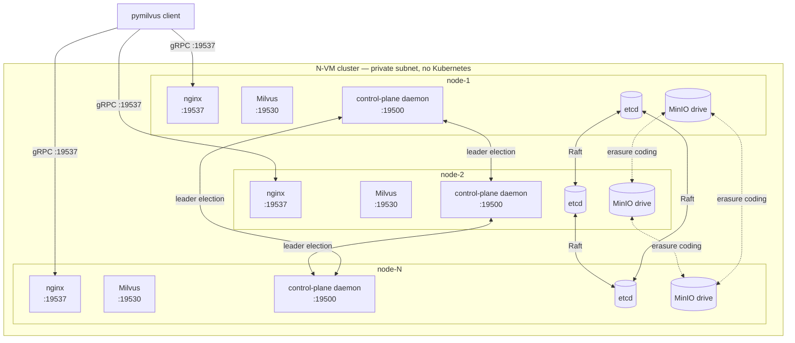

# milvus-onprem

**HA Milvus 2.5 / 2.6 across N Linux VMs — no Kubernetes.**

A single CLI plus a small Python control-plane daemon that gives you
the missing rung between single-host Milvus standalone and a full
Kubernetes Operator deploy. Designed for shops with a fleet of plain
Linux VMs and no cluster orchestrator.

> **Status: v1.2** — hardware-validated end-to-end on 4-VM clusters
> for both Milvus 2.6.11 and 2.5.4. 9 rounds of adversarial QA with
> 23 findings and 25 fixes shipped. See [docs/QA_REPORT.md](docs/QA_REPORT.md)
> for the full audit trail.

## Architecture

Per peer, 4-5 containers (more on Milvus 2.5). Every peer is identical;
no "primary" except via etcd leader election for the control plane.



| Component | Role |
|---|---|
| **etcd** | N-node Raft cluster — Milvus's metadata + the daemon's leader-election lease. Tolerates `(N-1)/2` member loss. |
| **MinIO** | Distributed mode, erasure-coded across all peers. Holds Milvus's segment data + backups. |
| **Milvus** | 2.6: one `milvus run standalone` container per peer with embedded Woodpecker WAL. 2.5: 5 sibling containers (mixcoord + proxy + querynode + datanode + indexnode) + a Pulsar singleton on `PULSAR_HOST`. |
| **nginx** | Layer-4 TCP load balancer in front of every peer's Milvus. Clients connect to any peer's `:19537` and get routed to a healthy backend. |
| **control-plane daemon** | One per peer, leader-elected via etcd lease. Owns `/join`, the jobs primitive (backup / restore / upgrade / remove-node), the watchdog (auto-restart unhealthy local containers + peer-down alerts), and topology fan-out. |

## 5-minute quickstart (3-node 2.6, distributed mode)

```bash
# On every node — one-time:
git clone https://github.com/codeadeel/milvus-onprem.git ~/milvus-onprem
cd ~/milvus-onprem

# On node-1 (the bootstrap node):
./milvus-onprem preflight                      # sanity check first
./milvus-onprem init --mode=distributed --milvus-version=v2.6.11
# the output prints a `./milvus-onprem join …` line — copy it

# On each other node:
./milvus-onprem join 10.0.0.10:19500 <CLUSTER_TOKEN>
# fetches cluster.env from the leader, runs bootstrap

# Verify (from any node):
./milvus-onprem status                          # all peers green
./milvus-onprem smoke                           # functional test
```

That's a working 3-node Milvus cluster. Clients connect to any peer's
`:19537`. **Adding a 4th node later? Just run the same `join` on the
new VM** — the daemon handles etcd member-add, topology fan-out,
rolling MinIO recreate, and nginx reload automatically.

For the full walkthrough with hardware-validated outputs:
**[docs/TUTORIAL.md](docs/TUTORIAL.md)**.

## Feature matrix

| Category | Feature | 2.5 | 2.6 |
|---|---|---|---|
| **Deploy** | `init --mode=distributed` | ✅ | ✅ |
| | `init --mode=standalone` | ✅ | ✅ |
| | `preflight` (docker / disk / ports / inter-peer TCP) | ✅ | ✅ |
| | Online `join` of new peer (1→N) | ✅ | ✅ |
| | `join --resume` after partial / interrupted join | ✅ | ✅ |
| | `teardown --full --force` | ✅ | ✅ |
| **HA** | etcd Raft (tolerates `(N-1)/2` loss) | ✅ | ✅ |
| | Distributed MinIO (erasure-coded) | ✅ | ✅ |
| | Rolling MinIO recreate on grow / shrink | ✅ 93s seq | ✅ 93s seq |
| | Single-node Milvus failure recovery | ✅ ~15-20s window with retry helper | ✅ invisible to SDK |
| | Mixcoord active-standby promotion | ✅ <1.1s on N=4 | ➖ N/A |
| | Permanently-lost-node recovery | ✅ | ✅ |
| | Daemon leader failover (etcd lease) | ✅ ~15s | ✅ ~15s |
| **Scale** | `remove-node --ip=<peer>` (online shrink) | ✅ | ✅ |
| | Even cluster sizes (N=4) accepted with warning | ✅ | ✅ |
| | N=1, 3, 5, 7, 9 supported | 1/3 ✅, others 📖 | 1/3 ✅, others 📖 |
| **Backup** | `backup-etcd` (concurrent-safe) | ✅ | ✅ |
| | `create-backup` (with name regex + dup pre-flight) | ✅ | ✅ |
| | `export-backup --to=` (lands on invoking peer) | ✅ | ✅ |
| | `restore-backup --rename --load` | ✅ | ✅ |
| | `restore-backup --collections=` filter | ⚠️ upstream quirk | ⚠️ upstream quirk |
| | `restore-backup --drop-existing` | ✅ | ✅ |
| | `restore-backup --no-restore-index` | ✅ | ✅ |
| | Cross-version restore (2.5 backup → 2.6) | ✅ | ✅ |
| | `MILVUS_BACKUP_VERSION` pin | ✅ | ✅ |
| **Upgrade** | Same-major rolling `upgrade --milvus-version=` | ✅ | ✅ 48s on N=4 |
| | Cross-major refusal (with helpful error) | ✅ | ✅ |
| | Cluster-wide version anchor in etcd | ✅ | ✅ |
| | Multi-version coexistence guard at render time | ✅ | ✅ |
| **Watchdog** | Local: docker-restart unhealthy `milvus-*` containers | ✅ | ✅ |
| | Loop guard (3 restarts in 5min → halt) | ✅ | ✅ |
| | `WATCHDOG_MODE=monitor` (alerts only, no restart) | ✅ | ✅ |
| | Peer-down alerts (TCP probe :19500) | ✅ | ✅ |
| | Threshold tuning (`WATCHDOG_*` env vars) | ✅ | ✅ |
| | Stuck-running job sweep (heartbeat-lease, F5.2) | ✅ ~77s | ✅ ~77s |
| **Auth** | Bearer-token (`secrets.compare_digest` constant-time) | ✅ | ✅ |
| | `rotate-token` (atomic across-peer) | ✅ | ✅ 19s on N=4 |
| | TLS / mTLS | ❌ not yet | ❌ not yet |
| **Air-gap** | `*_IMAGE_REPO` overrides for private registries | ✅ | ✅ |
| | Cloud-agnostic (no `gcloud` / `aws` / `az` calls) | ✅ | ✅ |
| | Direct-IP only (no DNS dependencies) | ✅ | ✅ |
| **Day-2** | `status` / `urls` / `version` / `ps` / `logs` / `smoke` / `wait` | ✅ | ✅ |
| | `jobs list/show/cancel/types` (daemon job introspection) | ✅ | ✅ |
| | `maintenance` (prune-images / prune-logs / prune-etcd-jobs) | ✅ | ✅ |
| | Operator hygiene `/admin/sweep` endpoint | ✅ | ✅ |
| **2.5-only** | mixcoord `enableActiveStandby: true` on all 4 coords | ✅ | ➖ |
| | Per-component healthchecks (TCP probe via bash /dev/tcp) | ✅ | ➖ |
| | Pulsar singleton on `PULSAR_HOST` | ✅ | ➖ |
| | Pulsar HA (3 ZK + 3 BK + 3 broker) | ❌ design-only | ➖ |

Legend: ✅ live-validated · 📖 logic-reviewed · ⚠️ works with caveats · ❌ not implemented · ➖ N/A

## Documentation index

| Read this | When |
|---|---|
| **[docs/GETTING_STARTED.md](docs/GETTING_STARTED.md)** | **First-time deploy.** Prerequisites, install, init, join, smoke. ~15 min. |
| [docs/TUTORIAL.md](docs/TUTORIAL.md) | Deeper walkthrough — every shipped feature on a real 4-VM cluster, with hardware-validated outputs. |
| [docs/ARCHITECTURE.md](docs/ARCHITECTURE.md) | How the components fit together. Read this when something surprises you. |
| [docs/CONFIG.md](docs/CONFIG.md) | `cluster.env` reference. Every variable, every default. |
| [docs/OPERATIONS.md](docs/OPERATIONS.md) | Day-2 ops: backup, scale-out, status, alert formats. |
| [docs/FAILOVER.md](docs/FAILOVER.md) | What happens when a node dies. 2.5 vs 2.6 behavior + retry pattern. |
| [docs/TROUBLESHOOTING.md](docs/TROUBLESHOOTING.md) | Symptom → fix table. Real bugs we've actually hit. |
| [docs/CONTROL_PLANE.md](docs/CONTROL_PLANE.md) | Daemon internals: leader election, jobs, watchdog, design rationale. |
| [docs/PULSAR_HA.md](docs/PULSAR_HA.md) | Design for in-cluster Pulsar HA on 2.5 (not yet implemented). |
| [docs/QA_REPORT.md](docs/QA_REPORT.md) | The 9-round QA audit trail: 23 findings, 25 fixes. |
| [daemon/README.md](daemon/README.md) | Per-file walkthrough of the Python daemon. |
| [templates/2.5/README.md](templates/2.5/README.md) · [templates/2.6/README.md](templates/2.6/README.md) | Per-version topology notes. |
| [test/tutorial/README.md](test/tutorial/README.md) | 10-step pymilvus walkthrough for app developers. |

## Supported environments

**Cloud-agnostic by design** — runs on any Linux VM with Docker.

- **Cloud:** AWS / GCP / Azure / OCI / DigitalOcean / Linode / Vultr
- **On-prem:** VMware / Proxmox / KVM / Xen / OpenStack / Nutanix
- **Bare metal:** any Linux server you can SSH into
- **Hybrid:** any mix, as long as nodes can reach each other on the cluster ports
- **Air-gapped:** mirror the 4-5 container images into your private registry
- **Local dev:** Multipass / lima / Vagrant / WSL2 / a fleet of Raspberry Pis

**Requirements:**
- Linux kernel ≥ 4.x (any distro: Debian, Ubuntu, RHEL, Rocky, Alma, openSUSE, Arch)
- Docker Engine ≥ 24 with the Compose plugin
- Inter-peer TCP reachability on the cluster ports (run `./milvus-onprem preflight` to verify)
- Image-pull access to `milvusdb/milvus`, `quay.io/coreos/etcd`, `minio/minio`, `nginx`, `apachepulsar/pulsar` (or a private mirror with these images)

**Not required:** Kubernetes · cloud-provider APIs · cloud DNS · a specific
Linux distro · a specific arch (amd64 + arm64 both work).

## Cluster sizes

| Size | Use | Tolerates |
|---|---|---|
| 1 | Standalone (no HA) | nothing |
| 3 | Smallest HA size | 1 peer down |
| 5 | Comfortable HA | 2 peers down |
| 7 | Larger fleets | 3 peers down |
| 9 | Maximum recommended | 4 peers down |

Even sizes (2, 4, 6, 8) are accepted with a warning — they tolerate the
same loss count as the next-lower odd size, so 4 ≈ 3 from a fault-tolerance
angle. Useful as a transient state during scale-out.

## License

Apache 2.0. See [LICENSE](LICENSE).

## Contributing

PRs welcome, especially:
- New `templates/X.Y/` for future Milvus versions
- Real-world deploy reports + bug fixes
- Air-gapped / private-registry recipes
