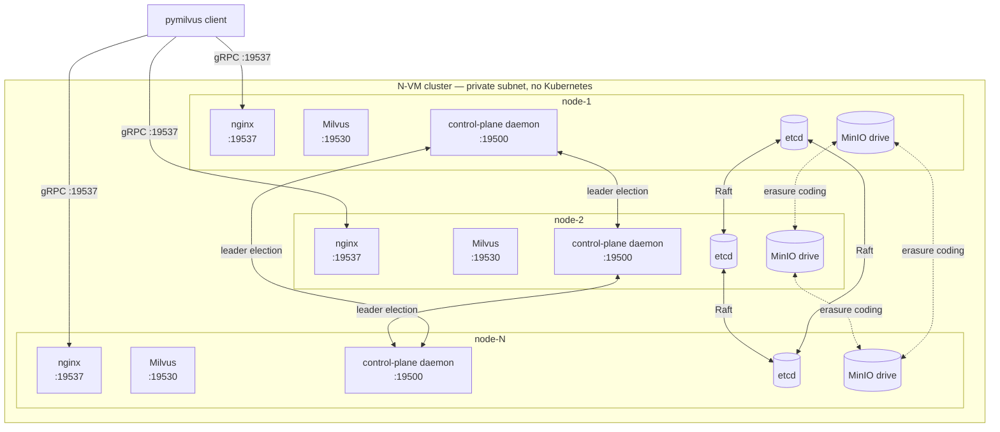

# HA Milvus on Linux VMs — no Kubernetes

A single CLI plus a small Python control-plane daemon that gives you
the missing rung between single-host Milvus standalone and a full
Kubernetes Operator deploy. Designed for shops with a fleet of plain
Linux VMs and no cluster orchestrator.

## Architecture

Per peer, 4-5 containers (more on Milvus 2.5). Every peer is identical;
no "primary" except via etcd leader election for the control plane.



| Component | Role |
|---|---|
| **etcd** | N-node Raft cluster — Milvus's metadata + the daemon's leader-election lease. Tolerates `(N-1)/2` member loss. |
| **MinIO** | Distributed mode, erasure-coded across all peers. Holds Milvus's segment data + backups. |
| **Milvus** | 2.6: one `milvus run standalone` container per peer with embedded Woodpecker WAL. 2.5: 5 sibling containers (mixcoord + proxy + querynode + datanode + indexnode) + a Pulsar singleton on `PULSAR_HOST`. |
| **nginx** | Layer-4 TCP load balancer in front of every peer's Milvus. Clients connect to any peer's `:19537` and get routed to a healthy backend. |
| **control-plane daemon** | One per peer, leader-elected via etcd lease. Owns `/join`, the jobs primitive (backup / restore / upgrade / remove-node), the watchdog (auto-restart unhealthy local containers + peer-down alerts), and topology fan-out. |

## 5-minute quickstart (3-node 2.6, distributed mode)

```bash
# On every node — one-time:
git clone https://github.com/codeadeel/milvus-onprem.git ~/milvus-onprem
cd ~/milvus-onprem

# On node-1 (the bootstrap node):
./milvus-onprem preflight                      # sanity check first
./milvus-onprem init --mode=distributed --milvus-version=v2.6.11
# the output prints a `./milvus-onprem join …` line — copy it

# On each other node:
./milvus-onprem join 10.0.0.10:19500 <CLUSTER_TOKEN>
# fetches cluster.env from the leader, runs bootstrap

# Verify (from any node):
./milvus-onprem status                          # all peers green
./milvus-onprem smoke                           # functional test
```

That's a working 3-node Milvus cluster. Clients connect to any peer's
`:19537`. **Adding a 4th node later? Just run the same `join` on the
new VM** — the daemon handles etcd member-add, topology fan-out,
rolling MinIO recreate, and nginx reload automatically.

For the full walkthrough with hardware-validated outputs:
**[docs/TUTORIAL.md](docs/TUTORIAL.md)**.

## Use it from your app (pymilvus)

Once the cluster's up, your app code is the same as any other Milvus
deploy — point pymilvus at any peer's `:19537` (the LB) and you're
done:

```python
from pymilvus import MilvusClient, DataType

# Connect to ANY peer's nginx LB. nginx routes around dead peers
# automatically — no failover code needed in your app.
client = MilvusClient(uri="http://10.0.0.10:19537")

# Create a collection with an HNSW index on the vector field
schema = client.create_schema()
schema.add_field("id",  DataType.INT64,        is_primary=True)
schema.add_field("vec", DataType.FLOAT_VECTOR, dim=768)
idx = client.prepare_index_params()
idx.add_index("vec", index_type="HNSW", metric_type="COSINE")
client.create_collection("docs", schema=schema, index_params=idx)

# Load with replicas across peers (replica_number=3 → spread on 3 peers
# for HA; 1 if you don't care about query failover)
client.load_collection("docs", replica_number=3)

# Insert + search are vanilla pymilvus
client.insert("docs", [{"id": 1, "vec": [0.1] * 768}])
hits = client.search("docs", data=[[0.1] * 768], limit=5,
                     anns_field="vec",
                     search_params={"metric_type": "COSINE"})
```

**Failover-safe search pattern.** During topology changes (peer dies,
upgrade running, etc.) Milvus may briefly return recovery-class errors
like `no available shard leaders`. Wrap reads in a small retry helper
— one ships at [`test/tutorial/_shared.py`](test/tutorial/_shared.py):

```python
from _shared import retry_on_recovering
hits = retry_on_recovering(lambda: client.search(...), max_wait_s=240)
```

For a 10-step pymilvus walkthrough (insert, load, search, filter,
mutate, inspect, etc.), see [`test/tutorial/`](test/tutorial/).

## CLI

Every operator action is one `./milvus-onprem <command>`. Common ones:

```bash
./milvus-onprem preflight                                    # pre-deploy sanity check
./milvus-onprem init --mode=distributed --data-root=/data    # bootstrap node
./milvus-onprem join <leader-ip>:19500 <token>               # join an existing cluster
./milvus-onprem join <leader-ip>:19500 <token> --data-root=/mnt/nvme  # join with per-peer data path
./milvus-onprem status                                       # local + peer health
./milvus-onprem smoke                                        # functional test
./milvus-onprem create-backup --name=daily_2026_04_29
./milvus-onprem upgrade --milvus-version=v2.6.12
./milvus-onprem remove-node --ip=<peer>
./milvus-onprem migrate-pulsar --to=node-2                   # 2.5 only — move Pulsar singleton
./milvus-onprem rotate-token
```

Full reference: **[docs/CLI.md](docs/CLI.md)**.

Per-command help: `./milvus-onprem <command> --help`.

## Supported environments

**Cloud-agnostic by design** — runs on any Linux VM with Docker.

- **Cloud:** AWS / GCP / Azure / OCI / DigitalOcean / Linode / Vultr
- **On-prem:** VMware / Proxmox / KVM / Xen / OpenStack / Nutanix
- **Bare metal:** any Linux server you can SSH into
- **Hybrid:** any mix, as long as nodes can reach each other on the cluster ports
- **Air-gapped:** mirror the 4-5 container images into your private registry
- **Local dev:** Multipass / lima / Vagrant / WSL2 / a fleet of Raspberry Pis

**Requirements:**
- Linux kernel ≥ 4.x (any distro: Debian, Ubuntu, RHEL, Rocky, Alma, openSUSE, Arch)
- Docker Engine ≥ 24 with the Compose plugin
- Inter-peer TCP reachability on the cluster ports (run `./milvus-onprem preflight` to verify)
- Image-pull access to `milvusdb/milvus`, `quay.io/coreos/etcd`, `minio/minio`, `nginx`, `apachepulsar/pulsar` (or a private mirror with these images)

**Not required:** Kubernetes · cloud-provider APIs · cloud DNS · a specific
Linux distro · a specific arch (amd64 + arm64 both work).

## Cluster sizes

| Size | Use | Tolerates |
|---|---|---|
| 1 | Standalone (no HA) | nothing |
| 3 | Smallest HA size | 1 peer down |
| 5 | Comfortable HA | 2 peers down |
| 7 | Larger fleets | 3 peers down |
| 9 | Maximum recommended | 4 peers down |

Even sizes (2, 4, 6, 8) are accepted with a warning — they tolerate the
same loss count as the next-lower odd size, so 4 ≈ 3 from a fault-tolerance
angle. Useful as a transient state during scale-out.

## Documentation index

**App developers (use the cluster from your app):**

| Read this | When |
|---|---|
| **[docs/SDK.md](docs/SDK.md)** | **Start here.** One-page guide: connect, schema, load, search, retry pattern. Copy-pasteable. |
| [test/tutorial/](test/tutorial/) | 10-step pymilvus walkthrough — one tiny script per concept. |
| [docs/FAILOVER.md](docs/FAILOVER.md) | What your app sees when a peer dies + the retry pattern that hides it. |

**Operators (deploy and run the cluster):**

| Read this | When |
|---|---|
| **[docs/GETTING_STARTED.md](docs/GETTING_STARTED.md)** | **First-time deploy.** Prerequisites, install, init, join, smoke. ~15 min. |
| [docs/CLI.md](docs/CLI.md) | Every CLI command, every flag, with examples. |
| [docs/TUTORIAL.md](docs/TUTORIAL.md) | Deeper walkthrough — every shipped feature on a real 4-VM cluster. |
| [docs/ARCHITECTURE.md](docs/ARCHITECTURE.md) | How the components fit together. Read this when something surprises you. |
| [docs/CONFIG.md](docs/CONFIG.md) | `cluster.env` reference. Every variable, every default. |
| [docs/OPERATIONS.md](docs/OPERATIONS.md) | Day-2 ops: backup, scale-out, status, alert formats. |
| [docs/TROUBLESHOOTING.md](docs/TROUBLESHOOTING.md) | Symptom → fix table. Real bugs we've actually hit + cloud firewall rules. |
| [docs/CONTROL_PLANE.md](docs/CONTROL_PLANE.md) | Daemon architecture: leader election, jobs, watchdog. |
| [daemon/README.md](daemon/README.md) | Per-file walkthrough of the Python daemon. |


## License

Apache 2.0. See [LICENSE](LICENSE).

## Contributing

PRs welcome, especially:
- New `templates/X.Y/` for future Milvus versions
- Real-world deploy reports + bug fixes
- Air-gapped / private-registry recipes
