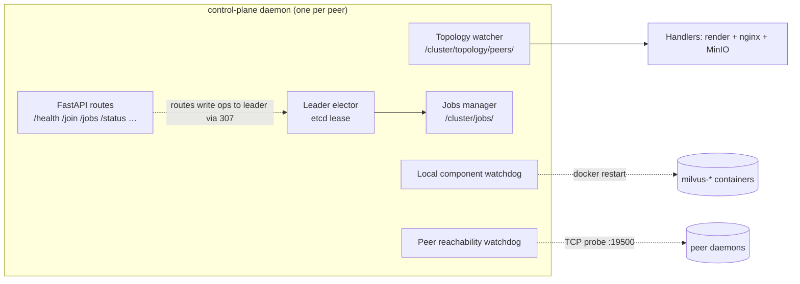

# milvus-onprem control plane daemon

FastAPI daemon, one per node, leader-elected via etcd. Owns the full
v1.2 surface: leader election, topology watch, `/join`, the jobs
abstraction (`create-backup` / `restore-backup` / `remove-node` /
`version-upgrade`), and the watchdog (local component auto-restart +
peer reachability alerts).

See `docs/CONTROL_PLANE.md` for the full design.



## Files

| File | Purpose |
|---|---|
| `main.py` | FastAPI app + lifespan + uvicorn entrypoint; wires all background tasks |
| `config.py` | Env-var-driven config (pydantic-settings) — incl. watchdog knobs |
| `etcd_client.py` | Async wrapper over the etcd v3 HTTP gateway (lease, kv, txn, watch) |
| `leader.py` | Leader election via etcd lease + atomic create |
| `topology.py` | Watches `/cluster/topology/peers/`, fans out events to handlers |
| `handlers.py` | Topology-change reactions: render templates + nginx reload + MinIO pool ops |
| `joining.py` | Leader-side `/join` orchestration (token check, name allocation, etcd member-add) |
| `jobs.py` | Long-running job lifecycle (etcd-backed state, leader-resumable) |
| `workers/` | Per-job-type code (`create_backup`, `export_backup`, `restore_backup`, `backup_etcd`, `remove_node`, `version_upgrade`) |
| `watchdog.py` | `LocalComponentWatchdog` + `PeerReachabilityWatchdog` (Stage 12) |
| `auth.py` | Bearer-token middleware |
| `api.py` | HTTP routes (`/health`, `/version`, `/leader`, `/topology`, `/jobs`, `/join`, `/status`, `/urls`, `/upgrade-self`) |
| `Dockerfile` | Container build (python:3.12-slim base + docker CLI + compose plugin + curl) |
| `requirements.txt` | Pinned deps |

## Configuration

Every setting comes from a `MILVUS_ONPREM_*` env var. Required:

| Var | Example | What |
|---|---|---|
| `MILVUS_ONPREM_CLUSTER_NAME` | `milvus-onprem` | Logical cluster ID. |
| `MILVUS_ONPREM_NODE_NAME` | `node-1` | This peer's stable name. |
| `MILVUS_ONPREM_LOCAL_IP` | `10.0.0.2` | This peer's IP. |
| `MILVUS_ONPREM_CLUSTER_TOKEN` | `<random-256-bit>` | Shared bearer token. |
| `MILVUS_ONPREM_ETCD_ENDPOINTS` | `http://10.0.0.2:2379,...` | Comma-separated. |

Optional (sensible defaults):

| Var | Default | What |
|---|---|---|
| `MILVUS_ONPREM_LISTEN_PORT` | `19500` | HTTP port. |
| `MILVUS_ONPREM_LEASE_TTL_S` | `15` | Leader lease TTL. |
| `MILVUS_ONPREM_KEEPALIVE_INTERVAL_S` | `5` | Lease keepalive cadence. |
| `MILVUS_ONPREM_LOG_LEVEL` | `info` | Python logging level. |

## Local smoke test (no real cluster)

Spin up a throwaway etcd, build the image, run the daemon, hit the
endpoints. From repo root:

```bash
# 1. ephemeral etcd
docker run -d --rm --name smoke-etcd -p 2379:2379 \
  quay.io/coreos/etcd:v3.5.25 \
  etcd \
  --listen-client-urls=http://0.0.0.0:2379 \
  --advertise-client-urls=http://localhost:2379

# 2. build image
docker build -t milvus-onprem-cp:dev daemon/

# 3. run daemon (network=host so it can reach the etcd above)
docker run -d --rm --name smoke-cp --network=host \
  -e MILVUS_ONPREM_CLUSTER_NAME=smoke \
  -e MILVUS_ONPREM_NODE_NAME=node-1 \
  -e MILVUS_ONPREM_LOCAL_IP=127.0.0.1 \
  -e MILVUS_ONPREM_CLUSTER_TOKEN=t0ken \
  -e MILVUS_ONPREM_ETCD_ENDPOINTS=http://127.0.0.1:2379 \
  milvus-onprem-cp:dev

# 4. probe
curl -s http://127.0.0.1:19500/health | jq
curl -s -H 'Authorization: Bearer t0ken' http://127.0.0.1:19500/leader | jq
docker logs smoke-cp | tail -20

# 5. cleanup
docker stop smoke-cp smoke-etcd
```

Expected: `/health` returns `is_leader: true` once the elector grabs
the lease (within ~1s on a fresh etcd). Daemon logs show `acquired
leadership (lease=...)`.

## Failure scenarios worth checking by hand

- Kill the daemon container while it's leader; the etcd lease expires
  in ~15s. A re-launched daemon takes over without manual cleanup.
- Block egress from one of two daemons in a multi-daemon test; the
  watcher reconnects automatically.
- **Watchdog drill — local auto-restart.** Spawn a throwaway
  `milvus-test` container with a deliberately failing healthcheck
  (`docker run -d --name milvus-test --health-cmd 'exit 1'
  --health-interval=5s alpine sleep 1d`); after 3 ticks (~30s) the
  daemon log emits `COMPONENT_RESTART attempt=1`, then 2 and 3, then
  `COMPONENT_RESTART_LOOP` and backs off. `docker rm -f milvus-test`
  to clean up.
- **Watchdog drill — peer down.** `docker stop milvus-onprem-cp` on
  any peer; from another peer's `docker logs milvus-onprem-cp`, a
  `PEER_DOWN_ALERT` fires after 6 ticks (~60s). `docker start` it
  back; `PEER_UP_ALERT was_down_for_s=N` follows on the next probe.
