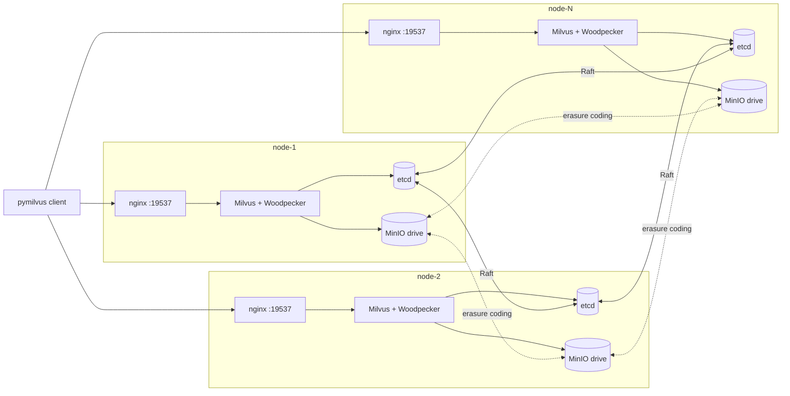

# Architecture

How the cluster's pieces fit together. Read this first before touching deploy.

## The 30-second picture



Every node runs the same set of containers. On Milvus 2.6 that's four
(etcd, minio, milvus, nginx); on 2.5 it's eight, because 2.5 is split
into coord-mode-cluster components (see "Milvus 2.5" below). Clients
hit any node's nginx; nginx round-robins to a healthy Milvus
proxy/standalone; Milvus reads/writes metadata in etcd
(consensus-replicated) and segment data in MinIO (erasure-coded). No
node is "special" — except the PULSAR_HOST node on 2.5, which also
runs the Pulsar singleton broker.

## Components per node

### nginx (load balancer)

- Listens on `${NGINX_LB_PORT}` (default `19537`).
- Layer-4 TCP proxy with passive health checks
  (`max_fails=3 fail_timeout=30s`).
- Round-robins requests across every Milvus instance in the cluster.
- A dead Milvus is marked down within 30s and routed around until it
  recovers.

### Milvus 2.6 (`milvus run standalone`)

- One Milvus binary per node, all running the "standalone" command.
- Despite the name, "standalone" forms a *cluster* when multiple
  instances share etcd — each instance registers in etcd, the
  coordinators (`mixcoord`) leader-elect, and QueryNodes/DataNodes
  load-balance segments.
- Embedded **Woodpecker** WAL — Milvus 2.6's built-in write-ahead log.
  Replaces the Pulsar/Kafka MQ that older Milvus versions required.
  Storage: WAL metadata in shared etcd, log segments in shared MinIO.

### Milvus 2.5 (coord-mode cluster)

2.5 cannot run multi-node HA in `milvus run standalone` — multiple
standalone instances panic on rootcoord election when they share an
etcd. So `templates/2.5/` deploys the components separately:

- `mixcoord` — all 4 coordinators (rootcoord + datacoord + querycoord
  + indexcoord) in one container, leader-elected via etcd. One per
  node; only one is the active leader at a time.
- `proxy` — gRPC entry on `${MILVUS_PORT}` (default `19530`); what
  nginx LBs across peers.
- `querynode` — query/search worker.
- `datanode` — ingest worker.
- `indexnode` — index-build worker.

Plus a Pulsar broker on PULSAR_HOST (singleton; SPOF for writes —
see [docs/PULSAR_HA.md](PULSAR_HA.md) for the in-cluster HA design,
not yet implemented). Net per-node container count: 9 on regular
peers, 10 on PULSAR_HOST (counts include the control-plane daemon).
Higher than 2.6's 4-per-node, but it's the topology 2.5 was designed
for.

### etcd (consensus store)

- N-node Raft cluster. Members named `node-1`, `node-2`, …, `node-N`.
- Stores Milvus's coordinator state: collection schemas, segment
  registry, channel checkpoints, session leases.
- Tolerates `floor((N-1)/2)` member failures simultaneously.
- 2-node clusters explicitly **not supported** (no quorum on 1-of-2;
  see [why we require odd sizes](#why-cluster-size-must-be-1-3-5)).

### MinIO (object storage)

- **Distributed mode** across all N nodes — single logical cluster,
  erasure-coded for redundancy.
- Each node contributes one drive (the `${DATA_ROOT}/minio/` directory).
- Tolerates loss of `(N - parity-set-size)` drives without data loss
  (default parity for typical sizes: 1 drive at N=3, 2 drives at N=5).
- Bucket: `milvus-bucket` (created by `bootstrap` on first run).
- Single-drive mode is used automatically for `CLUSTER_SIZE=1` (no HA).

## Data flow

### Write path

```
client → nginx → Milvus Proxy → etcd (metadata commit, Raft-replicated)
                              → Woodpecker WAL → MinIO (segment file written)
```

A write is durable once two things succeed:

1. The metadata change commits in etcd (Raft-replicated to a quorum
   of nodes — this is what makes the system survive single-node loss).
2. The segment data lands in MinIO (erasure-coded across all peers).

### Read path

```
client → nginx (any node's :19537) → that node's Milvus Proxy
       → QueryCoord (etcd-elected leader) → QueryNode on some node
       → segment data fetched from MinIO if not already loaded
       → results bubble back up
```

QueryNodes can be on any node; they advertise their segment cache via
etcd. A `replica_number=2` load means two QueryNodes on different nodes
each hold a copy in RAM; either can answer queries.

## Why cluster size must be 1, 3, 5, ...

`milvus-onprem` requires **odd cluster sizes**, with **1 (standalone)** as
a special case. Even sizes are rejected.

This is mathematics, not preference. etcd uses Raft consensus, and Raft
requires a strict majority of members to agree on every change. With
even sizes:

- **2 nodes:** majority is 2. Lose either, and you have 1, which is not
  a majority. The cluster freezes for writes. Worse, if the network
  splits between them, both sides think they're the survivor and you
  get **split-brain** — diverging databases with no clean way to
  reconcile.
- **4 nodes:** majority is 3. Tolerates exactly 1 failure — same as
  3 nodes. No benefit, but you've added a fourth machine and its
  associated cost / failure surface.
- **6 nodes:** majority is 4. Tolerates 2 failures — same as 5 nodes.
  Same trade-off.

Odd sizes are always strictly better:

| Size | Quorum | Failures tolerated |
|---|---|---|
| 1 | 1 | 0 (standalone, no HA) |
| 3 | 2 | **1** |
| 5 | 3 | **2** |
| 7 | 4 | **3** |
| 9 | 5 | 4 |

If you want HA: pick 3, 5, or 7. If you don't need HA: pick 1.

## Topology configuration

All nodes share an identical `cluster.env`. The key field is `PEER_IPS`:

```
PEER_IPS=10.0.0.10,10.0.0.11,10.0.0.12
```

Position determines node identity:
- First IP → `node-1`
- Second IP → `node-2`
- ... and so on.

Each VM figures out *which* node it is at runtime by matching `hostname -I`
against the IPs in `PEER_IPS`. No explicit "I am node-N" config.

## Failure modes and recovery

### Single node loss

**Behavior:** automatic, no intervention required. etcd's Raft quorum
absorbs it (e.g. 3-node cluster with 1 dead node = 2 of 3 members
healthy = quorum maintained = writes continue). MinIO's distributed
mode degrades but still serves reads/writes from remaining drives.
nginx detects the dead Milvus within 30s and routes around it.

**What you do:** investigate the dead node, fix it, bring it back.
When etcd on the recovered node starts, it rejoins the existing
cluster automatically. No manual `failover` / `failback` dance.

### Multi-node loss

**Behavior:** depends on the count. For a 3-node cluster, losing 2
nodes (66%) means losing quorum. etcd freezes for writes. Reads from
loaded collections still work (QueryNode RAM).

**What you do:** restore from backup. See [OPERATIONS.md](OPERATIONS.md)
for the runbook.

### Network partition

**Behavior:** the side with the quorum (majority) keeps serving;
the minority side freezes. **No split-brain** because Raft requires
majority for any commit.

**What you do:** fix the link. The minority side rejoins automatically
when reachability is restored.

## What's NOT in scope

This tool is intentionally narrow. It does NOT do:

- **Cross-DC replication.** Milvus has no native multi-region story;
  we don't try to fake one. If you need multi-DC, run two clusters
  and replicate at the application layer.
- **Workload orchestration of arbitrary services.** It's not a
  Kubernetes alternative. It does one thing: deploy and manage Milvus.
- **Image-pull from internet at runtime.** The CLI doesn't enforce
  this, but the design assumes you've mirrored the Milvus / etcd /
  MinIO / nginx images into your local registry.
- **TLS between nodes.** All inter-node traffic is plain HTTP / gRPC.
  Lives behind your network's perimeter. TLS termination at nginx is
  possible but not yet templated.

## Why bash + docker compose, not Go + a custom orchestrator?

Bash + docker compose is honest about what we are: a deployment recipe,
not a runtime. A Go binary with a custom controller would be a
miniature Kubernetes — exactly the complexity we set out to avoid.

The CLI is ~2000 lines of small, focused bash files. Anyone can read
it, understand what it does, and contribute.

## Further reading

- [DEPLOYMENT.md](DEPLOYMENT.md) — first-time deploy walkthrough.
- [CONFIG.md](CONFIG.md) — every cluster.env variable explained.
- [OPERATIONS.md](OPERATIONS.md) — day-2 ops.
- [TROUBLESHOOTING.md](TROUBLESHOOTING.md) — known issues + fixes.
