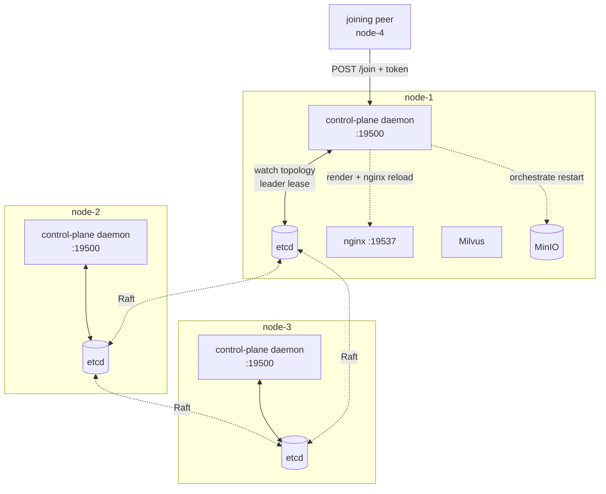
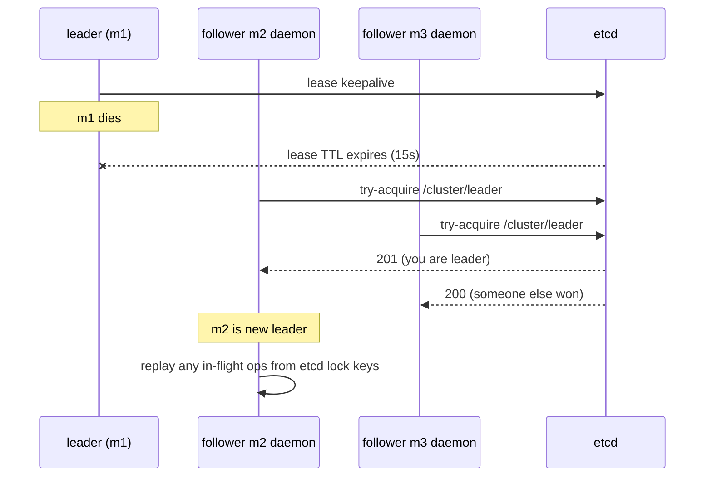
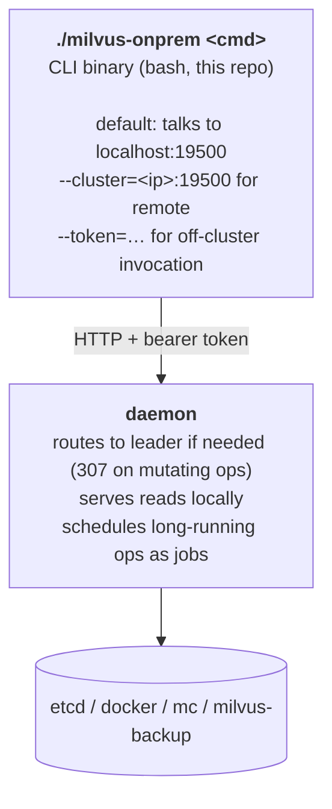
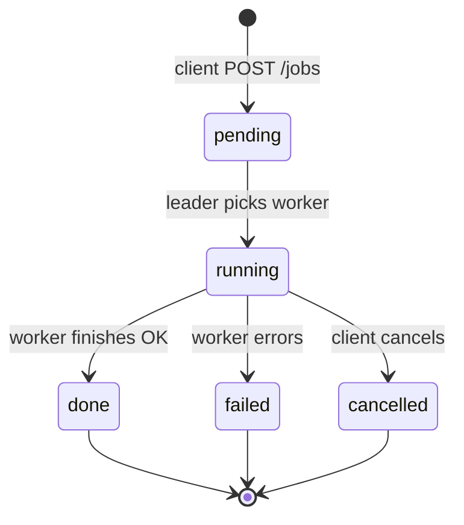

# Control plane — architecture

How the milvus-onprem control plane is structured, how peers
coordinate cluster-wide operations, and what the daemon does
autonomously.

## Goal

A self-maintaining HA Milvus cluster on plain Linux VMs. The control
plane handles its own internal state propagation — topology,
rendering, nginx reload, MinIO pool changes, etcd membership,
leader election, in-flight job recovery — without operator
intervention. The operator's job:

1. Provision VMs.
2. Run `init` on the first node.
3. Run `join` on each subsequent node.
4. Trigger backups / restores / upgrades on demand.

"Self-maintaining" here means **all internal state stays consistent
across peers automatically**: change one thing, it propagates
everywhere. It does **not** mean scheduled backups, periodic
housekeeping, or auto-restart of failing components — those are
non-goals (see below). User-facing operations are user-initiated;
cluster-internal consistency is the daemon's job.

## Non-goals

- mTLS / cert distribution. Auth is a shared cluster token.
- Zero-downtime mode flip standalone↔distributed. Switch modes via
  teardown + re-init.
- API versioning. Single version; bump deliberately if needed.
- Scheduled / cron / recurring jobs. Backups, snapshots, etc. are
  user-initiated. Operator runs the command when they want to.
- Periodic self-maintenance (etcd defrag, MinIO heal, segment GC,
  self-test). Milvus and MinIO have their own internal housekeeping;
  we trust them. Operator can trigger these manually if needed.
- Cloud / VM provisioning. Operator brings the VMs; the CLI deploys
  onto them.

## Architecture



### Roles

- **Daemon (every node)** — FastAPI HTTP server (Python 3.12).
  Containerised, runs in the rendered compose alongside Milvus.
  FastAPI provides pydantic request/response validation, OpenAPI
  schema generation, async I/O for etcd watches, and Server-Sent
  Events for log streaming.
- **Leader (one at a time)** — Whichever daemon holds the etcd
  leader lease. Handles all writes (`/join`, topology updates, MinIO
  orchestration, jobs). Followers redirect writes via 307 to the
  leader.
- **Followers** — All other daemons. Serve reads (`/status`,
  `/topology`, `/cluster-env`). Watch the etcd topology key; on
  change, re-render + nginx reload locally.

## State model

| Where | What |
|---|---|
| `cluster.env` (per node) | cluster name, version, ports, image repos, MinIO secret, **CLUSTER_TOKEN** (bootstrap config; secrets stay out of etcd) |
| etcd `/cluster/topology/peers/<node-name>` | `{ip, hostname, joined_at, role}` — source of truth for membership; watched by all daemons |
| etcd `/cluster/leader` | lease key with daemon ID — single holder; lease auto-expires |
| etcd `/cluster/minio_pools` | list of MinIO pools added over time |
| etcd `/cluster/locks/minio_restart` | lease lock — serialises rolling restarts |
| etcd `/cluster/jobs/<uuid>` | per-job state (see Jobs section) |
| `rendered/<node-name>/` | per-node compose + milvus.yaml + nginx.conf — generated, re-rendered on topology change |

`PEER_IPS` is derived at runtime from etcd. cluster.env holds only
"what doesn't change when the cluster grows."

## Lifecycle

### Init (standalone)

```
$ ./milvus-onprem init --mode=standalone
[init] cluster name: milvus-onprem
[init] mode: standalone (single VM, no HA)
[init] writing cluster.env
[init] running host_prep
[init] starting docker compose (etcd + minio + milvus, no control plane daemon)
[init] OK ready at http://<local-ip>:19530
```

Single node, single-instance services. No control plane daemon (a
static deploy doesn't need one).

### Init (distributed)

```
$ ./milvus-onprem init --mode=distributed
[init] cluster name: milvus-onprem
[init] mode: distributed (multi-VM, HA)
[init] generating CLUSTER_TOKEN: f3a8...c12d
[init] writing cluster.env
[init] running host_prep
[init] starting docker compose (etcd cluster-mode-of-1 + MinIO 4-drive
       single-server + milvus standalone-cluster-mode + control plane)
[init] OK leader elected: node-1
[init] cluster up. To add a peer:
         CLUSTER_TOKEN: f3a8...c12d
         on the new VM:
           ./milvus-onprem join <node-1-ip>:19500 f3a8...c12d
```

The N=1 deploy is already in cluster mode. Etcd has 1 member but
runs as a Raft cluster of 1 (`state=new`, single member). MinIO runs
as a single server with 4 bind-mount drives (4-drive distributed
minimum at single-server). Milvus runs in cluster-mode-of-1.

Growing from 1 to 3 is uniform with growing from 5 to 7 — pure
member-add, no mode flip.

### Grow (1 → 2 → 3 → ...)

On the new VM:

```
$ ./milvus-onprem join <existing-peer-ip>:19500 <token>
[join] contacting control plane at <existing-peer-ip>:19500
[join] auth OK
[join] received cluster.env, hostname=node-2
[join] running host_prep
[join] starting etcd (state=existing)
[join] starting MinIO
[join] starting Milvus
[join] starting control plane daemon
[join] OK joined cluster as node-2
```

What the leader does in response to `/join`:

1. Verify token from `Authorization: Bearer ...`.
2. Allocate next `node-N` name (atomic via etcd transaction).
3. `etcdctl member add node-N --peer-urls=http://<joiner-ip>:2380`.
4. Write `/cluster/topology/peers/node-N` with joiner's IP + hostname.
5. Acquire `/cluster/locks/minio_restart` lease.
6. `mc admin pool add http://<joiner-ip>:9000/data1..4`.
7. Release lock.
8. Return `cluster.env` body + assigned hostname to the joiner.

What every daemon (including leader) does on topology change:

1. Watch fires.
2. Re-render this node's templates.
3. Reload nginx (`nginx -s reload`).
4. **No** local docker restart for MinIO — pool expansion is
   server-side; existing peers don't restart.

Scale-out is non-disruptive on existing peers. The only pause is on
the joining node, while it's bootstrapping.

### Leader failover



In-flight operations (a partially-completed `/join`) are recoverable
because every step writes to etcd before the next. The new leader
scans lock / in-progress keys on takeover and resumes or rolls back.

## HTTP API

All requests except `/health` and `/version` require
`Authorization: Bearer <CLUSTER_TOKEN>`.

| Method + path | Who | What |
|---|---|---|
| `GET /health` | anyone | Daemon liveness — used by container healthcheck. Unauthenticated. |
| `GET /version` | anyone | Daemon version. Unauthenticated. |
| `GET /leader` | any peer | Current leader info. |
| `GET /topology` | any peer | Current peers + roles. |
| `GET /status` | any peer | Cluster-wide health snapshot. |
| `GET /urls` | any peer | Connection URLs to share with clients. |
| `GET /peer/clock` | any peer | This peer's unix time — used by `preflight --peer` to detect skew. |
| `POST /join` | external (joining VM) | Add peer to cluster. Leader-only — followers 307. |
| `POST /jobs` | operator | Create + schedule a job. Leader-only — followers 307. |
| `GET /jobs` | operator | List jobs (filter by state, type, age). |
| `GET /jobs/{id}` | operator | Single job state + logs. |
| `POST /jobs/{id}/cancel` | operator | Best-effort cancel. |
| `GET /jobs/types` | operator | List registered job types. |
| `POST /admin/sweep` | operator | Trigger immediate stuck-running + retention sweep. Leader-only. |
| `POST /upgrade-self` | leader | Each peer's local upgrade procedure during a rolling Milvus version-upgrade. Auth-gated; not for operators. |
| `POST /recreate-minio-self` | leader | Each peer's local MinIO container recreate during topology-driven rolling restart. Auth-gated; not for operators. |
| `POST /rotate-self` | leader | Each peer's local CLUSTER_TOKEN rotation procedure. Auth-gated; not for operators. |

`POST /join` response shape:

```json
{
  "node_name": "node-2",
  "cluster_env": "<full cluster.env contents>",
  "leader_ip": "<leader-ip>",
  "topology": [
    {"name": "node-1", "ip": "<...>"},
    {"name": "node-2", "ip": "<...>"}
  ]
}
```

## CLI ↔ daemon split



An operator on a laptop sets `--cluster=<peer>:19500` and gets the
same results as if invoked from a peer. Zero functional difference
between local and remote invocation.

### Operations matrix

| Command | Behavior |
|---|---|
| `init --mode=standalone` | Local-only; deploys single-instance services. |
| `init --mode=distributed` | Local on first node; bootstraps cluster-mode-of-1 + starts daemon. Generates CLUSTER_TOKEN. |
| `join <ip>:19500 <token>` | Calls daemon `/join`; daemon orchestrates everything. |
| `bootstrap` | Internal — daemon calls on first init / join. |
| `render` | Internal — daemon calls on topology change. |
| `up` / `down` | Daemon-coordinated per-node. |
| `status` / `urls` / `version` / `leader` | Daemon read endpoints. |
| `wait` | Daemon `GET /wait?timeout=N`. |
| `ps` | Local-only (`docker ps`); daemon offers `GET /ps?node=N` for remote. |
| `logs <component> [--node=N]` | Daemon `GET /logs/<component>?node=N&tail=N` — proxies to peer daemon if remote. |
| `teardown` | Local-only escape hatch — works even when daemon is unhealthy. |
| `install` / `uninstall` | Local-only (PATH wrapper, completion). |
| `smoke` | Local — runs the test against the LB. |
| `preflight` | Local + peer-side checks (HTTP probes via daemon). |
| `create-backup` / `export-backup` / `restore-backup` / `backup-etcd` | Daemon job: leader picks a node, runs `milvus-backup` / etcd snapshot, tracks state. |
| `remove-node --ip=X` | Daemon job: drains peer, etcd member-remove, MinIO pool-remove, nginx update on remaining peers. |
| `upgrade --milvus-version=vX.Y.Z` | Daemon job: rolling restart with new image, peer-by-peer. |
| `rotate-token` | Daemon job: parallel cluster-wide CLUSTER_TOKEN rotation. |
| `jobs list` / `jobs show <id>` / `jobs cancel <id>` | Daemon job-control. |

## MinIO scale-out

Distributed MinIO scale-out goes through `mc admin pool add` (the
existing pool's server list isn't mutable online):

```
mc admin pool add local http://<new-ip>:9000/data1 \
                        http://<new-ip>:9000/data2 \
                        http://<new-ip>:9000/data3 \
                        http://<new-ip>:9000/data4
```

This adds a new pool alongside the existing one. New writes balance
across pools by capacity; existing data stays where it is.

Implications:

- The N=1 deploy starts with 4 drives in 1 server (pool 1). When m2
  joins, a new pool is added with 4 drives on m2. Each peer = 1 pool
  of 4 drives.
- The 4-drive minimum at single-server is satisfied by 4 bind-mount
  paths under `/data/minio/{drive1,drive2,drive3,drive4}`.
- No rolling restart of existing MinIOs needed. Pool-add is online.
- **Trade-off:** existing data isn't re-balanced. If you scale 1 → 5
  then ingest a lot, the new ingest spreads across pools 1-5; old
  data stays in pool 1. Acceptable for normal growth patterns.

## Jobs abstraction

Long-running operations (backup, restore, upgrade, remove-node,
rotate-token) run as **jobs**: every long-running op gets a job
entry in etcd, identified by a UUID, with state, progress, params,
and a tail of log lines.

> Jobs are always operator-initiated. There is no scheduler, no
> cron, no recurring entry. The pattern manages user-triggered
> long-running ops cleanly, not automation-without-operator.

### Lifecycle



### etcd keys

```
/cluster/jobs/<uuid>          → JSON: {type, params, state, progress,
                                       started_at, finished_at, error?,
                                       owner, last_heartbeat, logs[]}
```

### Resilience

- The owner daemon writes progress + heartbeat to etcd every ~2s.
- The leader's stuck-running sweep marks jobs `failed` if their
  heartbeat is older than `MILVUS_ONPREM_JOBS_HEARTBEAT_TIMEOUT_S`
  (default 60s). Resolves the leader-death case where the worker
  task dies with the daemon and would otherwise leave the job
  `running` forever.
- A retention sweep deletes terminated jobs older than
  `MILVUS_ONPREM_JOBS_RETENTION_S` (default 30 days).
- Idempotency: each job type defines whether it's safe to retry from
  scratch or needs a checkpoint to resume.

### Endpoints

| Method + path | What |
|---|---|
| `POST /jobs` | Create job, return UUID. Body: `{type, params}`. |
| `GET /jobs` | List jobs (filterable). |
| `GET /jobs/<uuid>` | Single job state. |
| `POST /jobs/<uuid>/cancel` | Request cancel. |

## What the daemon does autonomously

The cluster is self-maintaining for internal state: any change the
operator triggers (or any peer-side change reflected in etcd)
propagates everywhere automatically.

### Topology propagation

- Auto-render templates on topology change (no manual `render`).
- Auto-reload nginx on topology change.
- Auto-allocate `node-N` names at join.
- Auto-add MinIO pool at join.
- Auto-call etcd member-add at join.
- Auto-validate token + IP not already a member.
- Detect leader-failover and resume in-flight jobs from etcd state.

### Operator-initiated jobs

- `create-backup` / `restore-backup` / `export-backup` /
  `backup-etcd` — backup pipeline, leader picks the node, runs the
  underlying tool, tracks state in etcd.
- `remove-node` — drain → etcd member-remove → MinIO pool
  decommission → re-render + nginx reload on every remaining peer.
- `version-upgrade` — pulls new image on every peer, rolling-
  restarts one at a time, waits healthy, repeats. Aborts on
  health-check failure mid-upgrade and stops at the last
  known-good peer.
- `rotate-token` — generates a new cluster token and fans out to
  every follower in parallel via `/rotate-self`; each peer writes
  cluster.env, re-renders, schedules a detached self-recreate of
  its control-plane container. Leader rotates itself last.

### Watchdog

Two background tasks per daemon (no systemd unit, no install step):

- **Local component watchdog** — polls `docker ps` on this host,
  auto-restarts `milvus-*` containers stuck in `(unhealthy)`. Loop-
  guarded (3 restarts in 5 min → back off). `auto` mode is default;
  `monitor` mode keeps the alerts but skips the action.
- **Peer reachability watchdog** — TCP-probes peers on `:19500`
  every tick; emits `PEER_DOWN_ALERT` / `PEER_UP_ALERT`. Alerts
  only — etcd Raft + nginx LB recover automatically.

### Things still requiring the operator (by design)

- VM provisioning / decommissioning.
- Routine backup discipline (when to back up — the CLI provides the
  command, not the schedule).
- Capacity planning, version-upgrade timing, recovery decisions on
  peer death.
- DNS / firewall / MTU outside nginx's TCP LB.
