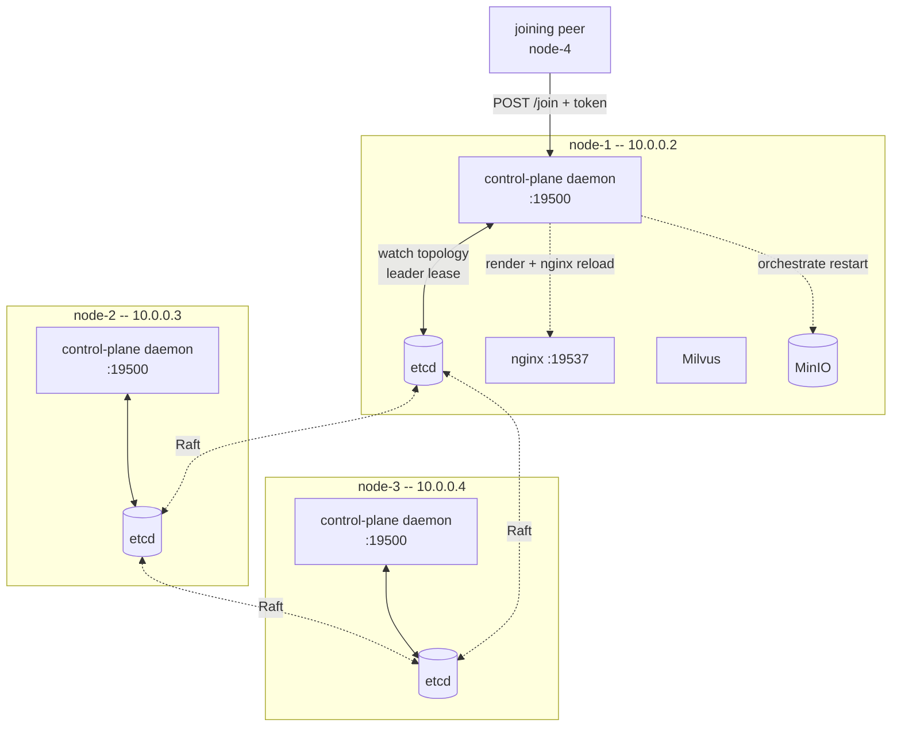
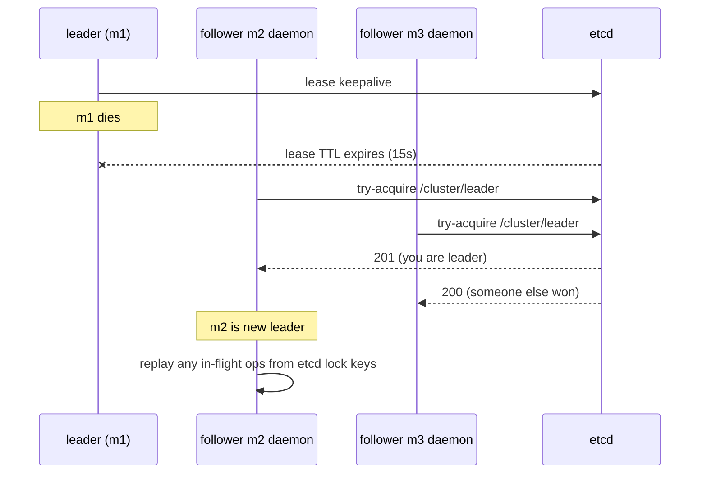
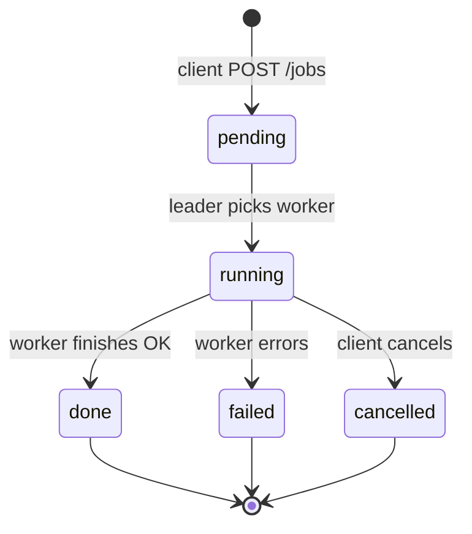

# Persistent control plane — design

> Status: **DRAFT** — pending operator review. No code changes derived
> from this doc until ratified. Once ratified, this doc is the spec
> for Stages 2-7 of the implementation.

## 1 — Why

Today's deploy flow has hard friction the operator has flagged on
real hardware:

- `init` requires every peer's IP up-front (`--peer-ips=A,B,C`).
- `add-node` is a 4-step manual dance: orchestrator-side `add-node`,
  per-peer `update-peers`, MinIO rolling restart, then `pair`/`join`
  on the new VM.
- The "rolling restart" of MinIO is broken: `docker restart` doesn't
  pick up the new compose command, and even with `--force-recreate`,
  MinIO's expansion path is `mc admin pool add` (separate pool), not
  server-list edits on an existing pool.
- `pair` is ephemeral — 10-minute idle timeout — so timing matters.
- No central authority to coordinate cluster-wide operations
  (rolling restarts, topology changes, future remove-node).

We're paying for these every time we scale. The design below replaces
the ephemeral `pair` flow with a **persistent control plane** that
runs on every node, elects a leader through etcd, holds cluster
topology in etcd, and orchestrates topology changes automatically.

## 2 — Goals & non-goals

### Goals

- One operator command per node grow: `./milvus-onprem join
  <existing-peer>:19500 <cluster-token>`. No `--peer-ips`. No
  per-peer `update-peers`. No `pair`.
- Topology lives in etcd. Every node watches it; render + nginx
  reload + MinIO orchestration happen automatically when it changes.
- Leader-elected control plane (HA): no SPOF for control operations.
- `init` UX: prompt or `--mode=standalone|distributed`. Distributed
  mode bootstraps a cluster-mode-of-1 ready to grow.
- MinIO scale-out: leader sequences expansion via `mc admin pool
  add` (new pool per growth event). No risky server-list edits.
- Backwards compat: **none**. We start fresh per operator's call.

### Non-goals (this design / v1)

- mTLS / cert distribution. Auth is a shared cluster token.
- `remove-node`. Punt to v1.1 once the add path is solid.
- Zero-downtime mode flip standalone↔distributed. We require
  teardown + re-init to switch modes.
- API versioning. Single version; bump deliberately if we ever
  need it.

## 3 — Architecture



### Key roles

- **Daemon (every node)** — Python HTTP server. Written in `~500 lines`
  total across `daemon/main.py`, `daemon/leader.py`, `daemon/api.py`,
  `daemon/topology.py`. Containerised, runs in the rendered compose
  next to Milvus.
- **Leader (one at a time)** — Whichever daemon holds the etcd
  leader lease. Handles all writes (`/join`, topology updates,
  MinIO orchestration). Followers redirect writes via 307 to leader.
- **Followers** — All other daemons. Serve reads (`/status`,
  `/topology`, `/cluster-env`). Watch etcd topology key; on change,
  re-render + nginx reload locally.

## 4 — State model

| Where | What | Why |
|---|---|---|
| `cluster.env` (per node) | cluster name, version, ports, image repos, MinIO secret, **CLUSTER_TOKEN** | Bootstrap config; secrets shouldn't be in etcd. |
| etcd `/cluster/topology/peers/<node-name>` | `{ip, hostname, joined_at, role}` | Source of truth for membership. Watched by all daemons. |
| etcd `/cluster/leader` | lease key with daemon ID | Leader election. Single holder; lease auto-expires. |
| etcd `/cluster/minio_pools` | list of pool entries (added pools over time) | MinIO expansion uses pool-add; we track pool history. |
| etcd `/cluster/locks/minio_restart` | lease lock | Serialises rolling restarts. |
| `rendered/<node-name>/` | per-node compose + milvus.yaml + nginx.conf | Generated; re-rendered on topology change. |

Notable: `PEER_IPS` is **gone from cluster.env**. It's derived at
runtime from etcd. cluster.env now holds only "what doesn't change
when the cluster grows."

## 5 — Lifecycle

### 5.1 — Init (standalone)

```
$ ./milvus-onprem init --mode=standalone
[init] cluster name: milvus-onprem
[init] mode: standalone (single VM, no HA)
[init] writing cluster.env
[init] running host_prep
[init] starting docker compose (etcd + minio + milvus, no control plane daemon)
[init] OK ready at http://10.0.0.2:19530
```

Single node, single-instance services. No control plane (it's not
needed for a static deploy). Identical to today's standalone flow.

### 5.2 — Init (distributed)

```
$ ./milvus-onprem init --mode=distributed
[init] cluster name: milvus-onprem
[init] mode: distributed (multi-VM, HA)
[init] generating CLUSTER_TOKEN: f3a8...c12d
[init] writing cluster.env
[init] running host_prep
[init] starting docker compose (etcd cluster-mode-of-1 + MinIO 4-drive
       single-server + milvus standalone-cluster-mode + control plane)
[init] OK leader elected: node-1 (10.0.0.2)
[init] cluster up. To add a peer:
         CLUSTER_TOKEN: f3a8...c12d
         on the new VM:
           ./milvus-onprem join 10.0.0.2:19500 f3a8...c12d
```

The N=1 deploy is **already in cluster mode**. Etcd has 1 member but
runs as a Raft cluster of 1 (`state=new`, single member). MinIO runs
as a single server with 4 bind-mount drives (4-drive distributed
minimum at single-server). Milvus runs in cluster-mode-of-1.

This means **growing from 1 to 3 is uniform with growing from 5 to
7** — pure member-add, no mode flip. The cost is single-VM
distributed deploys carry a bit of overhead vs true standalone.
That's acceptable per operator (Q6).

### 5.3 — Grow (1 → 2 → 3 → ...)

On the new VM (m2):

```
$ ./milvus-onprem join 10.0.0.2:19500 f3a8...c12d
[join] contacting control plane at 10.0.0.2:19500
[join] auth OK
[join] received cluster.env, hostname=node-2
[join] running host_prep
[join] starting etcd (state=existing)
[join] starting MinIO
[join] starting Milvus
[join] starting control plane daemon
[join] OK joined cluster as node-2 (10.0.0.3)
```

**What the leader does in response to the `/join` call:**

1. Verify token from `Authorization: Bearer ...` matches CLUSTER_TOKEN.
2. Allocate next `node-N` name (atomic via etcd transaction).
3. Call `etcdctl member add node-N --peer-urls=http://<joiner-ip>:2380`.
4. Write `/cluster/topology/peers/node-N` with joiner's IP + hostname.
5. Acquire `/cluster/locks/minio_restart` lease.
6. Add a new MinIO pool: `mc admin pool add http://<joiner-ip>:9000/data1..4`.
7. Release lock.
8. Return `cluster.env` body + assigned hostname to joiner.

**What every daemon (including leader) does on topology change:**

1. Watch fires.
2. Re-render this node's templates.
3. Reload nginx (`nginx -s reload`).
4. **No** local docker restart for MinIO — pool expansion is
   server-side; existing peers don't restart.

This means scale-out is **non-disruptive on existing peers**. The
only pause is on the joining node, while it's bootstrapping.

### 5.4 — Leader failover



In-flight operations (a partially-completed `/join`) are recoverable
because every step writes to etcd before the next. New leader scans
locks/in-progress keys on takeover and resumes or rolls back.

## 6 — HTTP API

All requests require `Authorization: Bearer <CLUSTER_TOKEN>`.

| Method + path | Who | What |
|---|---|---|
| `POST /join` | external (new VM) | Add peer to cluster. Leader only — followers 307. |
| `GET /cluster-env` | existing peer | Fetch latest cluster.env (e.g. after token rotation). |
| `GET /topology` | anyone | Current peers + roles. |
| `GET /leader` | anyone | Who is leader right now. |
| `GET /health` | anyone | This daemon's local view of cluster + self. |
| `POST /restart-minio` | internal | Trigger leader-coordinated rolling restart. Reserved. |
| `GET /version` | anyone | Daemon version. |

**Response shape — `POST /join`:**

```json
{
  "node_name": "node-2",
  "cluster_env": "<full cluster.env contents>",
  "leader_ip": "10.0.0.2",
  "topology": [
    {"name": "node-1", "ip": "10.0.0.2"},
    {"name": "node-2", "ip": "10.0.0.3"}
  ]
}
```

## 7 — MinIO scale-out (the right way)

The CLAUDE.md "rolling restart with new server list" approach is
broken (server-list change isn't a supported MinIO expansion path).
The supported path is `mc admin pool add`:

```
mc admin pool add local http://<new-ip>:9000/data1 \
                        http://<new-ip>:9000/data2 \
                        http://<new-ip>:9000/data3 \
                        http://<new-ip>:9000/data4
```

This adds a **new pool** alongside the existing one. New writes
balance across pools by capacity; existing data stays where it is.

Implications:

- The N=1 deploy starts with 4 drives in 1 server (pool 1). When
  m2 joins, we add pool 2 = 4 drives on m2. When m3 joins, pool 3
  on m3. Each peer = 1 pool of 4 drives.
- The 4-drive minimum at single-server is satisfied by 4
  bind-mount paths under `/data/minio/{drive1,drive2,drive3,drive4}`.
- No rolling restart of existing MinIOs needed. Pool-add is online.
- **Trade-off:** existing data doesn't get re-balanced. If you
  scale 1 → 5 then ingest a lot, the new ingest spreads across
  pools 1-5; old data stays in pool 1. Acceptable for normal
  growth patterns.

## 8 — Implementation stages

(Same staging discussed in chat — listed here for completeness.)

| # | Stage | Scope | Validates |
|---|---|---|---|
| 2 | Daemon scaffold | Python HTTP server, etcd leader lease, topology watch (no real endpoints, just heartbeat + leader log). Containerised. | Leader election + watch loop work. |
| 3 | `init` rewrite | `--mode=standalone\|distributed`. Cluster-mode-of-1 bootstrap for distributed. Token issuance. | First-deploy works. |
| 4 | `join` rewrite | Talks to persistent endpoint with token. Replaces pair/join. | Add 1→2. |
| 5 | Topology watch + auto-render | Every daemon watches etcd, re-renders + nginx-reloads on change. Removes update-peers. | Add 2→3 with auto-propagation. |
| 6 | Auto MinIO pool-add | Leader calls `mc admin pool add` on join. | MinIO storage actually grows. |
| 7 | Validation | End-to-end on 4 VMs: init distributed, grow 1→2→3→4, leader failover drill, smoke + replication-proof at each step. | Phase 2 -level proof. |

## 9 — Open questions / things to ratify before code

- **Port for control plane.** I'm proposing **19500** (replacing
  ephemeral pair). Alternative: 19501 to keep them separate.
  Pick: 19500.
- **Token rotation.** Manual for v1 (operator edits cluster.env
  + restarts daemons). Worth automating later.
- **Per-IP allowlist.** The cluster token alone gates joins. Should
  joins also require the leader to pre-authorize the IP (one-time
  ACL)? Adds a step but defends against token leakage. Default for
  v1: no — token alone is enough.
- **Daemon container image.** Build our own (`Dockerfile.daemon`,
  `python:3.12-slim` base + a few packages)? Or pre-publish to a
  registry? For v1: build locally on each node from a Dockerfile
  shipped in repo. Avoids registry dependency.
- **Etcd client library.** `python-etcd3` is the obvious choice but
  has been unmaintained. Alternative: HTTP/gRPC directly. For v1:
  shell out to `etcdctl` for write ops (simpler), use a thin
  Python wrapper for watches.
- **What happens when the joining VM's daemon also needs to come
  up before its container can be reached?** Bootstrap order on the
  joiner: etcd first (state=existing) → daemon → MinIO →
  Milvus. The daemon won't be reachable from outside until etcd
  gives it the lease, but that's fine — it's not the leader on
  first start anyway.
- **Where does the hostname / display name come from?** Sequential
  `node-N` allocated by leader at `/join` time, written to etcd.
  Stable across IP changes (if we ever support that).

## 10 — What this *removes* from the codebase

- `lib/cmd_pair.sh`
- `lib/cmd_add_node.sh` (functionality moves to leader's `/join`)
- `lib/cmd_update_peers.sh` (auto via topology watch)
- `lib/cmd_join.sh` (rewritten — talks to control plane HTTP, not
  pair server)
- The `--peer-ips=` flag from `cmd_init.sh` (replaced by mode flag)

Plus updates to: `lib/role.sh` (PEER_IPS now comes from etcd at
daemon-load time, with cluster.env as a stale-OK cache),
`lib/render.sh` (called by daemon on topology watch, not by
`bootstrap`), `lib/cmd_bootstrap.sh` (delegates to daemon for
multi-node).

Net: probably **fewer total lines of bash** (the manual orchestration
goes away) plus ~500 lines of Python.

## 11 — Validation plan (Stage 7)

- Init distributed on m1.
- Add m2 via `join`.  Verify topology in etcd, render auto-applied
  on m1, MinIO pool-add ran, smoke passes.
- Add m3, m4 same way.
- `05_prove_replication` returns identical hits on all 4 peers,
  with **MinIO actually 4-pool** (not the orphaned m4 we ended up
  with).
- Leader failover: `docker stop milvus-onprem-cp` on m1 → m2 takes
  leadership within ~15s → status reports new leader → joining a
  hypothetical m5 still works against m2's leader.
- Recover m1: bring daemon back, verify it joins as follower.
- Take down m1 entirely (`docker stop milvus-etcd milvus-minio
  milvus milvus-onprem-cp milvus-nginx`). Verify cluster keeps
  serving (3-of-4 etcd quorum, 3 MinIO pools still available,
  nginx on m2/m3/m4 routes around dead m1's Milvus).

---

## 12 — Scope: ALL user operations route through the daemon

Per operator direction, the persistent control plane isn't just for
topology — every user-facing cluster operation (init, join, backup,
upgrade, etc.) routes through it. The CLI becomes a **thin client**
that calls daemon endpoints; the daemon is the single API surface
for the cluster.

### CLI ↔ daemon split

```
┌─ ./milvus-onprem <cmd> ─────────────────┐
│  CLI binary (bash, this repo)           │
│                                         │
│  default: talks to localhost:19500      │
│  --cluster=<ip>:19500 to talk remote    │
│  --token=<...> for off-cluster invocation│
└────────────────┬────────────────────────┘
                 │  HTTP + bearer token
                 ▼
┌─ daemon ──────────────────────────────────┐
│  Receives request, routes to leader if   │
│  needed (307 redirect on mutating ops),  │
│  executes locally (read ops) or          │
│  schedules a job (long-running ops)      │
└────────────────┬─────────────────────────┘
                 │
                 ▼
            etcd / docker / mc / milvus-backup
```

**What this means in practice:** an operator on her laptop sets
`MILVUS_ONPREM_CLUSTER=10.0.0.2:19500` + `MILVUS_ONPREM_TOKEN=...`,
runs `./milvus-onprem status` / `create-backup` / `add-node` and
gets the same results as if she SSH'd into a peer. Zero functional
difference between local and remote invocation.

### Operations matrix

| Today's command | New behavior | Tier |
|---|---|---|
| `init --mode=standalone` | Local-only; deploys single-instance services | v1 |
| `init --mode=distributed --milvus-version=v2.6.11` | Local on first node; bootstraps cluster-mode-of-1 + starts daemon. Generates CLUSTER_TOKEN. | v1 |
| `join <ip>:19500 <token>` | Calls daemon `/join`; daemon orchestrates everything | v1 |
| `add-node` | **REMOVED** — just `join` from the new VM | v1 |
| `update-peers` | **REMOVED** — auto-propagates via etcd watch | v1 |
| `pair` | **REMOVED** — daemon is persistent | v1 |
| `bootstrap` | Internal — daemon calls on first init / join | v1 |
| `render` | Internal — daemon calls on topology change | v1 |
| `up` / `down` | Daemon-coordinated per-node | v1 |
| `status` | Daemon `GET /status` — returns cluster-wide health | v1 |
| `wait` | Daemon `GET /wait?timeout=N` | v1 |
| `urls` | Daemon `GET /urls` | v1 |
| `ps` | Local-only (just `docker ps`); daemon offers `GET /ps?node=N` for remote | v1 |
| `logs <component> [--node=N]` | Daemon `GET /logs/<component>?node=N&tail=N` — proxy to peer daemon if remote | v1 |
| `version` | Daemon `GET /version` | v1 |
| `teardown` | **Local-only escape hatch** — must work even when daemon is unhealthy | v1 |
| `install` / `uninstall` | Local-only (PATH wrapper, systemd) | v1 |
| `smoke` | Daemon `POST /smoke` — runs the test against the LB | v1 |
| `create-backup --name=X` | Daemon job: leader picks a node, runs `milvus-backup`, tracks state | v1.1 |
| `export-backup` / `restore-backup` | Daemon jobs | v1.1 |
| `backup-etcd` | Daemon job (etcd snapshot via leader) | v1.1 |
| `list-backups` | Daemon `GET /backups` | v1.1 |
| `schedule-backup --cron="0 2 * * *" --retention=7` | Daemon stores schedule in etcd, runs as recurring job | v1.1 |
| `remove-node --ip=X` | Daemon job: drains peer, etcd member-remove, MinIO pool-remove, nginx update | v1.1 |
| `upgrade --milvus-version=v2.6.12 [--strategy=rolling]` | Daemon job: rolling restart with new image, peer-by-peer | v1.2 |
| `rollback --to=v2.6.11` | Daemon job | v1.2 |
| `compact-etcd` | Daemon job (defrag + compact) | v1.2 |
| `heal-minio` | Daemon job | v1.2 |

### New CLI commands enabled by the daemon

| Command | What | Tier |
|---|---|---|
| `jobs list [--state=running\|done\|failed]` | List recent jobs from etcd | v1.1 |
| `jobs show <id>` | Show one job's params + progress + logs | v1.1 |
| `jobs cancel <id>` | Cancel a running job | v1.2 |
| `events` | Stream cluster events (joins, restarts, alerts) via SSE | v1.2 |
| `config get <key>` / `config set <key> <value>` | Cluster-wide config kv via etcd | v1.2 |
| `leader` | Show current leader | v1 |

## 13 — Jobs abstraction

Long-running operations (backup, restore, upgrade, remove-node)
need an async pattern. We introduce a **jobs** primitive: every
long-running op gets a job entry in etcd, identified by a UUID,
with state, progress, params, and logs.

### Job lifecycle



### etcd keys

```
/cluster/jobs/<uuid>                  → JSON: {type, params, state, progress, started_at, finished_at, error?}
/cluster/jobs/<uuid>/logs             → append-only log lines (capped)
/cluster/jobs/<uuid>/owner            → which daemon is executing (lease — recovers on owner death)
/cluster/schedules/<id>               → JSON: {cron, type, params, retention?}  (recurring jobs)
```

### Job types (extensible)

- `create-backup`, `restore-backup`, `export-backup`, `backup-etcd`
- `add-pool` (MinIO pool-add — runs as part of `/join`)
- `remove-node`
- `version-upgrade` (rolling)
- `etcd-defrag`, `etcd-compact`
- `minio-heal`
- `health-check` (periodic)
- `cleanup-orphan-segments` (Milvus housekeeping)

### Resilience

- Worker writes progress to etcd as it goes (every Nth log line or
  every state change).
- Worker holds `/cluster/jobs/<uuid>/owner` as a **lease**. If the
  worker dies, lease expires, leader detects and either retries or
  marks failed.
- Idempotency: every job type defines whether it's safe to retry
  from scratch or needs a checkpoint to resume.

### Endpoints

| Method + path | What |
|---|---|
| `POST /jobs` | Create job, return UUID. Body: `{type, params}`. |
| `GET /jobs` | List jobs (filterable by state, type, age). |
| `GET /jobs/<uuid>` | Single job state. |
| `GET /jobs/<uuid>/logs?stream=true` | Stream logs (SSE) or paginate. |
| `POST /jobs/<uuid>/cancel` | Request cancel. |
| `POST /schedules` | Register a recurring job. |
| `GET /schedules` / `DELETE /schedules/<id>` | Manage schedules. |

## 14 — Automation goals (minimum-human-intervention)

Concrete things the daemon does **without operator action**:

### v1 (ships with first cut)
- Auto-render templates on topology change (no manual `render`).
- Auto-reload nginx on topology change.
- Auto-allocate `node-N` names at join.
- Auto-add MinIO pool at join.
- Auto-call etcd member-add at join.
- Auto-validate token + IP not already a member.
- Auto-detect leader-failover and resume in-flight jobs.

### v1.1 (backup + remove-node)
- **Scheduled backups** with retention. Operator: one
  `schedule-backup --cron=… --retention=N` call. Daemon: runs
  forever, prunes old backups, surfaces failures.
- Auto-pause replicas during restore (avoid stale reads).
- Auto-pool-remove on `remove-node` (orchestrated drain →
  member-remove → pool decommission).

### v1.2 (upgrade + housekeeping)
- **Rolling Milvus upgrade**: one `upgrade --milvus-version=X` call.
  Daemon: pulls new image on every peer, rolling-restarts one at a
  time, waits healthy, repeats. Aborts and rolls back on health
  check failure mid-upgrade.
- Periodic etcd compact + defrag (weekly default; configurable).
- Periodic MinIO `mc admin heal --recursive`.
- Periodic Milvus segment GC.
- **Auto-watchdog** integrated with control plane: each daemon
  reports peer-status to leader. Leader emits structured alerts
  to a configurable sink (journald default; webhook optional)
  when a peer is down beyond threshold. Optional: leader can
  `docker restart` an unhealthy local component on a peer
  (defaults to off; opt in via `--auto-restart`).
- Periodic cluster-wide self-test: backup-and-restore on a
  throwaway collection. Validates that the entire backup
  pipeline still works without the operator running smoke
  manually.
- Resource-pressure alerts: disk, memory, etcd DB size, MinIO
  drive utilisation.

### Things still needing the operator (by design — out of scope
for IP-only / no-cloud-API design)

- Provisioning new VMs.
- Decommissioning VMs at the cloud level.
- DNS / load-balancer config beyond what nginx does.
- Network changes (firewall, MTU).
- Capacity planning (when to scale up).

## 15 — Updated implementation stages

| Stage | Scope | Validates |
|---|---|---|
| 2 | Daemon scaffold + leader election + topology watch (v1) | Daemon runs as container, elects leader, watches topology. |
| 3 | `init --mode=...` rewrite, cluster-mode-of-1, token issuance (v1) | First-deploy works in both modes. |
| 4 | `join` rewrite via persistent daemon (v1) | 1→2 grow with no manual peer-prep. |
| 5 | Topology-watch render + nginx reload + MinIO pool-add (v1) | 2→3→4 grow auto-propagates. |
| 6 | Read-only operator endpoints: `status`, `urls`, `version`, `logs`, `leader`, `events` (v1) | CLI works as thin client end-to-end. |
| 7 | **First validation** — full v1 deploy + grow + leader failover + replication-proof on 4 peers + LB | v1 ships. |
| 8 | Jobs abstraction + `create-backup`, `restore-backup`, `backup-etcd`, `list-backups`, `jobs list/show` (v1.1) | Backup pipeline works via control plane. |
| 9 | `schedule-backup` with cron + retention (v1.1) | Recurring backups + pruning. |
| 10 | `remove-node` job (v1.1) | Cluster shrink. |
| 11 | **v1.1 validation** — backup-and-restore, scale up + down on 4 VMs | v1.1 ships. |
| 12 | `upgrade --milvus-version=X` rolling (v1.2) | In-place version upgrade. |
| 13 | Auto-watchdog integrated into daemon + structured alerts (v1.2) | Operator gets paged on peer failure. |
| 14 | Periodic housekeeping (etcd defrag, MinIO heal, segment GC) (v1.2) | Cluster self-maintains. |
| 15 | Periodic self-test (backup→restore on throwaway collection) (v1.2) | Cluster validates itself. |
| 16 | **v1.2 validation** — full upgrade drill, watchdog drill, soak test | v1.2 ships. |

Each stage is one commit (or two — code + validation evidence).
After Stage 7 (v1 ships) we have a working cluster meeting the
core "no manual peer-prep" goal. v1.1 and v1.2 are increments;
operator can punt either if priorities shift.

## 16 — Open questions / things to ratify (updated)

(Original §9 questions still apply. Adding scope-expansion-driven
ones here.)

1. **CLI default endpoint.** When operator runs `./milvus-onprem
   status` from inside a cluster VM, default to `localhost:19500`.
   When run from off-cluster (no local daemon), require
   `--cluster=<ip>` or env var `MILVUS_ONPREM_CLUSTER`.
   Pick: yes.
2. **Token storage on operator's laptop.** For off-cluster CLI
   use, where does the token live? Options: env var, `~/.config/
   milvus-onprem/token`, prompt-on-each-call. My pick: env var
   default + file fallback.
3. **Job retention.** How long do completed jobs stay in etcd?
   Default 30 days, configurable. Logs capped at 1MB per job.
4. **Job concurrency.** Some jobs are mutually exclusive (e.g. two
   `version-upgrade` running simultaneously). Mutex via etcd lock
   key per job-type; second job waits or fails fast (configurable).
   My pick: fail fast.
5. **Backup storage location.** Same MinIO pools as cluster data
   (separate bucket `milvus-backups`)? Or external object store
   for safety? My pick: separate bucket in cluster MinIO for v1.1;
   external is post-v1.2.
6. **Version upgrade — what about Milvus 2.5 → 2.6 cross-major?**
   Probably not safe to do in-place via rolling restart (different
   templates, different topology shape). Treat as "backup then
   re-init"; in-place upgrade only within a major. My pick: yes.
7. **Auto-restart unhealthy components.** Default off; opt-in via
   `--auto-restart` at init time. Operator can change later via
   `config set auto_restart true`. Aggressive auto-restart can
   mask real issues; conservative default is safer.
8. **Off-cluster bootstrap.** Should `init --mode=distributed` be
   runnable from the operator's laptop ssh-ing into m1, OR must
   it be run from m1 itself? My pick: m1 itself. The first init
   needs local docker / sudo / disk; remote-init makes
   bootstrapping fragile.

## 17 — What this *adds* to the codebase

- `daemon/` (Python sources, ~1500-2500 lines across v1 → v1.2)
  - `main.py` — entrypoint, signal handlers, config loader
  - `leader.py` — leader election + lease keepalive
  - `api.py` — HTTP routes (FastAPI or stdlib http.server)
  - `topology.py` — etcd watch + render trigger
  - `jobs.py` — jobs primitive + worker loop
  - `workers/` — one file per job type (create_backup.py,
    version_upgrade.py, etc.)
  - `auth.py` — token validation
- `daemon/Dockerfile.daemon` — built locally on each node at first
  bootstrap; `python:3.12-slim` base.
- New compose service `milvus-onprem-cp` in templates.
- Substantial rewrite of `lib/cmd_*.sh` — most become thin HTTP
  clients calling localhost:19500.
- New `lib/cli_client.sh` helper for HTTP calls + token loading.

## 18 — What this *removes*

(Same as §10 plus the following, accumulated through stages 8-16.)

- `lib/cmd_pair.sh`, `lib/cmd_add_node.sh`, `lib/cmd_update_peers.sh`
- `lib/cmd_join.sh` (rewritten)
- `--peer-ips=` flag from `cmd_init.sh`
- The hand-coded MinIO rolling-restart procedure from
  `docs/OPERATIONS.md` (replaced by automatic pool-add)
- Manual etcd member-add docs (replaced by auto on join)
- Manual `update-peers` invocation docs (replaced by auto)

---

**Next step after operator ratification of §9 + §16 open questions:**
move to Stage 2 (daemon scaffold), one stage per commit.
