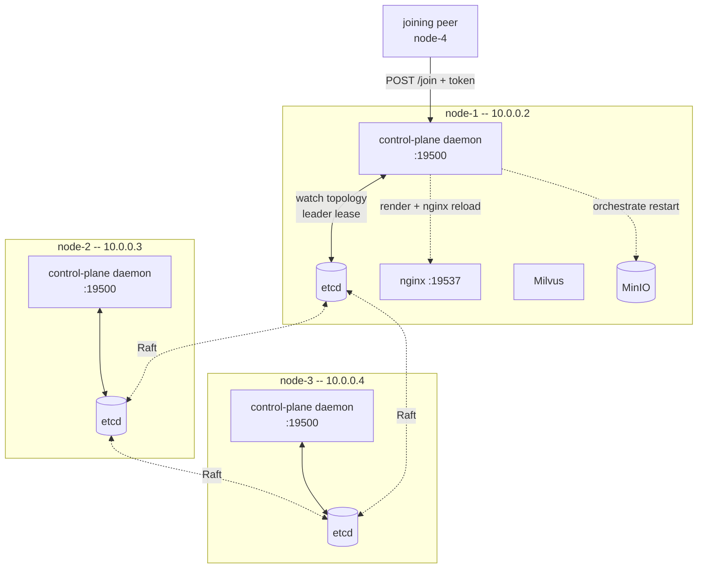
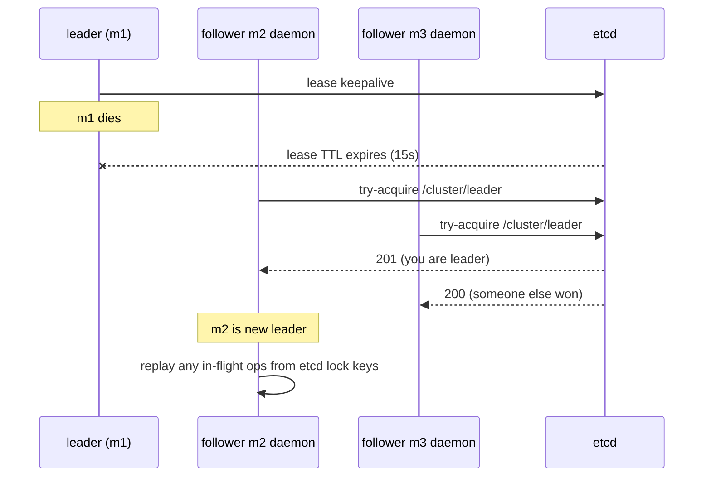

# Persistent control plane — design

> Status: **DRAFT** — pending operator review. No code changes derived
> from this doc until ratified. Once ratified, this doc is the spec
> for Stages 2-7 of the implementation.

## 1 — Why

Today's deploy flow has hard friction the operator has flagged on
real hardware:

- `init` requires every peer's IP up-front (`--peer-ips=A,B,C`).
- `add-node` is a 4-step manual dance: orchestrator-side `add-node`,
  per-peer `update-peers`, MinIO rolling restart, then `pair`/`join`
  on the new VM.
- The "rolling restart" of MinIO is broken: `docker restart` doesn't
  pick up the new compose command, and even with `--force-recreate`,
  MinIO's expansion path is `mc admin pool add` (separate pool), not
  server-list edits on an existing pool.
- `pair` is ephemeral — 10-minute idle timeout — so timing matters.
- No central authority to coordinate cluster-wide operations
  (rolling restarts, topology changes, future remove-node).

We're paying for these every time we scale. The design below replaces
the ephemeral `pair` flow with a **persistent control plane** that
runs on every node, elects a leader through etcd, holds cluster
topology in etcd, and orchestrates topology changes automatically.

## 2 — Goals & non-goals

### Goals

- One operator command per node grow: `./milvus-onprem join
  <existing-peer>:19500 <cluster-token>`. No `--peer-ips`. No
  per-peer `update-peers`. No `pair`.
- Topology lives in etcd. Every node watches it; render + nginx
  reload + MinIO orchestration happen automatically when it changes.
- Leader-elected control plane (HA): no SPOF for control operations.
- `init` UX: prompt or `--mode=standalone|distributed`. Distributed
  mode bootstraps a cluster-mode-of-1 ready to grow.
- MinIO scale-out: leader sequences expansion via `mc admin pool
  add` (new pool per growth event). No risky server-list edits.
- Backwards compat: **none**. We start fresh per operator's call.

### Non-goals (this design / v1)

- mTLS / cert distribution. Auth is a shared cluster token.
- `remove-node`. Punt to v1.1 once the add path is solid.
- Zero-downtime mode flip standalone↔distributed. We require
  teardown + re-init to switch modes.
- API versioning. Single version; bump deliberately if we ever
  need it.

## 3 — Architecture



### Key roles

- **Daemon (every node)** — Python HTTP server. Written in `~500 lines`
  total across `daemon/main.py`, `daemon/leader.py`, `daemon/api.py`,
  `daemon/topology.py`. Containerised, runs in the rendered compose
  next to Milvus.
- **Leader (one at a time)** — Whichever daemon holds the etcd
  leader lease. Handles all writes (`/join`, topology updates,
  MinIO orchestration). Followers redirect writes via 307 to leader.
- **Followers** — All other daemons. Serve reads (`/status`,
  `/topology`, `/cluster-env`). Watch etcd topology key; on change,
  re-render + nginx reload locally.

## 4 — State model

| Where | What | Why |
|---|---|---|
| `cluster.env` (per node) | cluster name, version, ports, image repos, MinIO secret, **CLUSTER_TOKEN** | Bootstrap config; secrets shouldn't be in etcd. |
| etcd `/cluster/topology/peers/<node-name>` | `{ip, hostname, joined_at, role}` | Source of truth for membership. Watched by all daemons. |
| etcd `/cluster/leader` | lease key with daemon ID | Leader election. Single holder; lease auto-expires. |
| etcd `/cluster/minio_pools` | list of pool entries (added pools over time) | MinIO expansion uses pool-add; we track pool history. |
| etcd `/cluster/locks/minio_restart` | lease lock | Serialises rolling restarts. |
| `rendered/<node-name>/` | per-node compose + milvus.yaml + nginx.conf | Generated; re-rendered on topology change. |

Notable: `PEER_IPS` is **gone from cluster.env**. It's derived at
runtime from etcd. cluster.env now holds only "what doesn't change
when the cluster grows."

## 5 — Lifecycle

### 5.1 — Init (standalone)

```
$ ./milvus-onprem init --mode=standalone
[init] cluster name: milvus-onprem
[init] mode: standalone (single VM, no HA)
[init] writing cluster.env
[init] running host_prep
[init] starting docker compose (etcd + minio + milvus, no control plane daemon)
[init] OK ready at http://10.0.0.2:19530
```

Single node, single-instance services. No control plane (it's not
needed for a static deploy). Identical to today's standalone flow.

### 5.2 — Init (distributed)

```
$ ./milvus-onprem init --mode=distributed
[init] cluster name: milvus-onprem
[init] mode: distributed (multi-VM, HA)
[init] generating CLUSTER_TOKEN: f3a8...c12d
[init] writing cluster.env
[init] running host_prep
[init] starting docker compose (etcd cluster-mode-of-1 + MinIO 4-drive
       single-server + milvus standalone-cluster-mode + control plane)
[init] OK leader elected: node-1 (10.0.0.2)
[init] cluster up. To add a peer:
         CLUSTER_TOKEN: f3a8...c12d
         on the new VM:
           ./milvus-onprem join 10.0.0.2:19500 f3a8...c12d
```

The N=1 deploy is **already in cluster mode**. Etcd has 1 member but
runs as a Raft cluster of 1 (`state=new`, single member). MinIO runs
as a single server with 4 bind-mount drives (4-drive distributed
minimum at single-server). Milvus runs in cluster-mode-of-1.

This means **growing from 1 to 3 is uniform with growing from 5 to
7** — pure member-add, no mode flip. The cost is single-VM
distributed deploys carry a bit of overhead vs true standalone.
That's acceptable per operator (Q6).

### 5.3 — Grow (1 → 2 → 3 → ...)

On the new VM (m2):

```
$ ./milvus-onprem join 10.0.0.2:19500 f3a8...c12d
[join] contacting control plane at 10.0.0.2:19500
[join] auth OK
[join] received cluster.env, hostname=node-2
[join] running host_prep
[join] starting etcd (state=existing)
[join] starting MinIO
[join] starting Milvus
[join] starting control plane daemon
[join] OK joined cluster as node-2 (10.0.0.3)
```

**What the leader does in response to the `/join` call:**

1. Verify token from `Authorization: Bearer ...` matches CLUSTER_TOKEN.
2. Allocate next `node-N` name (atomic via etcd transaction).
3. Call `etcdctl member add node-N --peer-urls=http://<joiner-ip>:2380`.
4. Write `/cluster/topology/peers/node-N` with joiner's IP + hostname.
5. Acquire `/cluster/locks/minio_restart` lease.
6. Add a new MinIO pool: `mc admin pool add http://<joiner-ip>:9000/data1..4`.
7. Release lock.
8. Return `cluster.env` body + assigned hostname to joiner.

**What every daemon (including leader) does on topology change:**

1. Watch fires.
2. Re-render this node's templates.
3. Reload nginx (`nginx -s reload`).
4. **No** local docker restart for MinIO — pool expansion is
   server-side; existing peers don't restart.

This means scale-out is **non-disruptive on existing peers**. The
only pause is on the joining node, while it's bootstrapping.

### 5.4 — Leader failover



In-flight operations (a partially-completed `/join`) are recoverable
because every step writes to etcd before the next. New leader scans
locks/in-progress keys on takeover and resumes or rolls back.

## 6 — HTTP API

All requests require `Authorization: Bearer <CLUSTER_TOKEN>`.

| Method + path | Who | What |
|---|---|---|
| `POST /join` | external (new VM) | Add peer to cluster. Leader only — followers 307. |
| `GET /cluster-env` | existing peer | Fetch latest cluster.env (e.g. after token rotation). |
| `GET /topology` | anyone | Current peers + roles. |
| `GET /leader` | anyone | Who is leader right now. |
| `GET /health` | anyone | This daemon's local view of cluster + self. |
| `POST /restart-minio` | internal | Trigger leader-coordinated rolling restart. Reserved. |
| `GET /version` | anyone | Daemon version. |

**Response shape — `POST /join`:**

```json
{
  "node_name": "node-2",
  "cluster_env": "<full cluster.env contents>",
  "leader_ip": "10.0.0.2",
  "topology": [
    {"name": "node-1", "ip": "10.0.0.2"},
    {"name": "node-2", "ip": "10.0.0.3"}
  ]
}
```

## 7 — MinIO scale-out (the right way)

The CLAUDE.md "rolling restart with new server list" approach is
broken (server-list change isn't a supported MinIO expansion path).
The supported path is `mc admin pool add`:

```
mc admin pool add local http://<new-ip>:9000/data1 \
                        http://<new-ip>:9000/data2 \
                        http://<new-ip>:9000/data3 \
                        http://<new-ip>:9000/data4
```

This adds a **new pool** alongside the existing one. New writes
balance across pools by capacity; existing data stays where it is.

Implications:

- The N=1 deploy starts with 4 drives in 1 server (pool 1). When
  m2 joins, we add pool 2 = 4 drives on m2. When m3 joins, pool 3
  on m3. Each peer = 1 pool of 4 drives.
- The 4-drive minimum at single-server is satisfied by 4
  bind-mount paths under `/data/minio/{drive1,drive2,drive3,drive4}`.
- No rolling restart of existing MinIOs needed. Pool-add is online.
- **Trade-off:** existing data doesn't get re-balanced. If you
  scale 1 → 5 then ingest a lot, the new ingest spreads across
  pools 1-5; old data stays in pool 1. Acceptable for normal
  growth patterns.

## 8 — Implementation stages

(Same staging discussed in chat — listed here for completeness.)

| # | Stage | Scope | Validates |
|---|---|---|---|
| 2 | Daemon scaffold | Python HTTP server, etcd leader lease, topology watch (no real endpoints, just heartbeat + leader log). Containerised. | Leader election + watch loop work. |
| 3 | `init` rewrite | `--mode=standalone\|distributed`. Cluster-mode-of-1 bootstrap for distributed. Token issuance. | First-deploy works. |
| 4 | `join` rewrite | Talks to persistent endpoint with token. Replaces pair/join. | Add 1→2. |
| 5 | Topology watch + auto-render | Every daemon watches etcd, re-renders + nginx-reloads on change. Removes update-peers. | Add 2→3 with auto-propagation. |
| 6 | Auto MinIO pool-add | Leader calls `mc admin pool add` on join. | MinIO storage actually grows. |
| 7 | Validation | End-to-end on 4 VMs: init distributed, grow 1→2→3→4, leader failover drill, smoke + replication-proof at each step. | Phase 2 -level proof. |

## 9 — Open questions / things to ratify before code

- **Port for control plane.** I'm proposing **19500** (replacing
  ephemeral pair). Alternative: 19501 to keep them separate.
  Pick: 19500.
- **Token rotation.** Manual for v1 (operator edits cluster.env
  + restarts daemons). Worth automating later.
- **Per-IP allowlist.** The cluster token alone gates joins. Should
  joins also require the leader to pre-authorize the IP (one-time
  ACL)? Adds a step but defends against token leakage. Default for
  v1: no — token alone is enough.
- **Daemon container image.** Build our own (`Dockerfile.daemon`,
  `python:3.12-slim` base + a few packages)? Or pre-publish to a
  registry? For v1: build locally on each node from a Dockerfile
  shipped in repo. Avoids registry dependency.
- **Etcd client library.** `python-etcd3` is the obvious choice but
  has been unmaintained. Alternative: HTTP/gRPC directly. For v1:
  shell out to `etcdctl` for write ops (simpler), use a thin
  Python wrapper for watches.
- **What happens when the joining VM's daemon also needs to come
  up before its container can be reached?** Bootstrap order on the
  joiner: etcd first (state=existing) → daemon → MinIO →
  Milvus. The daemon won't be reachable from outside until etcd
  gives it the lease, but that's fine — it's not the leader on
  first start anyway.
- **Where does the hostname / display name come from?** Sequential
  `node-N` allocated by leader at `/join` time, written to etcd.
  Stable across IP changes (if we ever support that).

## 10 — What this *removes* from the codebase

- `lib/cmd_pair.sh`
- `lib/cmd_add_node.sh` (functionality moves to leader's `/join`)
- `lib/cmd_update_peers.sh` (auto via topology watch)
- `lib/cmd_join.sh` (rewritten — talks to control plane HTTP, not
  pair server)
- The `--peer-ips=` flag from `cmd_init.sh` (replaced by mode flag)

Plus updates to: `lib/role.sh` (PEER_IPS now comes from etcd at
daemon-load time, with cluster.env as a stale-OK cache),
`lib/render.sh` (called by daemon on topology watch, not by
`bootstrap`), `lib/cmd_bootstrap.sh` (delegates to daemon for
multi-node).

Net: probably **fewer total lines of bash** (the manual orchestration
goes away) plus ~500 lines of Python.

## 11 — Validation plan (Stage 7)

- Init distributed on m1.
- Add m2 via `join`.  Verify topology in etcd, render auto-applied
  on m1, MinIO pool-add ran, smoke passes.
- Add m3, m4 same way.
- `05_prove_replication` returns identical hits on all 4 peers,
  with **MinIO actually 4-pool** (not the orphaned m4 we ended up
  with).
- Leader failover: `docker stop milvus-onprem-cp` on m1 → m2 takes
  leadership within ~15s → status reports new leader → joining a
  hypothetical m5 still works against m2's leader.
- Recover m1: bring daemon back, verify it joins as follower.
- Take down m1 entirely (`docker stop milvus-etcd milvus-minio
  milvus milvus-onprem-cp milvus-nginx`). Verify cluster keeps
  serving (3-of-4 etcd quorum, 3 MinIO pools still available,
  nginx on m2/m3/m4 routes around dead m1's Milvus).

---

**Next step after operator ratification:** I move to Stage 2
(daemon scaffold) and start cutting code, one stage per commit.
