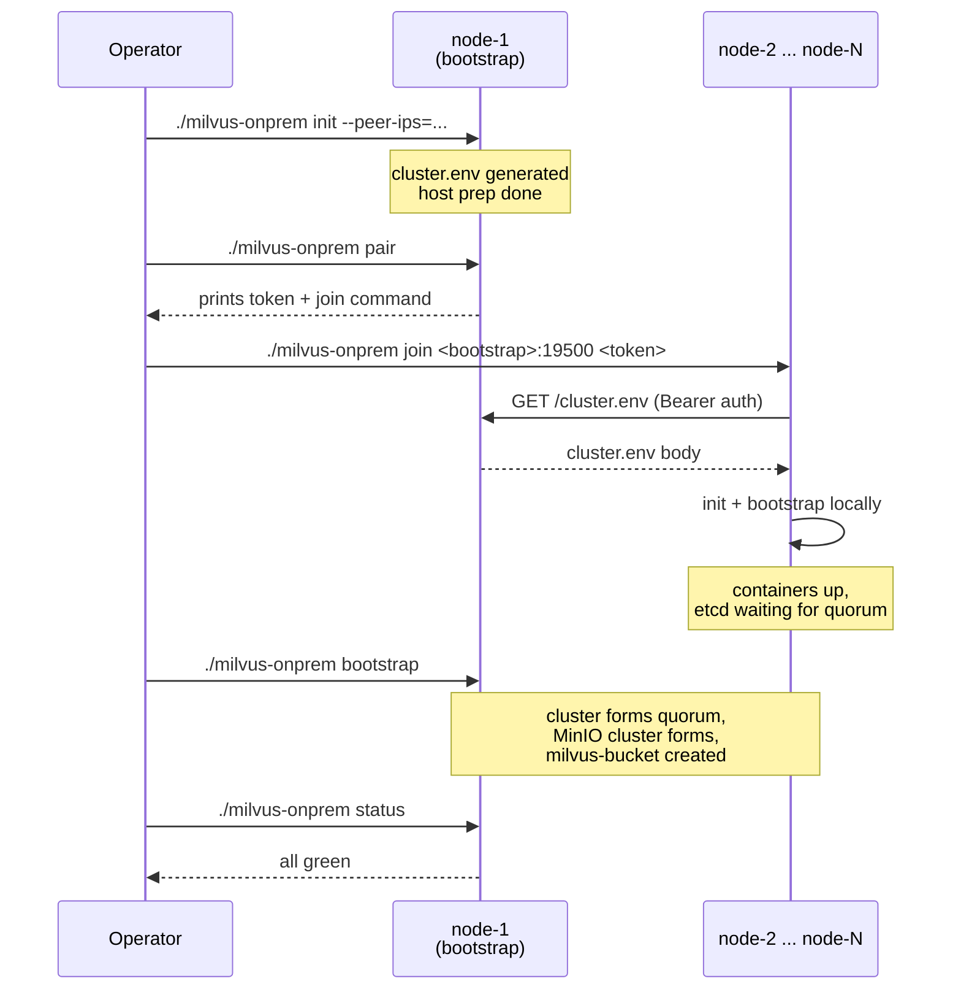

# Deployment

Step-by-step deployment reference for milvus-onprem.

> **First-time?** [GETTING_STARTED.md](GETTING_STARTED.md) is the
> shorter quickstart with the recommended 3-node 2.6 path. This doc
> is the comprehensive reference covering edge cases, port matrices,
> firewall rules, and prerequisites in detail.

Worked example: 3-node deploy. Adjust IPs and node count for your size.

If you hit problems, see [TROUBLESHOOTING.md](TROUBLESHOOTING.md).
For day-2 ops, see [OPERATIONS.md](OPERATIONS.md).

---

## Prerequisites

### Nodes

- 1, 3, 5, 7, or 9 Linux VMs (even sizes rejected — see
  [ARCHITECTURE.md](ARCHITECTURE.md#why-cluster-size-must-be-1-3-5)).
- Each VM at least **4 vCPU / 16 GB RAM / 50 GB disk**.
- Same internal network — every node must be able to reach every other
  node on the ports below.
- Each VM has a **stable internal IP** that you know in advance. Position
  in `PEER_IPS` determines node identity.

VMs can be **anywhere** — AWS, GCP, Azure, on-prem (VMware / Proxmox /
KVM), bare metal, hybrid, even local dev (VirtualBox / Multipass).
The CLI is cloud-agnostic: no cloud APIs called, no cloud DNS, just
direct IP-over-TCP between peers. See
[the README's "Supported environments" section](../README.md#supported-environments)
for the full list.

### Software on each VM

- Linux (any distro)
- Docker Engine ≥ 24.x with the Compose plugin (`docker compose version`)
- Operator user has **passwordless sudo** (used by `init` to chown
  `${DATA_ROOT}`)
- Operator user is in the **`docker` group**
- `curl`, `python3`, `git`, `tar` available

### Network ports between nodes

| Port | Service | Required between |
|---|---|---|
| 2379 / 2380 | etcd (client / peer) | every node ↔ every node |
| 9000 | MinIO API | every node ↔ every node |
| 9091 | Milvus healthz | every node ↔ every node |
| 19530 | Milvus gRPC | every node ↔ every node |
| 19537 | nginx LB | every node ↔ every node + clients |
| 19500 | pair (HTTP rendezvous) | bootstrap node ← every other node, ONLY DURING INITIAL DEPLOY |

The pair port (`19500`) is only used during the first deploy. After all
peers have joined, it can be closed in your firewall.

### Air-gapped / restricted-egress sites

The cluster is fully cloud-agnostic — no `gcloud` / `aws` / `az` calls,
no metadata service, no DNS dependencies, IP-only inter-node traffic.
The only outbound dependencies are at *deploy time*:

1. **Container image pulls** from public registries (`milvusdb`,
   `quay.io/coreos`, `minio`, `apachepulsar`, `nginx`). For air-gapped
   sites, mirror these to your internal registry and override the
   `*_IMAGE_REPO` variables in `cluster.env` — see
   [CONFIG.md "Image repositories"](CONFIG.md#image-repositories-air-gapped--mirrored-registries).
2. **`milvus-backup` binary** download from GitHub on first
   `create-backup` / `restore-backup`. Pre-place the binary at
   `~/milvus-onprem/.local/bin/milvus-backup` on every peer to skip the
   fetch — see
   [OPERATIONS.md "Air-gapped backup binary"](OPERATIONS.md#air-gapped-backup-binary).

At runtime the cluster runs entirely over local IPs. The required
state — etcd Raft, distributed MinIO, Milvus etcd-based service
discovery — uses peers in `PEER_IPS` directly. No external service
resolution is performed.

---

## Deployment overview



Five steps total:

1. **Clone the repo** on every node (same path, same commit).
2. **Init + pair on bootstrap node.** Bootstrap node is whichever you
   pick — by convention `node-1` (first IP in `PEER_IPS`).
3. **Join from every other node.** Each one auto-runs init + bootstrap
   on itself.
4. **Bootstrap on the bootstrap node** to wire up the full cluster
   (etcd quorum + distributed MinIO + bucket creation).
5. **Verify** with `status` and `smoke`.

Estimated time: **~10–15 minutes** total for a 3-node deploy.

---

## Step 1 — Clone the repo on every node

On **every node**:

```bash
git clone https://github.com/codeadeel/milvus-onprem.git ~/milvus-onprem
cd ~/milvus-onprem
git log --oneline -1
```

Same commit on every node. Drift here will cause subtle bugs.

---

## Step 2 — Init + pair on the bootstrap node

Pick one node as the bootstrap node. Run on **node-1** (first IP in
`PEER_IPS`):

```bash
cd ~/milvus-onprem
./milvus-onprem init \
  --peer-ips=10.0.0.10,10.0.0.11,10.0.0.12
```

What this does:
1. Validates the peer count (must be 1 or odd ≥ 3).
2. Auto-generates a random `MINIO_SECRET_KEY` (printed loudly — needs
   to match across all peers, but `pair` distributes it for you).
3. Writes `cluster.env` (gitignored) with all defaults baked in.
4. Runs host prep: `mkdir -p ${DATA_ROOT}/{etcd,minio,milvus}` with
   the right ownership (UID 1000 for etcd/minio, your user for milvus).

**Optional flags:**

```bash
./milvus-onprem init \
  --peer-ips=10.0.0.10,10.0.0.11,10.0.0.12 \
  --milvus-port=29530 \           # custom Milvus port
  --lb-port=29537 \               # custom LB port
  --minio-secret-key=<existing>   # use a specific secret instead of generating
```

See `./milvus-onprem init --help` for the full flag list.

---

## Step 3 — Pair on the bootstrap node

Still on the bootstrap node:

```bash
./milvus-onprem pair
```

This starts a Python HTTP server on `:19500` that serves `cluster.env`
to authenticated peers. Output looks like:

```
==> pair server starting on 10.0.0.10:19500
    token: 4f5a8b2c91d3...
    expected fetches: 2 (one per non-bootstrap peer)

On EACH OTHER peer VM, run:

    milvus-onprem join 10.0.0.10:19500 4f5a8b2c91d3...

Server exits after 2 fetches or 10 min idle. Ctrl-C to abort.

[pair] listening on 0.0.0.0:19500
```

**Copy the entire `milvus-onprem join ...` line.** Don't retype the
token — it's 32 random hex chars.

The pair server stays running until either:
- All `(N-1)` peers have fetched (auto-exits)
- 10 minutes of idle (auto-exits)
- You Ctrl-C (manual abort; rerun `pair` to mint a new token)

---

## Step 4 — Join from every other node

On **each other peer** (in our example: `node-2` and `node-3`):

```bash
cd ~/milvus-onprem
./milvus-onprem join 10.0.0.10:19500 4f5a8b2c91d3...
```

Each `join` does, automatically:
1. Fetches `cluster.env` from the bootstrap node (Bearer auth).
2. Validates the file has `PEER_IPS=`.
3. Runs host prep (`mkdir + chown ${DATA_ROOT}`).
4. Runs the full `bootstrap` flow (render templates → start etcd →
   start MinIO → wait for peer reachability → start Milvus → start
   nginx → wait for cluster convergence → create `milvus-bucket`).

For each peer, the join + bootstrap takes ~3–5 minutes. The bootstrap
on the second-and-later peers may print warnings about etcd quorum —
that's expected because the bootstrap node hasn't run its own
bootstrap yet (next step).

---

## Step 5 — Bootstrap on the bootstrap node

Once all other peers have run `join`, the pair server on the bootstrap
node will exit on its own. Now run bootstrap there too:

```bash
./milvus-onprem bootstrap
```

This is the same flow each `join` ran — render → up → wait → bucket.
With this, **all N etcd members are now running**, quorum forms, MinIO
distributed cluster forms, and Milvus comes up healthy on every node.

You'll see something like:

```
==> Stage 1/7: render templates
==> Stage 2/7: start etcd
[OK] local etcd OK
==> Stage 3/7: start MinIO
  distributed MinIO — waiting for all peers to reach :9000
[OK] MinIO cluster health OK
==> Stage 4/7: start Milvus
==> Stage 5/7: start nginx LB
==> Stage 6/7: wait for cluster-wide convergence
[OK] cluster converged in 8s
==> Stage 7/7: ensure milvus-bucket exists in MinIO
[OK] minio: bucket 'milvus-bucket' already exists
==> bootstrap complete on node-1
```

---

## Step 6 — Verify

From any node:

```bash
./milvus-onprem status
./milvus-onprem wait
```

`status` should show:
- All 4 local containers running
- All local reachability checks `[OK]`
- All peer reachability checks `[OK]`

`wait` should converge in seconds.

Then run the smoke test:

```bash
pip3 install --user --break-system-packages -r test/requirements.txt
python3 test/smoke-test.py
```

Should end with `SMOKE TEST PASSED`. The first `replica_number=2` load
takes 1–3 minutes on a fresh cluster (cold cache); subsequent loads
are sub-second.

---

## Step 7 (recommended) — Verify replication

Run the pymilvus tutorial, which includes a per-peer replication proof:

```bash
cd test/tutorial
for f in 0*.py 1*.py; do echo "### $f"; python3 "$f"; done
```

The interesting one is `05_prove_replication.py` — it queries every
peer directly (bypassing the LB) and prints the same hit from each
node. If they all return identical `id` and `dist`, you've got real
working redundancy.

---

## Common stumbles

| Symptom | Cause | Fix |
|---|---|---|
| `init` fails: "could not match hostname -I against PEER_IPS" | This VM's IP isn't in `PEER_IPS` | Run `hostname -I`, confirm the IP is what you put in `PEER_IPS`, fix as needed. Set `FORCE_NODE_INDEX=N` to override. |
| `pair`: `cannot bind 10.x.x.x:19500: Address already in use` | Old pair server still running, or another process on that port | `sudo ss -tlnp \| grep 19500` to find it, kill. Or use `PAIR_PORT=19501 ./milvus-onprem pair` and adjust the join command. |
| `join`: `fetch failed` | Token typo, pair server exited, or firewall | Most likely: re-run `pair` on bootstrap to mint a fresh token. |
| `bootstrap` Stage 3: `MinIO cluster health` warnings | Distributed MinIO needs all peers reachable; not yet | Expected if other peers haven't bootstrapped yet — re-run `bootstrap` after they do. |
| `smoke`: hangs at `load (replica_number=2)` for >5 min | Only one Milvus has registered with QueryCoord | Check `docker logs milvus` on each peer; usually a slow startup. |

For the rest, see [TROUBLESHOOTING.md](TROUBLESHOOTING.md).

---

## What "done" looks like

- `./milvus-onprem status` on every node shows all green.
- `./milvus-onprem wait` returns immediately.
- `python3 test/smoke-test.py` prints `SMOKE TEST PASSED`.
- `python3 test/tutorial/05_prove_replication.py` shows every peer
  returning identical results.
- A `pymilvus.MilvusClient("http://<any-node>:19537").list_collections()`
  call works from a client outside the cluster.

That's a working HA Milvus deploy. Hand the URL `http://<any-node>:19537`
to your dev team and you're done.
