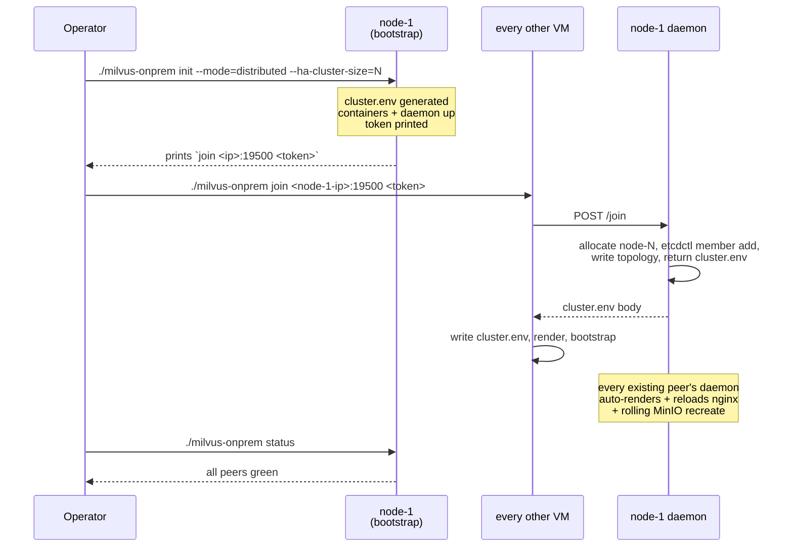

# Deployment

Step-by-step deployment for milvus-onprem.

For a faster path see [GETTING_STARTED.md](GETTING_STARTED.md). For
per-command reference see [CLI.md](CLI.md). For ops after deploy see
[OPERATIONS.md](OPERATIONS.md). For symptom→fix see
[TROUBLESHOOTING.md](TROUBLESHOOTING.md).

## Prerequisites

### Nodes

- 1, 3, 5, 7, or 9 Linux VMs. Even sizes are accepted with a warning
  but tolerate the same loss count as the next-lower odd size.
- Each VM at least **4 vCPU / 16 GB RAM / 50 GB disk**.
- Same internal network — every node reaches every other node on the
  ports below.
- Each VM has a **stable internal IP**.

VMs can be anywhere — AWS, GCP, Azure, on-prem (VMware / Proxmox /
KVM), bare metal, hybrid, local dev. The CLI is cloud-agnostic: no
cloud APIs, no cloud DNS, IP-over-TCP between peers.

### Software on each VM

- Linux (any distro)
- Docker Engine ≥ 24.x with the Compose plugin (`docker compose version`)
- Operator user has **passwordless sudo** (used by `init` to chown
  `${DATA_ROOT}`)
- Operator user is in the **`docker` group**
- `curl`, `python3`, `git`, `tar` available

### Network ports between nodes

| Port | Service | Direction |
|---|---|---|
| 2379 / 2380 | etcd (client / peer) | every node ↔ every node |
| 9000 / 9091 | MinIO API / console | every node ↔ every node |
| 19500 | control-plane daemon | every node ↔ every node |
| 19530 | Milvus gRPC | every node ↔ every node |
| 19537 | nginx LB | every node ↔ every node + clients |
| 6650 / 8080 | Pulsar (2.5 only) | PULSAR_HOST ↔ every other node |

Run `./milvus-onprem preflight --peer --peers=<peer-ip>` on a fresh
VM to verify reachability before deploy.

### Air-gapped / restricted-egress sites

Outbound dependencies at deploy time only:

1. **Container image pulls** from public registries (`milvusdb`,
   `quay.io/coreos`, `minio`, `apachepulsar`, `nginx`). Mirror these
   to your internal registry and override the `*_IMAGE_REPO` variables
   in `cluster.env` — see
   [CONFIG.md "Image repositories"](CONFIG.md#image-repositories-air-gapped--mirrored-registries).
2. **`milvus-backup` binary** download from GitHub on first
   `create-backup` / `restore-backup`. Pre-place the binary at
   `${REPO_ROOT}/.local/bin/milvus-backup` on every peer to skip the
   fetch — see
   [OPERATIONS.md "Air-gapped backup binary"](OPERATIONS.md#air-gapped-backup-binary).

At runtime the cluster runs entirely over local IPs.

## Deploy flow



Three steps:

1. **Clone the repo** on every VM.
2. **`init --mode=distributed` on the first VM.** Prints the join
   command.
3. **`join` on every other VM.** Done.

Estimated time: ~10 minutes total for 3 nodes.

## Step 1 — Clone the repo on every VM

On every node:

```bash
git clone https://github.com/codeadeel/milvus-onprem.git ~/milvus-onprem
cd ~/milvus-onprem
git log --oneline -1
```

Same commit on every node.

## Step 2 — Init on the bootstrap VM

Pick one VM as the bootstrap node. On it:

```bash
cd ~/milvus-onprem
./milvus-onprem init --mode=distributed --ha-cluster-size=3
```

`--ha-cluster-size=N` (use the planned cluster size) renders the
first N peers as one MinIO erasure-coded pool that tolerates loss of
any single host. Skip it for a no-host-loss-tolerance cluster that
scales out more freely — see
[FAILOVER.md § MinIO pool layout](FAILOVER.md#minio-pool-layout).

What this does:

1. Auto-runs `preflight --local` (docker, disk, ports, tools).
2. Generates `MINIO_SECRET_KEY` and `CLUSTER_TOKEN` (256-bit each).
3. Writes `cluster.env` (gitignored).
4. Runs host prep (`mkdir -p ${DATA_ROOT}/{etcd,minio,milvus}` with
   the right ownership).
5. Builds the daemon image locally.
6. Brings up etcd (cluster-mode-of-1), MinIO, Milvus, nginx, and the
   control-plane daemon.

Output ends with the join command for other peers:

```
========================================================================
  cluster up. To add peers, on each new VM run:

      ./milvus-onprem join 10.0.0.10:19500 <CLUSTER_TOKEN>
========================================================================
```

Save that one-liner. The token is also stored in `cluster.env` if you
need to retrieve it later.

### Useful init flags

```bash
./milvus-onprem init --mode=distributed --milvus-version=v2.5.4 --ha-cluster-size=3
./milvus-onprem init --mode=distributed --data-root=/srv/milvus --ha-cluster-size=3
./milvus-onprem init --mode=distributed --milvus-port=29530 --lb-port=29537 --ha-cluster-size=3
```

See `./milvus-onprem init --help` for the full flag list.

## Step 3 — Join from every other VM

On each other peer:

```bash
cd ~/milvus-onprem
./milvus-onprem join <bootstrap-ip>:19500 <CLUSTER_TOKEN>
```

What `join` does on the new VM:

1. Auto-runs `preflight --local`.
2. POSTs to the bootstrap node's `/join` endpoint with this VM's IP.
3. The bootstrap node's daemon allocates `node-N`, calls
   `etcdctl member add`, writes the topology entry, returns a
   fully-baked `cluster.env`.
4. The new VM writes that `cluster.env`, runs host prep, builds the
   daemon image, renders templates, and runs bootstrap with
   `ETCD_INITIAL_CLUSTER_STATE=existing`.
5. Existing peers' daemons watch the topology change and
   auto-re-render + reload nginx + rolling-restart MinIO.

Per-peer time: ~30-60s for the join itself, ~90s extra for the
rolling MinIO sweep on existing peers.

## Step 4 — Verify

From any node:

```bash
./milvus-onprem status                       # all peers green
./milvus-onprem wait                         # converges in seconds

pip3 install --user --break-system-packages -r test/requirements.txt
./milvus-onprem smoke                        # functional test
```

`smoke` ends with `SMOKE TEST PASSED`. The first `replica_number=2`
load takes 1–3 minutes on a fresh cluster.

## Step 5 (optional) — Verify replication

```bash
cd test/tutorial
for f in 0*.py 1*.py; do echo "### $f"; python3 "$f"; done
```

`05_prove_replication.py` queries every peer directly (bypassing the
LB) and prints the same top hit from each node. Identical `id` and
`dist` across peers = working replication.

## Common stumbles

| Symptom | Cause | Fix |
|---|---|---|
| `init` fails: "could not match hostname -I against PEER_IPS" | This VM's IP isn't in `PEER_IPS` (only relevant once peers have joined) | Run `hostname -I`, confirm. Set `FORCE_NODE_INDEX=N` to override. |
| `join` fails: HTTP timeout / connection refused | Firewall blocks port 19500 between peers | Open port 19500 between peers. Run `./milvus-onprem preflight --peer --peers=<bootstrap-ip>` to verify. |
| `join` fails: 401 / 403 | Token typo or rotated since you copied it | Retrieve current `CLUSTER_TOKEN` from any peer's `cluster.env` (it's the source of truth). |
| `bootstrap` Stage 3: `MinIO cluster health` warnings | Distributed MinIO needs all peers reachable; only some have joined | Expected during rolling join. Re-run after the next join. |
| `smoke` hangs at `load (replica_number=2)` for >5 min | Only one Milvus has registered with querycoord | Check `docker logs milvus` on each peer. |

For the rest, see [TROUBLESHOOTING.md](TROUBLESHOOTING.md).

## What "done" looks like

- `./milvus-onprem status` on every node shows all peers green.
- `./milvus-onprem wait` returns in seconds.
- `./milvus-onprem smoke` prints `SMOKE TEST PASSED`.
- `python3 test/tutorial/05_prove_replication.py` shows every peer
  returning identical results.
- `pymilvus.MilvusClient("http://<any-node>:19537").list_collections()`
  works from any client.
