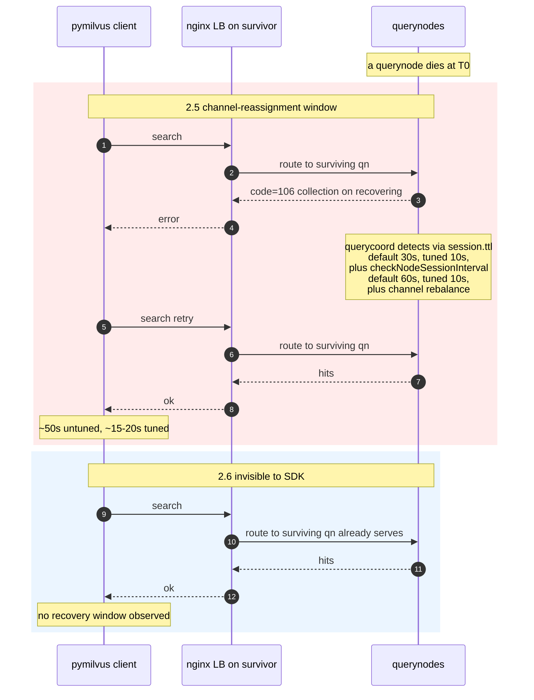
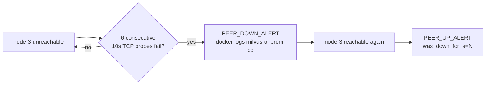
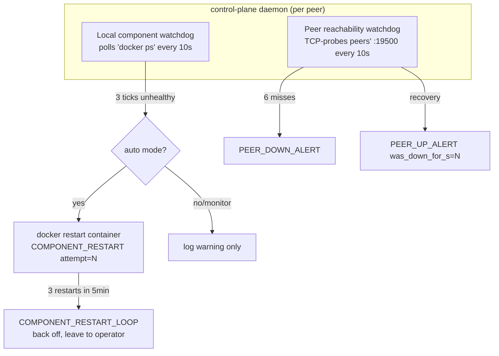
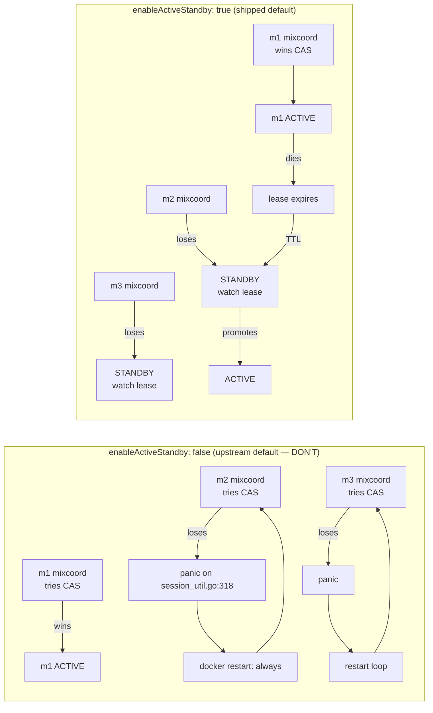

# Failover behavior

What this cluster does when a node dies, how to observe it, and what
the SDK caller is expected to handle. Findings are from the 3-node
failover drill on real GCP VMs (m1/m2/m3), Apr 2026.

## Summary

| Topology | Recovery window | First-read failure mode | Operator action |
|---|---|---|---|
| **Milvus 2.6 + Woodpecker** | ~0s observed | none — bare reads keep working | bring node back; auto-rejoin |
| **Milvus 2.5 + Pulsar** (default cfg) | ~50s | `code=106 collection on recovering` until querycoord rebalances channels | retry with backoff; bring node back |
| **Milvus 2.5 + Pulsar** (tuned cfg) | ~15–20s | same `code=106` window, just shorter | same as above |

### What the SDK sees on 2.5 vs 2.6



The watchdog runs **inside the control-plane daemon** on every peer
(no separate systemd unit) and emits a `PEER_DOWN_ALERT` after the
`MILVUS_ONPREM_WATCHDOG_PEER_FAILURE_THRESHOLD` consecutive misses
(default 6 × 10s = 60s) on **any** topology. It is independent of
Milvus's own failure detection and is purely an alerting loop:



## What's actually happening

When a node dies, three failure-detection layers work independently:

1. **etcd Raft** — etcd peers lose contact with the dead member's
   lease in milliseconds; quorum holds with `(N-1)/2` member loss.
2. **MinIO erasure coding** — surviving drives keep serving reads/
   writes for the missing share; degraded mode is transparent.
3. **Milvus session/health** — coord and node sessions in etcd have
   a TTL (`common.session.ttl`, default 30s). The lease only expires
   *after* the TTL, then querycoord runs its node-session check
   (`queryCoord.checkNodeSessionInterval`, default 60s) and starts
   reassigning DML channels to surviving querynodes. **In-flight
   reads during this window get `code=106 collection on recovering`.**

On 2.6 in **standalone** mode each VM runs the consolidated milvus
binary with embedded coord + worker + Woodpecker WAL, so a node loss
takes the cluster (it's a single-VM deploy by definition). On 2.6
in **distributed** mode (the cluster mode milvus-onprem ships) the
coord layer is centralized — one ACTIVE mixcoord across every peer,
others standby — and shard-leader assignment goes through queryCoord
the same way as 2.5. So 2.6 distributed needs the same failure-
detection tunings as 2.5; without them, a peer outage left shard
leaders pointed at the dead querynode for ~50s before reassignment,
during which queries failed with `code=503: no available shard
leaders`. The tunings below close that window to ~15-20s.

## SDK-side: retry on recovery errors

The canonical fix is client-side retry with backoff. A small helper
ships in [`test/tutorial/_shared.py`](../test/tutorial/_shared.py):

```python
from _shared import retry_on_recovering
hits = retry_on_recovering(lambda: client.search(...))
```

It only retries known recovery-class messages (`recovering`,
`no available`, `channel not available`, `channel checker not ready`,
`node not found`) and re-raises everything else, so real bugs still
surface. Default budget is 120s. **Load-bearing on both 2.5 and 2.6
distributed** — the worst-case shard whose delegator was on the dead
peer can take ~60-180s for queryCoord to re-promote, so the retry
budget needs to comfortably cover that. Bump to `budget_s=240` if
your cluster has slow disks or many shards.

## Server-side: tuning 2.5 and 2.6 for faster recovery

Both `templates/2.5/milvus.yaml.tpl` and `templates/2.6/milvus.yaml.tpl`
ship these tightened defaults:

```yaml
common:
  session:
    ttl: 10                         # was 30 — etcd lease expires faster
queryCoord:
  checkNodeSessionInterval: 10      # was 60 — detect dead node sooner
  heartbeatAvailableInterval: 5000  # was 10000 — shorter heartbeat window
```

Effect on **2.5**: the `code=106 collection on recovering` window
drops from ~50s untuned to ~15-20s in 3-node drills.

Effect on **2.6 distributed**: most queries (those NOT on the
specific shard whose delegator was on the dead peer) recover in the
same ~5-15s window — the proxy stops sending to the dead querynode
quickly. But for the worst-case shard (the one whose delegator was
on the dead peer), Milvus 2.6's queryCoord delegator-reassignment is
**not gated by these knobs** — `balanceIntervalSeconds` was tested
and didn't move the needle. In 4-peer drills, that one shard's
queries can return `code=503 no available shard leaders` for ~60-180s
before queryCoord re-promotes a delegator on a healthy peer. The
SDK retry pattern below is what makes this transparent to the app.

**Tradeoff: tighter timeouts mean a higher chance of false-positive
eviction under transient network jitter.** On a LAN with sub-ms
latency this is fine. Over WAN with bursty packet loss, lift the
values closer to defaults. Edit the relevant `templates/<version>/
milvus.yaml.tpl`, re-render with `milvus-onprem render`, and `up`
to apply.

## Replica placement for HA

Milvus's shard-leader assignment is per-shard, not per-collection.
With `replica_number=2` in a 4-peer cluster, both replicas of a
given shard can land on the same pair of peers — and if one of
those peers fails, the other has to serve all that shard's queries
alone. If the failed peer happened to be the leader, the
`heartbeatAvailableInterval` window above gates the failover.

For maximum query availability under single-peer loss in a 4+-peer
cluster, load with `replica_number=3`:

```python
client.load_collection("my_coll", replica_number=3)
```

`milvus-onprem restore-backup --load` picks this automatically:

| Cluster size | Default `replica_number` |
|---|---|
| 1 | 1 |
| 2-3 | 2 |
| 4+ | 3 |

Operators on smaller clusters (or who care more about resource use
than availability) can override post-restore with an explicit
`load_collection(... replica_number=N)`.

## Watchdog observation

The watchdog runs **inside the control-plane daemon container** on
every peer (no systemd unit, no install step). Two background tasks:



To observe alerts on any peer:

```bash
docker logs -f milvus-onprem-cp 2>&1 | grep -E 'PEER_(DOWN|UP)_ALERT|COMPONENT_'
```

Alert lines (single-line, parses straight to a dict):

```
PEER_DOWN_ALERT        ts=<unix> node=<name> ip=<ip> consecutive_failures=N
PEER_UP_ALERT          ts=<unix> node=<name> ip=<ip> was_down_for_s=N
COMPONENT_RESTART      ts=<unix> container=<name> reason=unhealthy attempt=N
COMPONENT_RESTART_LOOP ts=<unix> container=<name> restarts_in_5m=N
```

`was_down_for_s` measures from the down-alert time, not the actual
outage start (which is up to `peer_failure_threshold × interval` ≈
60s earlier).

`MILVUS_ONPREM_WATCHDOG_MODE=monitor` switches off the local
auto-restart but keeps both the unhealthy detection and all peer
alerts active. See [CONFIG.md § Watchdog](CONFIG.md#watchdog) for
the full env-var reference.

## 2.5 mixcoord active-standby (HA at the coord layer)

In a 3-node 2.5 cluster, only ONE mixcoord can hold the singleton
coord session keys (`by-dev/meta/session/{rootcoord,datacoord,querycoord,indexcoord}`)
at a time — etcd CompareAndSwap is the leader-election primitive.
The other two mixcoords need somewhere to wait. Two configs:



`templates/2.5/milvus.yaml.tpl` ships `enableActiveStandby: true`
for all four coords. Hardware drill: stopping the active mixcoord
on m1 promoted m2's standby querycoord to ACTIVE in **483ms**,
versus the old config's many-second coord-down window. Without this
flag the cluster *appears* to work because workers are unaffected
(they use suffixed session keys, no collision), but the control
plane is a single point of failure.

This setting only applies to 2.5. 2.6's `milvus run standalone`
binary co-locates coord and worker per node, so there's no separate
mixcoord to elect.

## Recovery procedure

For a transient outage (reboot, cable, container OOM):

1. **Don't panic.** Cluster keeps serving reads (writes too on 2.6;
   on 2.5 if the dead node isn't `PULSAR_HOST`).
2. **Retry SDK calls** that raised `code=106` — most succeed within
   ~20s on tuned 2.5, immediately on 2.6. Use `retry_on_recovering`.
3. **Bring the node back**: `./milvus-onprem up` on the recovered
   node. `restart: always` on the containers means a simple
   `systemctl start docker` is often enough after a host reboot.
4. **Verify**: `./milvus-onprem status` from any peer should show all
   peers green. `wait` should converge in seconds.
5. **Cross-peer consistency check**: run
   `test/tutorial/05_prove_replication.py` to confirm every peer
   returns the same hits for the same query.

For a permanently-lost node (disk failure, reimage), the procedure
involves `etcdctl member remove` + a fresh init/join — see
[Replacing a permanently-lost node](TROUBLESHOOTING.md#replacing-a-permanently-lost-node)
in TROUBLESHOOTING.md.
