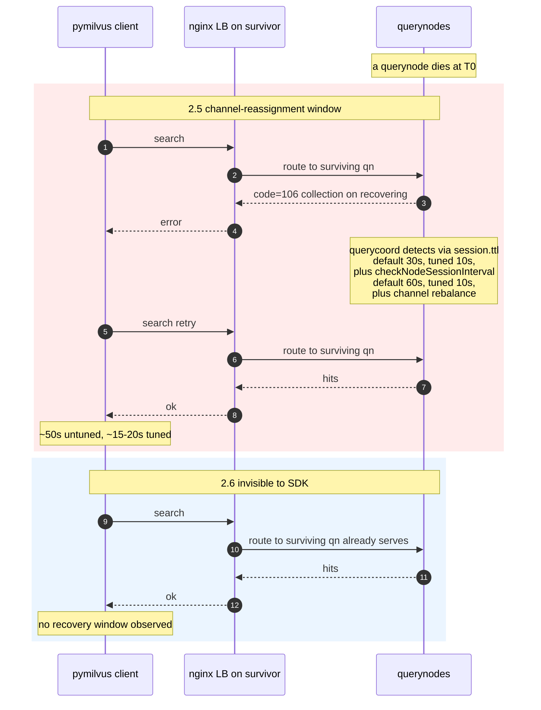
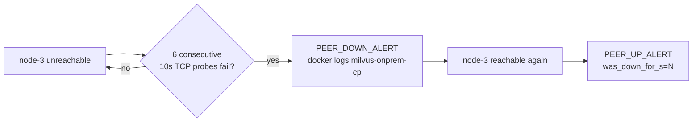
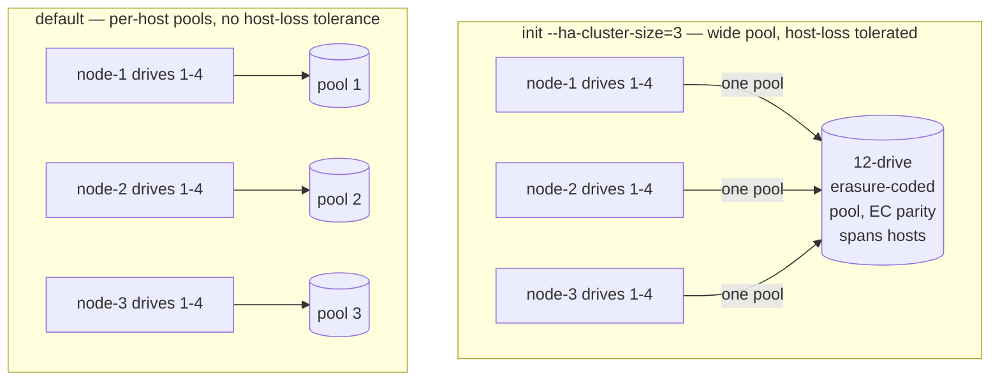
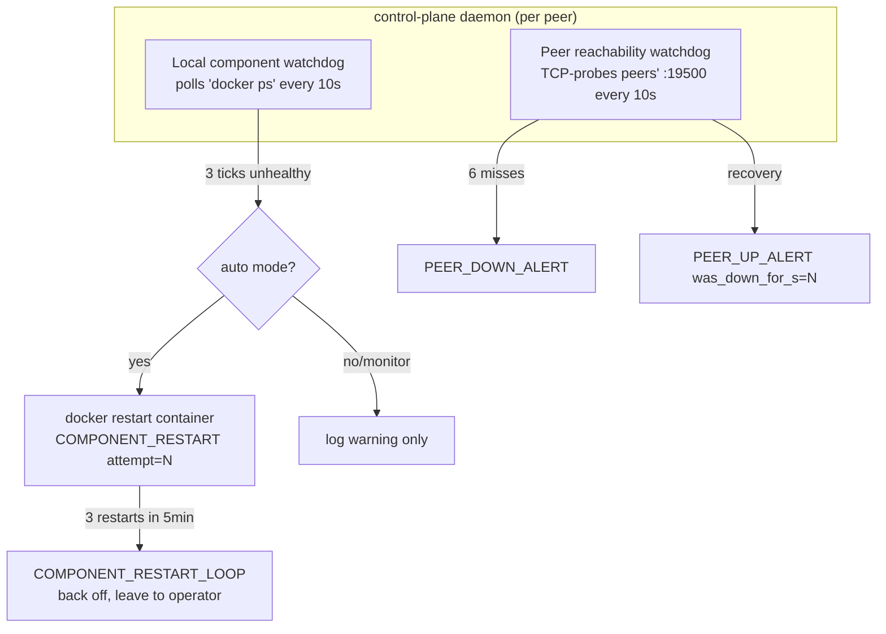
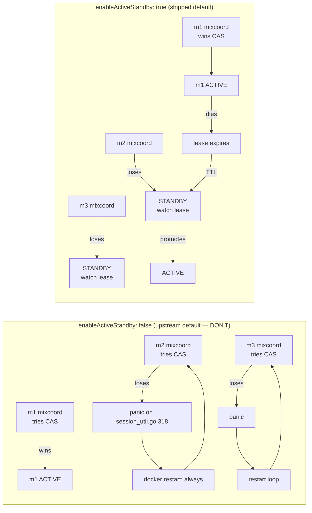

# Failover behavior

What this cluster does when a node dies, how to observe it, and what
the SDK caller is expected to handle. Findings are from the 3-node
failover drill on real GCP VMs (m1/m2/m3), Apr 2026.

## Summary

| Topology | Recovery window | First-read failure mode | Operator action |
|---|---|---|---|
| **Milvus 2.6 + Woodpecker** | ~0s observed | none — bare reads keep working | bring node back; auto-rejoin |
| **Milvus 2.5 + Pulsar** (default cfg) | ~50s | `code=106 collection on recovering` until querycoord rebalances channels | retry with backoff; bring node back |
| **Milvus 2.5 + Pulsar** (tuned cfg) | ~15–20s | same `code=106` window, just shorter | same as above |

### What the SDK sees on 2.5 vs 2.6



The watchdog runs **inside the control-plane daemon** on every peer
(no separate systemd unit) and emits a `PEER_DOWN_ALERT` after the
`MILVUS_ONPREM_WATCHDOG_PEER_FAILURE_THRESHOLD` consecutive misses
(default 6 × 10s = 60s) on **any** topology. It is independent of
Milvus's own failure detection and is purely an alerting loop:



## What's actually happening

When a node dies, three failure-detection layers work independently:

1. **etcd Raft** — etcd peers lose contact with the dead member's
   lease in milliseconds; quorum holds with `(N-1)/2` member loss.
2. **MinIO erasure coding** — host-loss tolerance depends on which
   pool layout was chosen at `init` (see [MinIO pool layout](#minio-pool-layout)
   below). With `init --ha-cluster-size=N`, the first N peers form a
   single erasure-coded pool that tolerates loss of any one host —
   reads and writes keep flowing on the survivors. Without the flag,
   each peer is its own pool and a host outage takes the bucket
   offline (any `ListObjects` call fails with `0 drives provided`,
   which cascades into a Milvus streamingnode boot panic).
3. **Milvus session/health** — coord and node sessions in etcd have
   a TTL (`common.session.ttl`, default 30s). The lease only expires
   *after* the TTL, then querycoord runs its node-session check
   (`queryCoord.checkNodeSessionInterval`, default 60s) and starts
   reassigning DML channels to surviving querynodes. **In-flight
   reads during this window get `code=106 collection on recovering`.**

On 2.6 in **standalone** mode each VM runs the consolidated milvus
binary with embedded coord + worker + Woodpecker WAL, so a node loss
takes the cluster (it's a single-VM deploy by definition). On 2.6
in **distributed** mode (the cluster mode milvus-onprem ships) the
coord layer is centralized — one ACTIVE mixcoord across every peer,
others standby — and shard-leader assignment goes through queryCoord
the same way as 2.5. So 2.6 distributed needs the same failure-
detection tunings as 2.5; without them, a peer outage left shard
leaders pointed at the dead querynode for ~50s before reassignment,
during which queries failed with `code=503: no available shard
leaders`. The tunings below close that window to ~15-20s.

## MinIO pool layout

`init --ha-cluster-size=N` (distributed mode only) chooses how MinIO
spreads erasure parity across hosts. The flag is frozen at init —
the only way to change it is teardown plus re-init.



**HA layout** (`--ha-cluster-size=N>=3`): the first N peers register
under sequential aliases `mio-1 ... mio-N` (resolved via the minio
container's `extra_hosts` block) and MinIO sees a single
`http://mio-{1...N}:9000/drive{1...4}` ellipsis — one pool, 4N
drives. Default MinIO parity is `EC:N` for an N-host set, so loss of
any one host leaves enough drives for read AND write quorum. Peers
that join AFTER the initial N land in additional per-host pools
(no cross-host parity for their share of writes). The wide pool's
`format.json` stays untouched at grow time.

**Legacy layout** (no `--ha-cluster-size`): each peer is its own
pool. Joining and removing peers never disturbs neighbouring pools'
on-disk state, so scale-out is trivially safe — but losing a host
loses an entire pool, and any `ListObjects` call fans out across
all pools and fails the moment one is unreachable. The cascade is
real and observable: the failing list bubbles up into Milvus
streamingnode's chunk-manager precheck on every container restart,
which then panics with `init query node segcore failed [...]
listPathRaw: 0 drives provided` and crash-loops the cluster.

**Choose at init time:**

| Goal | Flag |
|---|---|
| Survive any single host going offline | `--ha-cluster-size=<peer count>` |
| Frequent scale-out, tolerate manual remove-node only | omit the flag |

For a 3-VM cluster known up front, `--ha-cluster-size=3` is the
right default. Run it on the bootstrap node:

```bash
./milvus-onprem init --mode=distributed --milvus-version=v2.6.11 \
                     --ha-cluster-size=3
```

Then `join` from each remaining VM as usual. MinIO on the bootstrap
node logs `Waiting for at least 1 remote servers...` until the
peers appear; each peer's join triggers a rolling-recreate that
fills in the `mio-K → <ip>` mapping in every other peer's
`extra_hosts`, and bootstrap completes once the quorum is reachable.

## SDK-side: retry on recovery errors

The canonical fix is client-side retry with backoff. A small helper
ships in [`test/tutorial/_shared.py`](../test/tutorial/_shared.py):

```python
from _shared import retry_on_recovering
hits = retry_on_recovering(lambda: client.search(...))
```

It only retries known recovery-class messages (`recovering`,
`no available`, `channel not available`, `channel checker not ready`,
`node not found`) and re-raises everything else, so real bugs still
surface. Default `max_wait_s=120`. **Load-bearing on both 2.5 and
2.6 distributed** — the worst-case shard whose delegator was on the
dead peer can take ~60-180s for queryCoord to re-promote, so the
retry budget needs to comfortably cover that. Bump to
`max_wait_s=240` if your cluster has slow disks or many shards:

```python
hits = retry_on_recovering(lambda: client.search(...), max_wait_s=240)
```

## Server-side: tuning 2.5 and 2.6 for faster recovery

Both `templates/2.5/milvus.yaml.tpl` and `templates/2.6/milvus.yaml.tpl`
ship these tightened defaults:

```yaml
common:
  session:
    ttl: 10                         # was 30 — etcd lease expires faster
queryCoord:
  checkNodeSessionInterval: 10      # was 60 — detect dead node sooner
  heartbeatAvailableInterval: 5000  # was 10000 — shorter heartbeat window
```

Effect on **2.5**: the `code=106 collection on recovering` window
drops from ~50s untuned to ~15-20s in 3-node drills.

Effect on **2.6 distributed**: most queries (those NOT on the
specific shard whose delegator was on the dead peer) recover in the
same ~5-15s window — the proxy stops sending to the dead querynode
quickly. But for the worst-case shard (the one whose delegator was
on the dead peer), Milvus 2.6's queryCoord delegator-reassignment is
**not gated by these knobs** — `balanceIntervalSeconds` was tested
and didn't move the needle. In 4-peer drills, that one shard's
queries can return `code=503 no available shard leaders` for ~60-180s
before queryCoord re-promotes a delegator on a healthy peer. The
SDK retry pattern below is what makes this transparent to the app.

**Tradeoff: tighter timeouts mean a higher chance of false-positive
eviction under transient network jitter.** On a LAN with sub-ms
latency this is fine. Over WAN with bursty packet loss, lift the
values closer to defaults. Edit the relevant `templates/<version>/
milvus.yaml.tpl`, re-render with `milvus-onprem render`, and `up`
to apply.

## Auto-migrate Pulsar on host failure (2.5 only, opt-in)

In 2.5 distributed mode the Pulsar broker is a singleton on
`PULSAR_HOST`. When that peer dies, all Milvus reads AND writes stop
— proxy can't even bootstrap without a working Pulsar. The manual
fix is `./milvus-onprem migrate-pulsar --to=<other-peer>` BEFORE the
host is shut down. For unplanned outages, the daemon can do this
automatically.

**Opt-in via `cluster.env`** (default off):

```bash
AUTO_MIGRATE_PULSAR_ON_HOST_FAILURE=true
AUTO_MIGRATE_PULSAR_THRESHOLD=30   # ~5 min at the default 10s watchdog tick
```

When enabled, the leader's `PeerReachabilityWatchdog` watches every
peer. If `PULSAR_HOST` misses `AUTO_MIGRATE_PULSAR_THRESHOLD`
consecutive probes (default 30 = ~5 min, much longer than the
60s `PEER_DOWN_ALERT` threshold to absorb network blips), the leader
submits a `migrate-pulsar` job to move Pulsar onto the next-eligible
surviving peer (sorted node-N order, lowest first). Emits a single-
line audit log:

```
AUTO_MIGRATE_PULSAR ts=<unix> from=<down-name> to=<new-host> job_id=<uuid>
```

**Tradeoff — read this before enabling.** `migrate-pulsar` drops
any Pulsar messages that were in-flight at the moment Pulsar died:
writes the broker hadn't acknowledged are LOST. This is a property
of the Pulsar singleton model, not of the auto-migrate feature
itself. If your write path can't tolerate that, leave the flag
false and use the manual `migrate-pulsar` command before planned
shutdowns. For 2.6 (Woodpecker per-peer WAL) this whole class of
failure mode doesn't exist — `MQ_TYPE=pulsar` is the gate, so on
2.6 the flag is a no-op even if set.

The flag is intentionally per-cluster, not per-peer — only the
leader fires the migrate so cluster-wide one peer makes the call.
After auto-migrate runs once for an outage, it's marked "fired"
for that down-peer and won't re-fire until the original peer
recovers (then the flag clears so a future outage of the new host
can also auto-failover). The system does NOT auto-migrate-back
when the original host returns — that would risk write-loss-on-
bounce ping-pong; the operator can manually `migrate-pulsar` back
if desired.

## Replica placement for HA

Milvus's shard-leader assignment is per-shard, not per-collection.
With `replica_number=2` in a 4-peer cluster, both replicas of a
given shard can land on the same pair of peers — and if one of
those peers fails, the other has to serve all that shard's queries
alone. If the failed peer happened to be the leader, the
`heartbeatAvailableInterval` window above gates the failover.

For maximum query availability under single-peer loss in a 4+-peer
cluster, load with `replica_number=3`:

```python
client.load_collection("my_coll", replica_number=3)
```

`milvus-onprem restore-backup --load` picks this automatically:

| Cluster size | Default `replica_number` |
|---|---|
| 1 | 1 |
| 2-3 | 2 |
| 4+ | 3 |

Operators on smaller clusters (or who care more about resource use
than availability) can override post-restore with an explicit
`load_collection(... replica_number=N)`.

## Watchdog observation

The watchdog runs **inside the control-plane daemon container** on
every peer (no systemd unit, no install step). Two background tasks:



To observe alerts on any peer:

```bash
docker logs -f milvus-onprem-cp 2>&1 | grep -E 'PEER_(DOWN|UP)_ALERT|COMPONENT_'
```

Alert lines (single-line, parses straight to a dict):

```
PEER_DOWN_ALERT        ts=<unix> node=<name> ip=<ip> consecutive_failures=N
PEER_UP_ALERT          ts=<unix> node=<name> ip=<ip> was_down_for_s=N
COMPONENT_RESTART      ts=<unix> container=<name> reason=unhealthy attempt=N
COMPONENT_RESTART_LOOP ts=<unix> container=<name> restarts_in_5m=N
```

`was_down_for_s` measures from the down-alert time, not the actual
outage start (which is up to `peer_failure_threshold × interval` ≈
60s earlier).

`MILVUS_ONPREM_WATCHDOG_MODE=monitor` switches off the local
auto-restart but keeps both the unhealthy detection and all peer
alerts active. See [CONFIG.md § Watchdog](CONFIG.md#watchdog) for
the full env-var reference.

## 2.5 mixcoord active-standby (HA at the coord layer)

In a 3-node 2.5 cluster, only ONE mixcoord can hold the singleton
coord session keys (`by-dev/meta/session/{rootcoord,datacoord,querycoord,indexcoord}`)
at a time — etcd CompareAndSwap is the leader-election primitive.
The other two mixcoords need somewhere to wait. Two configs:



`templates/2.5/milvus.yaml.tpl` ships `enableActiveStandby: true`
for all four coords. Hardware drill: stopping the active mixcoord
on m1 promoted m2's standby querycoord to ACTIVE in **483ms**,
versus the old config's many-second coord-down window. Without this
flag the cluster *appears* to work because workers are unaffected
(they use suffixed session keys, no collision), but the control
plane is a single point of failure.

This setting only applies to 2.5. 2.6's `milvus run standalone`
binary co-locates coord and worker per node, so there's no separate
mixcoord to elect.

## Recovery procedure

For a transient outage (reboot, cable, container OOM):

1. **Don't panic.** Cluster keeps serving reads (writes too on 2.6;
   on 2.5 if the dead node isn't `PULSAR_HOST`).
2. **Retry SDK calls** that raised `code=106` — most succeed within
   ~20s on tuned 2.5, immediately on 2.6. Use `retry_on_recovering`.
3. **Bring the node back**: `./milvus-onprem up` on the recovered
   node. `restart: always` on the containers means a simple
   `systemctl start docker` is often enough after a host reboot.
4. **Verify**: `./milvus-onprem status` from any peer should show all
   peers green. `wait` should converge in seconds.
5. **Cross-peer consistency check**: run
   `test/tutorial/05_prove_replication.py` to confirm every peer
   returns the same hits for the same query.

For a permanently-lost node (disk failure, reimage), the procedure
involves `etcdctl member remove` + a fresh init/join — see
[Replacing a permanently-lost node](TROUBLESHOOTING.md#replacing-a-permanently-lost-node)
in TROUBLESHOOTING.md.
