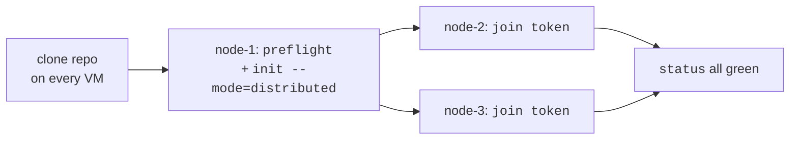

# Getting started — first-time deploy

You have N Linux VMs (1, 3, 5, 7, or 9) on a private subnet. You want
HA Milvus running on them in ~15 minutes, without Kubernetes.
Here's the path.

> **For a deeper feature-by-feature walkthrough**, see [TUTORIAL.md](TUTORIAL.md).
> This doc is the first-time-deploy quickstart.

## Prerequisites

On every VM:

- **Linux** — any distro, kernel ≥ 4.x
- **Docker Engine ≥ 24** with the Compose plugin
- Operator user in the `docker` group (or willing to use `sudo`)
- This repo cloned at `~/milvus-onprem` (or anywhere — we'll use that path here)
- ≥ 5 GB free under `/data` (configurable)
- Inter-peer TCP reachability on:
  - **2379** etcd client
  - **2380** etcd peer Raft
  - **9000** MinIO
  - **9091** Milvus health
  - **19500** control-plane daemon
  - **19530** Milvus gRPC
  - **19537** nginx LB
  - **6650, 8080** (only if Milvus 2.5 + Pulsar)

You can verify all the above with:

```bash
./milvus-onprem preflight
```

It checks docker / disk / required ports / inter-peer TCP and reports
any blocker before you spend 90 seconds spinning up containers.

## Pick your shape

Two decisions before you start:

**1. Milvus version**

| Option | Best for |
|---|---|
| **2.6.11** (recommended) | New deploys. Embedded Woodpecker WAL, no Pulsar, simpler topology — 5 containers per peer (etcd, MinIO, Milvus, nginx, control-plane daemon). |
| **2.5.4** | Existing 2.5 data, library compat constraints. 9-10 containers per peer (per-component coords + Pulsar singleton). [SPOF caveat applies](../templates/2.5/README.md#spof-caveat-the-pulsar-singleton). |

**2. Cluster size**

| Size | Why |
|---|---|
| 1 | Standalone — single VM, no HA. Dev / smoke / single-host deploys. |
| 3 | Smallest HA size. Raft tolerates 1 peer down. **Recommended starting point.** |
| 5, 7, 9 | Larger fleets. Each step up adds one more failure tolerance. |

Even sizes (2, 4, 6) are accepted with a warning — they tolerate the
same failure count as the next-lower odd size.

## Deploy — 3-node 2.6 (the recommended path)

### Step 1: pick a bootstrap node

Pick one VM as the "bootstrap" node. We'll call it `node-1`. It runs
the first `init` and serves the cluster config to peers via the
control-plane daemon's `/join` endpoint.



### Step 2: bootstrap on node-1

```bash
cd ~/milvus-onprem
./milvus-onprem preflight                                     # ① sanity check
./milvus-onprem init --mode=distributed --milvus-version=v2.6.11 \
                     --ha-cluster-size=3                      # ② host-loss tolerant
```

`--ha-cluster-size=N` declares the initial peer count so MinIO renders
the first N peers as one erasure-coded pool that survives loss of any
single host. Pick `N` to match your planned cluster size (3 in this
walkthrough). Omit the flag if you'd rather scale out freely than
tolerate single-host outages — see
[FAILOVER.md § MinIO pool layout](FAILOVER.md#minio-pool-layout) for
the trade-off.

What `init` does:

1. Writes `cluster.env` with cluster-wide secrets and defaults.
2. Generates a 256-bit `CLUSTER_TOKEN` (the bearer token every peer uses).
3. Builds the daemon image locally (`milvus-onprem-cp:dev`).
4. Renders `rendered/node-1/{docker-compose.yml,milvus.yaml,nginx.conf}`.
5. Runs bootstrap stages: hosts dirs → pulls images → etcd → MinIO → daemon → milvus → bucket.

Output ends with the join command for peers:

```
./milvus-onprem join 10.0.0.10:19500 <CLUSTER_TOKEN>
```

**Save that one-liner** — you'll paste it on every other peer.

### Step 3: verify node-1 is healthy

```bash
./milvus-onprem status        # local + peer reachability
./milvus-onprem ps            # 5 containers — milvus, milvus-etcd, milvus-minio, milvus-nginx, milvus-onprem-cp
```

The daemon log (`docker logs milvus-onprem-cp`) should show
`acquired leadership (lease=…)` — node-1 is now leader of a
cluster-of-1.

### Step 4: join node-2 and node-3

On each other peer, run the same command (paste from Step 2's output):

```bash
cd ~/milvus-onprem
./milvus-onprem preflight --local              # quick local sanity
./milvus-onprem join 10.0.0.10:19500 <CLUSTER_TOKEN>
```

What `join` does:

1. Pre-flight (skippable with `--skip-preflight`).
2. POSTs to node-1's `/join` endpoint with this peer's IP.
3. The leader allocates `node-N`, calls etcd member-add, returns
   a fully-baked `cluster.env` for this peer.
4. This peer writes the cluster.env, builds the daemon image,
   renders templates, runs bootstrap with
   `ETCD_INITIAL_CLUSTER_STATE=existing` (etcd joins the running
   Raft instead of trying to bootstrap a fresh cluster).
5. ~30-60s and you see `joined as node-2 (leader=10.0.0.10)`.

### Step 5: verify the cluster

From any node:

```bash
./milvus-onprem status
```

Expected: every peer reachable on etcd / minio / milvus.
Header reads `cluster size: 3 (peers: 10.0.0.10,10.0.0.11,10.0.0.12)`.

### Step 6: prove it works

```bash
./milvus-onprem smoke
```

Creates a `smoke_test` collection, inserts 1000 random vectors with
HNSW, loads with `replica_number=2`, runs an ANN top-5, runs a hybrid
filter query, verifies row count, drops the collection. **PASSED line
at the bottom = your cluster is live.**

## Connect a client

Clients connect to **any peer's `:19537`** (the nginx layer-4 LB).
Routes to a healthy backend; no peer is "primary" for clients.

```python
from pymilvus import MilvusClient
c = MilvusClient(uri="http://10.0.0.10:19537")
print(c.list_collections())
```

`./milvus-onprem urls` prints all four reachable URLs at any time.

### First insert + search (copy-paste-able)

The end-to-end "I can search vectors now" path takes 5 calls:

```python
from pymilvus import MilvusClient, DataType
import random

c = MilvusClient(uri="http://10.0.0.10:19537")    # any peer's LB

# 1. Schema + index — declared together
schema = c.create_schema()
schema.add_field("id",  DataType.INT64,        is_primary=True)
schema.add_field("vec", DataType.FLOAT_VECTOR, dim=128)
idx = c.prepare_index_params()
idx.add_index("vec", index_type="HNSW", metric_type="COSINE")
c.create_collection("demo", schema=schema, index_params=idx)

# 2. Load with replicas spread across peers — replica_number=3 needs >= 3 peers
c.load_collection("demo", replica_number=3)

# 3. Insert + flush
rows = [{"id": i, "vec": [random.random() for _ in range(128)]}
        for i in range(1000)]
c.insert("demo", rows)
c.flush("demo")

# 4. Search
hits = c.search("demo", data=[[0.5] * 128], limit=5,
                anns_field="vec",
                search_params={"metric_type": "COSINE"})
print(hits)
```

### Failover-safe reads (recommended for production apps)

During topology changes (peer dies, upgrade running, auto-migrate-pulsar
firing), Milvus may briefly return recovery-class errors like
`no available shard leaders` or `index not found`. Wrap reads in the
shipped retry helper:

```python
import sys; sys.path.insert(0, "test/tutorial")
from _shared import retry_on_recovering

hits = retry_on_recovering(lambda: c.search(...), max_wait_s=240)
```

`max_wait_s=240` covers the worst-case shard-leader failover window
on 2.6 distributed (~60-180s on a busy cluster). For 2.5 the typical
window is ~15-20s; default 120 is fine.

For a 10-step pymilvus walkthrough (insert, load, search, filter,
mutate, inspect, replication-prove, cleanup), see
[`test/tutorial/`](../test/tutorial/).

## Add a 4th node later

```bash
# On the new VM (m4):
cd ~/milvus-onprem
./milvus-onprem join 10.0.0.10:19500 <CLUSTER_TOKEN>
```

That's it. Same `join` command as the original peers. The daemon:
- adds m4 to etcd Raft as `node-4`
- writes the topology entry, fanning out to all peers
- triggers a sequenced rolling MinIO recreate (~30s/peer, no
  cluster-wide blip — only one MinIO down at a time)
- m4 joins; nginx upstreams update; cluster size = 4

### Different data path on this peer? Use `--data-root`

If the new peer has a different mount layout from the others (e.g.
fast NVMe at `/mnt/nvme` instead of `/data`), pass `--data-root`:

```bash
./milvus-onprem join 10.0.0.10:19500 <CLUSTER_TOKEN> --data-root=/mnt/nvme
```

That peer will store its etcd / MinIO / Milvus / Pulsar data under the
override path. Other peers keep `/data`. Override survives all topology
changes (rotate-token, remove-node, upgrade) and `teardown` correctly
wipes the right path on each peer.

## What now?

| You want to … | Read |
|---|---|
| Run every shipped feature with examples | [TUTORIAL.md](TUTORIAL.md) |
| Tune ports / thresholds / image versions | [CONFIG.md](CONFIG.md) |
| Take backups / restore / scale out | [OPERATIONS.md](OPERATIONS.md) |
| Understand failure recovery behavior | [FAILOVER.md](FAILOVER.md) |
| Diagnose a specific symptom | [TROUBLESHOOTING.md](TROUBLESHOOTING.md) |
| Understand the daemon design | [CONTROL_PLANE.md](CONTROL_PLANE.md) |

## Quick reference card

```bash
# Verify before doing anything
./milvus-onprem preflight                  # sanity-check ports / docker / inter-peer TCP

# Lifecycle
./milvus-onprem init --mode=distributed --milvus-version=v2.6.11 --ha-cluster-size=3
./milvus-onprem join <bootstrap-ip>:19500 <token>           # on each new peer
./milvus-onprem teardown --full --force                     # destroy + wipe data

# Day-2 operations
./milvus-onprem status                     # cluster + peer health
./milvus-onprem smoke                      # 1000-row functional test
./milvus-onprem urls                       # connection URLs to give clients
./milvus-onprem ps                         # container state
./milvus-onprem logs <component> --tail=200

# Backup / restore
./milvus-onprem backup-etcd
./milvus-onprem create-backup --name=daily_backup
./milvus-onprem export-backup --name=daily_backup --to=/tmp/backups/daily
./milvus-onprem restore-backup --name=daily_backup --rename=src:dst --load

# Scale + upgrade
./milvus-onprem upgrade --milvus-version=v2.6.12
./milvus-onprem remove-node --ip=<peer>

# Cluster hygiene
./milvus-onprem maintenance --all --confirm     # prune-images + logs + etcd-jobs sweep
./milvus-onprem rotate-token                    # atomic across-peer

# Daemon-job introspection
./milvus-onprem jobs list
./milvus-onprem jobs show <id>
./milvus-onprem jobs cancel <id>
```

## When something goes wrong

Three sources of truth:

1. **`./milvus-onprem status`** — the operator-facing summary
2. **`docker logs <container> --tail=200`** — what milvus / etcd / minio / nginx are saying
3. **`docker logs milvus-onprem-cp 2>&1 | grep -E 'PEER_(DOWN|UP)|COMPONENT_'`** — watchdog alerts in greppable form

If the symptom isn't obvious, check [TROUBLESHOOTING.md](TROUBLESHOOTING.md)
— it's symptom→fix indexed by what you actually see.
