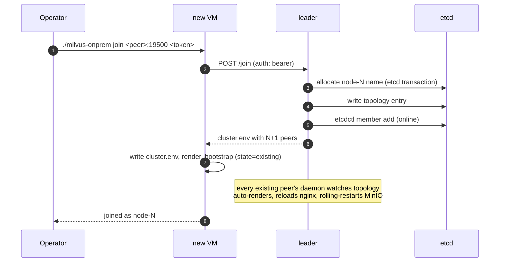

# Operations

Day-2 operational tasks. For first-time deploy see [DEPLOYMENT.md](DEPLOYMENT.md).
For when things break, see [TROUBLESHOOTING.md](TROUBLESHOOTING.md).

## Daily / regular operations

### Check cluster health

From any node:

```bash
./milvus-onprem status
./milvus-onprem wait              # blocks until convergence (good after restarts)
```

`status` shows:
- Local containers + their state (`docker ps`-style)
- Local reachability — etcd, MinIO, Milvus, nginx
- Per-peer reachability — every other node's services

All-green = healthy cluster.

### Smoke test

```bash
python3 test/smoke-test.py
```

Creates a temporary collection, inserts 1k vectors, loads with
`replica_number=2`, runs ANN + hybrid searches, drops the collection.
End-to-end validation of the data path.

If this fails after a previously-passing deploy, *something has
changed*. Check `status` and recent etcd / Milvus logs.

### Quick etcd snapshot

Cheap insurance before any risky operation (image bump, config
change, restore):

```bash
./milvus-onprem backup-etcd
# default output: /tmp/etcd-snapshot-YYYYMMDD-HHMMSS.db

./milvus-onprem backup-etcd --output=/path/to/safer/location.db
```

Snapshots are small (typically <100 MB even for sizable clusters).
Easy to keep daily backups via cron:

```cron
0 3 * * *  /home/operator/milvus-onprem/milvus-onprem backup-etcd --output=/backups/etcd-$(date +\%F).db
```

## Backup and restore

`create-backup` / `export-backup` / `restore-backup` wrap the official
`milvus-backup` CLI from Zilliz. The binary is auto-downloaded on
first use into `${REPO_ROOT}/.local/bin/milvus-backup`.

> **Backup name format:** alphanumerics + underscores only.
> `milvus-backup` rejects hyphens.

### Take a backup

```bash
./milvus-onprem create-backup --name=daily_2026_04_26
# stores in MinIO at milvus-bucket/backup/daily_2026_04_26/

./milvus-onprem create-backup --name=billing-only --collections=billing,invoices
# only the named collections

./milvus-onprem create-backup --list
# list all existing backups
```

### Export a backup off-cluster

`milvus-backup` snapshots live in MinIO. To copy one to a filesystem
(e.g. for off-site archival):

```bash
docker exec milvus-minio mc cp -r \
  local/milvus-bucket/backup/daily_2026_04_26/ \
  /data/exports/daily_2026_04_26/
```

(`local` is the MinIO alias `minio_mc` sets up; the path inside the
container maps to `${DATA_ROOT}/minio` on the host.)

### Restore a backup

```bash
# from a previously-created backup still in our MinIO:
./milvus-onprem restore-backup --skip-upload --name=daily_2026_04_26 --restore_index

# from a backup that was created elsewhere and lives in a filesystem dir:
./milvus-onprem restore-backup --from=/path/to/external_backup
# this mc-mirrors the dir into our MinIO first, then restores

# rename collections during restore (avoid clobbering live data):
./milvus-onprem restore-backup --from=/path/to/dev_export \
  --rename=source_coll:imported_v1
```

Typical timing:
- 1 GB backup: a few minutes
- 100 GB backup: 30-60 minutes (mostly the upload step)

### The 100-GB-from-developer scenario

A developer hands you 100 GB of `milvus-backup` data on a laptop.
To get it into the cluster:

```bash
# 1. Get the export directory onto any peer of the cluster, using
#    whatever transport your environment supports — shared NFS,
#    object copy, USB, scp from a jump host, etc. End state: the
#    backup directory lives somewhere on a peer's local filesystem.

# 2. From that peer, run:
./milvus-onprem restore-backup --from=/path/to/dev_export
```

### Useful flags for restore

```bash
# auto-load collections after restore (replica_number auto-derived from CLUSTER_SIZE):
./milvus-onprem restore-backup --from=~/dev_export --load

# overwrite existing collections (drops them first; requires pymilvus):
./milvus-onprem restore-backup --from=~/dev_export --drop-existing --load

# rename collections during restore (avoid clobbering live data):
./milvus-onprem restore-backup --from=~/dev_export --rename=src_coll:imported_v1
```

### Backup in N-node HA clusters

Backups work the **same way** on a 3/5/7-node HA cluster as they do
in standalone:

- **Run from any node.** The CLI talks to Milvus via the local LB
  (`:19537`) and to MinIO via local `:9000`. Distributed MinIO means
  any node's `:9000` serves the same content. Pick whichever node is
  most convenient — they're symmetric.
- **Backup data is itself redundant.** In distributed MinIO with N≥3
  nodes, the backup tree gets erasure-coded across all peers. Losing
  one node doesn't lose the backup. (Standalone single-drive MinIO
  has zero redundancy on its data; off-site `export-backup` is
  essential there.)
- **`--load` yields immediate read redundancy.** The auto-derived
  `replica_number` is `min(2, CLUSTER_SIZE)` — so on HA you get 2,
  meaning the restored collection is loaded onto **two QueryNodes
  on different nodes** the moment restore finishes. Either replica
  can serve queries if the other is taken out.
- **2.5 caveat: Pulsar singleton.** With Milvus 2.5, the message
  queue is a singleton on `PULSAR_HOST`. If that node is down at
  backup time, Milvus can't flush in-flight writes through it, so
  the default backup (which flushes first) fails.

  `milvus-onprem create-backup` handles this with a Pulsar
  reachability pre-flight. If Pulsar is down, the command refuses to
  start and tells you the two ways forward:

  1. Fix Pulsar first (`docker start milvus-pulsar` on `PULSAR_HOST`).
  2. Use `--strategy=skip_flush` to back up only what's already on
     disk — fast, but very recent writes still in the Pulsar WAL
     won't be included.

  See [templates/2.5/README.md](../templates/2.5/README.md#spof-caveat-the-pulsar-singleton)
  for the full SPOF discussion.

  **2.6 (Woodpecker) has no such concern** — the WAL is embedded in
  every Milvus instance, so any healthy node can flush.

### Air-gapped backup binary

`milvus-onprem create-backup` / `restore-backup` shell out to the
upstream `milvus-backup` binary. On first use the binary is downloaded
from `github.com/zilliztech/milvus-backup/releases` into
`~/milvus-onprem/.local/bin/milvus-backup`. Subsequent runs find it
cached and skip the download — no internet needed thereafter.

For air-gapped sites or restricted-egress environments, pre-place the
binary once on every node:

```bash
# on a connected machine, fetch the right asset for your target arch:
ver=v0.5.14    # or whatever MILVUS_BACKUP_VERSION you've pinned
curl -L -o /tmp/milvus-backup.tgz \
  "https://github.com/zilliztech/milvus-backup/releases/download/${ver}/milvus-backup_${ver#v}_Linux_x86_64.tar.gz"

# transfer the tarball into the air-gapped network, then on each peer:
mkdir -p ~/milvus-onprem/.local/bin
tar -xzf /path/to/milvus-backup.tgz -C ~/milvus-onprem/.local/bin/ milvus-backup
chmod +x ~/milvus-onprem/.local/bin/milvus-backup
```

Once the binary is in place, every `create-backup`/`restore-backup`
call is fully offline. The auto-fetch logic detects the cached file
via `[[ -x "$MILVUS_BACKUP_BIN" ]]` and skips the GitHub download.

A typical backup cron in HA:

```cron
# every night at 3am: take a full milvus-backup snapshot.
# distributed MinIO replicates it across nodes automatically.
0 3 * * *  /opt/milvus-onprem/milvus-onprem create-backup \
             --name=daily_$(date +\%Y_\%m_\%d)

# weekly off-site export to /backups (assume that's an NFS mount):
0 4 * * 0  /opt/milvus-onprem/milvus-onprem export-backup \
             --name=daily_$(date +\%Y_\%m_\%d --date='yesterday') \
             --to=/backups/milvus/weekly_$(date +\%Y_\%m_\%d)
```

## Recovering from single-node loss

With odd-N quorum (3, 5, 7, …), losing one node is automatic. etcd's
Raft quorum absorbs it; MinIO degrades gracefully; nginx routes
around the dead Milvus.

On 2.6 a single-node loss is invisible to the SDK. On 2.5 in-flight
reads briefly see `code=106 collection on recovering` until
querycoord rebalances channels (~15-20s with shipped tunings). See
[FAILOVER.md](FAILOVER.md) for the retry helper.

Recovery:

1. Cluster keeps serving from `(N-1)` nodes.
2. Retry SDK calls hitting `code=106` (the `retry_on_recovering`
   helper in `test/tutorial/_shared.py` does this).
3. Bring the node back: `./milvus-onprem up`. Containers have
   `restart: always`, so `systemctl start docker` after a host reboot
   is often enough.
4. Verify: `./milvus-onprem status` and `wait`.
5. Cross-peer consistency: `python3 test/tutorial/05_prove_replication.py`.

If the recovered node's data dir is **lost** (disk replaced, VM
reimaged), follow [Replacing a permanently-lost node](TROUBLESHOOTING.md#replacing-a-permanently-lost-node).

## Scale-out (add a node to an existing cluster)

On the new VM, run `join` against any existing peer. The daemon
handles everything:

```bash
cd ~/milvus-onprem
./milvus-onprem join <peer-ip>:19500 <CLUSTER_TOKEN>
```

What happens behind the scenes:



The CLUSTER_TOKEN lives in `cluster.env` on every existing peer if
you need to retrieve it.

Existing peers stay serving throughout. The rolling MinIO recreate
keeps `(N-1)` of `N` MinIOs healthy at any moment, so distributed-mode
quorum holds.

## Upgrading

### Patch-level upgrades (e.g. v2.6.11 → v2.6.12)

```bash
./milvus-onprem upgrade --milvus-version=v2.6.12
```

The daemon's `version-upgrade` job pulls the new image on every
peer, then rolling-restarts the milvus services peer-by-peer (leader
first), waits healthy after each, and aborts on the first failure.

### Major-minor upgrades (e.g. v2.5.x → v2.6.x)

Cross-major upgrades require a planned migration via backup/restore:

```bash
./milvus-onprem create-backup --name=pre_upgrade
./milvus-onprem export-backup --name=pre_upgrade --to=/safe/path/

# on every node:
./milvus-onprem teardown --full --force

# on the bootstrap VM:
./milvus-onprem init --mode=distributed --milvus-version=v2.6.x
# on every other VM:
./milvus-onprem join <bootstrap-ip>:19500 <CLUSTER_TOKEN>
# back on any peer:
./milvus-onprem restore-backup --from=/safe/path/pre_upgrade
```

Plan a maintenance window. This is a hard cutover, not a rolling
upgrade.

## Logging

Container logs:

```bash
docker logs --tail 200 milvus-etcd
docker logs --tail 200 milvus-minio
docker logs --tail 200 milvus
docker logs --tail 200 milvus-nginx
```

Watchdog (runs inside the daemon container — no install step):

```bash
docker logs -f milvus-onprem-cp 2>&1 | grep -E 'PEER_(DOWN|UP)_ALERT|COMPONENT_'
docker logs --since 10m milvus-onprem-cp 2>&1 | grep COMPONENT_
```

Four single-line, greppable, parses-to-dict alerts:

```
PEER_DOWN_ALERT        ts=<unix> node=<name> ip=<ip> consecutive_failures=N
PEER_UP_ALERT          ts=<unix> node=<name> ip=<ip> was_down_for_s=N
COMPONENT_RESTART      ts=<unix> container=<name> reason=unhealthy attempt=N
COMPONENT_RESTART_LOOP ts=<unix> container=<name> restarts_in_5m=N
```

When `COMPONENT_RESTART_LOOP` fires the daemon stops auto-restarting
the looping container and leaves it for the operator (3 restarts in
5min is a sign of a misconfiguration, not a transient blip).

For deeper Milvus debugging, edit `templates/<version>/milvus.yaml.tpl`
and set `log.level: debug`, then `render && up`. Be prepared for a lot
of output.

## Multi-node failure / unrecoverable state

If multiple nodes are unhealthy at once:

1. Don't run failover-style commands. Raft self-heals; manual failover
   on a recoverable cluster makes it worse.
2. Take an etcd snapshot from any reachable node:
   `./milvus-onprem backup-etcd`.
3. `./milvus-onprem status` on each node — identify which components
   are unhealthy where.
4. Check container logs on the unhealthy components.
5. If it's truly unrecoverable:
   - Capture `cluster.env` and rendered configs off-cluster.
   - `teardown --full --force` on every node.
   - Redeploy from scratch (see [DEPLOYMENT.md](DEPLOYMENT.md)).
   - `restore-backup` from your latest `create-backup` snapshot.

This recovery path requires that `create-backup` snapshots exist.
Take daily ones via cron.
