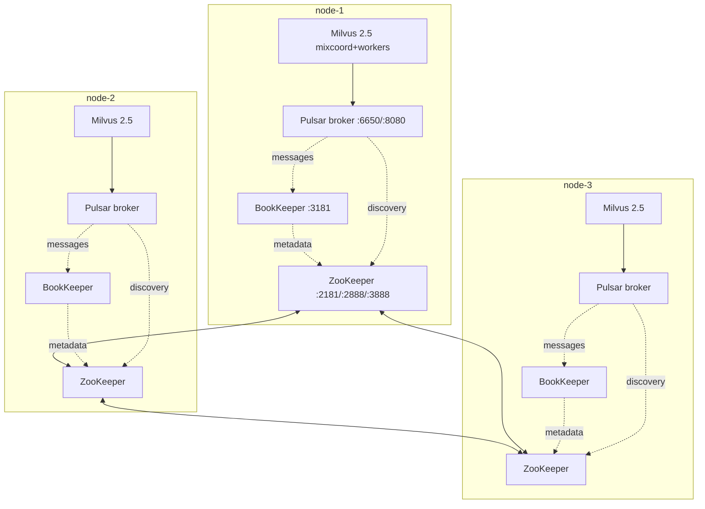

# Pulsar HA on Milvus 2.5 — design + scaffolding

> **Status:** *design doc only — not yet implemented.* The shipped 2.5
> path is the singleton-Pulsar topology in `templates/2.5/`. This file
> captures what a real HA Pulsar would look like in our deploy shape so
> a future session can pick it up cleanly.
>
> **Recommendation:** if you can use Milvus 2.6, use it. Woodpecker
> WAL is embedded per-node, so there is no Pulsar to make HA. This doc
> exists for shops stuck on 2.5 (existing data, library compat, etc.)
> that genuinely need HA writes.

## TL;DR

Real Pulsar HA is **9 extra containers across a 3-node cluster**:



Compare to the current singleton: **3 extra containers total** (1
Pulsar on PULSAR_HOST). The HA path triples the container count to
get true zero-SPOF writes.

## Why it isn't shipped yet

Pulsar HA bootstrap is fiddly. Each layer (ZK → BK → broker → cluster
metadata) has cross-references that have to align before the next
layer comes up:

1. **ZooKeeper ensemble** has to elect a leader before anything else
   starts. `myid` files per node, server list in `zoo.cfg`, election
   ports 2888/3888 reachable across peers.
2. **BookKeeper bookies** register with ZK on first start. The
   first-time bootstrap requires `bin/bookkeeper shell metaformat`
   against the ZK ensemble — exactly once, cluster-wide. Re-running
   it wipes the metadata.
3. **Pulsar brokers** register with ZK and use BK as the segment
   storage. They need `clusterName`, `advertisedAddress`, and
   `metadataStoreUrl` set per-node.
4. **Cluster bootstrap** — `pulsar-admin clusters create <name>`
   followed by `tenants create public` and
   `namespaces create public/default` — exactly once, on the first
   broker that comes up.

Any one of these out of order, and the cluster wedges in ways that
log "no available brokers" / "metadata not found" rather than
anything immediately actionable. Validating the path needs at least
two full teardown/re-init cycles on a 3-VM cluster (one to nail the
bootstrap, one to confirm idempotency). That's 4-6 hours of focused
work per implementation pass.

## Proposed shape

### cluster.env knob

```bash
# templates/2.5 only. Default false preserves the singleton path.
PULSAR_HA=false
```

When `PULSAR_HA=true`:
- The singleton Pulsar service is replaced by 3 services per peer:
  `milvus-zookeeper`, `milvus-bookkeeper`, `milvus-pulsar` (broker
  only, despite the name).
- `PULSAR_HOST` is unused; every peer runs a broker, every peer's
  Milvus connects to its local broker.
- `MILVUS_PULSAR_URL` becomes a comma-separated list of all 3
  brokers, and Milvus's pulsar config gets `pulsar://10.0.0.2:6650,10.0.0.3:6650,10.0.0.4:6650`.

### New template files

```
templates/2.5/
  _pulsar-ha-zookeeper.yml.tpl   per-peer ZK service block
  _pulsar-ha-bookkeeper.yml.tpl  per-peer BK service block
  _pulsar-ha-broker.yml.tpl      per-peer broker service block
  zookeeper-myid.tpl             "1" / "2" / "3" written per peer
  bookkeeper-bootstrap.sh        leader-only one-shot metaformat
                                 (driven by the daemon's bootstrap
                                 handler, not a separate script)
```

`lib/render.sh` chooses singleton vs HA based on `PULSAR_HA`. The
existing `_pulsar-service.yml.tpl` stays put for the singleton path.

### Service shape (3 per peer)

ZK:
```yaml
zookeeper:
  image: ${PULSAR_IMAGE_REPO}:${PULSAR_IMAGE_TAG}
  container_name: milvus-zookeeper
  network_mode: host
  restart: always
  environment:
    - PULSAR_MEM=-Xms256m -Xmx256m
    - ZK_SERVER_ID=${ZK_SERVER_ID}        # 1/2/3 per peer
  volumes:
    - ${DATA_ROOT}/zookeeper:/pulsar/data/zookeeper
  command: >
    bash -c "
      echo ${ZK_SERVER_ID} > /pulsar/data/zookeeper/myid;
      bin/apply-config-from-env.py conf/zookeeper.conf &&
      exec bin/pulsar zookeeper
    "
  healthcheck:
    test: ["CMD", "bash", "-c", "echo > /dev/tcp/localhost/2181"]
    interval: 10s
    retries: 6
```

BK:
```yaml
bookkeeper:
  image: ${PULSAR_IMAGE_REPO}:${PULSAR_IMAGE_TAG}
  container_name: milvus-bookkeeper
  network_mode: host
  restart: always
  environment:
    - PULSAR_MEM=-Xms512m -Xmx512m
    - zkServers=${ZK_SERVERS}              # 10.0.0.2:2181,10.0.0.3:2181,...
    - clusterName=${CLUSTER_NAME}
    - advertisedAddress=${LOCAL_IP}
  volumes:
    - ${DATA_ROOT}/bookkeeper:/pulsar/data/bookkeeper
  depends_on:
    zookeeper:
      condition: service_healthy
  command: >
    bash -c "
      bin/apply-config-from-env.py conf/bookkeeper.conf &&
      exec bin/pulsar bookie
    "
  healthcheck:
    test: ["CMD", "bash", "-c", "echo > /dev/tcp/localhost/3181"]
    interval: 10s
    retries: 6
```

Broker:
```yaml
pulsar:
  image: ${PULSAR_IMAGE_REPO}:${PULSAR_IMAGE_TAG}
  container_name: milvus-pulsar
  network_mode: host
  restart: always
  environment:
    - PULSAR_MEM=-Xms512m -Xmx512m
    - clusterName=${CLUSTER_NAME}
    - zookeeperServers=${ZK_SERVERS}
    - configurationStoreServers=${ZK_SERVERS}
    - metadataStoreUrl=zk:${ZK_SERVERS}
    - advertisedAddress=${LOCAL_IP}
  depends_on:
    bookkeeper:
      condition: service_healthy
  command: >
    bash -c "
      bin/apply-config-from-env.py conf/broker.conf &&
      exec bin/pulsar broker
    "
  healthcheck:
    test: ["CMD", "curl", "-f", "http://localhost:8080/admin/v2/brokers/health"]
    interval: 10s
    retries: 6
```

### One-shot cluster bootstrap

`pulsar-admin clusters create` and the public tenant + namespace must
run **exactly once** for the cluster lifetime. The right place is in
the daemon's bootstrap handler (similar to how Milvus 2.5's `Stage
3a` starts the singleton Pulsar today):

```bash
# Pseudo-code for daemon-side post-bootstrap step, runs only on the
# leader, gated on a one-shot etcd marker /cluster/pulsar-bootstrapped
docker exec milvus-pulsar bin/bookkeeper shell metaformat -nonInteractive
docker exec milvus-pulsar bin/pulsar-admin clusters create \
  --url http://${LOCAL_IP}:8080 \
  --broker-url pulsar://${LOCAL_IP}:6650 \
  ${CLUSTER_NAME}
docker exec milvus-pulsar bin/pulsar-admin tenants create public
docker exec milvus-pulsar bin/pulsar-admin namespaces create public/default
etcdctl put /cluster/pulsar-bootstrapped true
```

The marker key prevents re-runs (which would either be no-ops or
data-destroying depending on the command).

### Milvus-side change

`templates/2.5/milvus.yaml.tpl` currently points Milvus at a single
broker:

```yaml
pulsar:
  address: ${PULSAR_HOST_IP}
  port: ${PULSAR_BROKER_PORT}
```

For HA, switch to a pulsar service URL list:

```yaml
pulsar:
  serviceUrl: pulsar://${ZK_SERVERS_AS_BROKER_URLS}
  # e.g. pulsar://10.0.0.2:6650,10.0.0.3:6650,10.0.0.4:6650
```

(Milvus's pulsar client supports comma-separated brokers and will
fail over.)

## Validation plan (when this lands)

A real HA test isn't just "smoke passes" — it's "kill any one of the
9 containers and confirm writes still succeed."

Drill matrix:

| Action | Expected |
|---|---|
| Stop one ZK on m1 | ZK ensemble keeps quorum (2-of-3); broker keeps serving |
| Stop one BK on m1 | Pulsar continues; segments under-replicated (heal on restart) |
| Stop one broker on m1 | Milvus on m2/m3 continues writing through their local brokers |
| Stop all of m1 (ZK+BK+broker+Milvus) | Cluster keeps serving 2-of-3; no write outage |
| Restart everything on m1 | Cluster heals; ZK ensemble reconciles, BK resyncs segments |
| `mc admin info` MinIO across all 3 | Drives still 12-of-12 (MinIO is unaffected) |

Run a 1000-row insert + load + search loop in a separate terminal
during each drill — that's the SDK-level smoke that proves "writes
don't stop."

## Resource cost

Per node, on top of the existing 9-10 containers:
- ZK: ~256 MB heap (`PULSAR_MEM=-Xms256m -Xmx256m`)
- BK: ~512 MB heap + journal disk (~1-5 GB depending on traffic)
- Broker: ~512 MB heap

So ~1.5 GB extra RAM and a few GB disk per peer. Tighter MEM tunings
are possible but the defaults are intentionally conservative.

## What lands first when this is picked up

1. The 3 service-block templates + the render-time switch on
   `PULSAR_HA=true`.
2. A bootstrap step in `daemon/joining.py` (or a new
   `daemon/workers/pulsar_bootstrap.py`) that runs the one-shot
   `clusters create` on the leader.
3. The Milvus YAML rewrite (singleton → multi-broker URL).
4. Drill matrix from "Validation plan" above on a fresh 3-VM
   cluster.

Until then, the operator's choices remain:

1. **Use 2.6 + Woodpecker.** No SPOF, no Pulsar to manage. Default
   path; what the rest of the docs assume.
2. **Use 2.5 + singleton Pulsar.** Writes stop if PULSAR_HOST node
   dies; reads from already-loaded collections continue. Documented
   in [`templates/2.5/README.md` § SPOF caveat](../templates/2.5/README.md#spof-caveat-the-pulsar-singleton).
3. **Use 2.5 + external Pulsar cluster.** Set `PULSAR_HOST` to an
   IP outside the milvus-onprem cluster; remove the local Pulsar
   service from the rendered compose. Operationally this is the
   right answer if you have the Pulsar expertise — your Pulsar SREs
   handle HA, milvus-onprem just connects.
