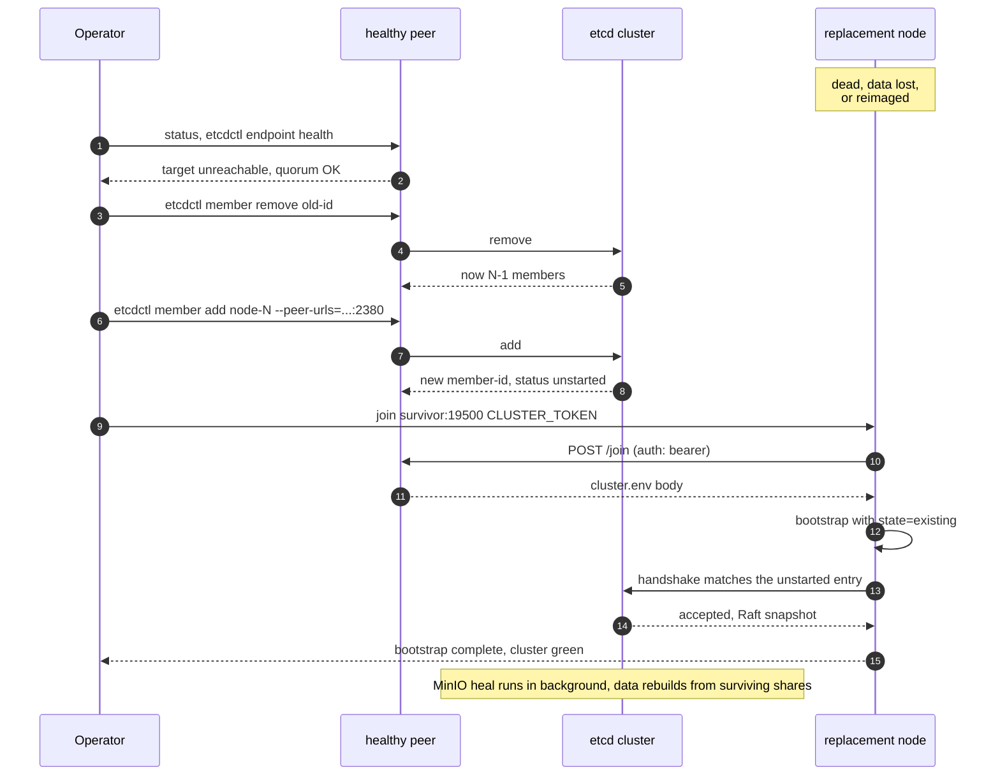

# Troubleshooting

A grab-bag of issues people have hit (or are likely to hit) during deploy
and operation. If you encounter something not listed, the systematic
debugging order is:

1. `./milvus-onprem status` — what does the cluster see?
2. `docker ps -a` — what containers are up vs down vs restarting?
3. `docker logs --tail 100 <container>` — what does the failing container say?
4. `./milvus-onprem wait --timeout-s=30` — does it converge given a moment?

For day-2 operational tasks, see [OPERATIONS.md](OPERATIONS.md).

## Init / join issues

### Milvus 2.5 panics with `CompareAndSwap error ... for key: rootcoord`

If you see this in `docker logs milvus-mixcoord` or
`docker logs milvus`, you are running `milvus run standalone` with
multiple instances against a shared etcd — that mode does not support
multi-instance HA. Every instance races to register itself as
rootcoord; the N-1 losers panic and restart in a loop.

Fix: use the coord-mode-cluster topology in `templates/2.5/`. A
correct 2.5 multi-node deploy runs `mixcoord` + `proxy` +
`querynode` + `datanode` + `indexnode` per node (5 milvus-*
containers, each in its own role). `milvus-onprem ps` on a healthy
2.5 multi-node cluster shows these 5 containers plus `milvus-etcd`
/ `milvus-minio` / `milvus-nginx` / `milvus-onprem-cp` (and
`milvus-pulsar` on PULSAR_HOST).

If your render produces a single `milvus` service, run
`teardown --full --force` and re-run `init` against `templates/2.5/`.

### Milvus 2.5: `milvus-mixcoord` panics with `panic: function CompareAndSwap error ... for key: querycoord`

Symptom: in a 3-node 2.5 cluster, one peer's `milvus-mixcoord` is
stable and the other two restart-loop indefinitely
(`docker inspect milvus-mixcoord --format '{{.RestartCount}}'`
keeps growing). Panic fires from
`internal/util/sessionutil/session_util.go:318`.

Fix: `templates/2.5/milvus.yaml.tpl` ships `enableActiveStandby:
true` on `rootCoord`, `dataCoord`, `queryCoord`, and `indexCoord`.
If your render is missing this, re-render with the current template
and `docker restart milvus-mixcoord` on each peer (rolling: hit the
standbys first, then the active leader).

Each peer's mixcoord then sits in ACTIVE or STANDBY state per coord;
the 4 coord roles are independently elected and failover drills at
<500ms.

### `init`: `--mode is required`

`init` runs interactively if stdin is a TTY; otherwise pass `--mode`:

```bash
./milvus-onprem init --mode=distributed   # multi-VM HA
./milvus-onprem init --mode=standalone    # single VM, no HA
```

### `init`: `cluster.env already exists at ...`

You're trying to re-run init on a node that's already been initialised.
Either:

- You meant to use the existing config → skip init, just `bootstrap`.
- You want to start fresh → `./milvus-onprem teardown --full --force`,
  then re-run init.
- You want to overwrite without losing data → `init --overwrite`. Rare;
  usually a `teardown --full` is cleaner.

### `init`: `PEER_IPS must have 1 (standalone) or odd >=3 entries`

Even-numbered cluster sizes (2, 4, 6) are rejected — see
[ARCHITECTURE.md](ARCHITECTURE.md#why-cluster-size-must-be-1-3-5).

### `join`: HTTP timeout / connection refused

The new VM can't reach an existing peer's daemon on `:19500`.

- **Firewall.** Open port 19500 between peers. Verify with
  `./milvus-onprem preflight --peer --peers=<peer-ip>` from the
  joining VM.
- **Daemon not up yet.** Check `docker ps` on the target peer.
  `docker logs milvus-onprem-cp` should show `acquired leadership`
  or `following <leader>`.

### `join`: 401 / 403 from /join

Token mismatch.

- **Token typo or stale.** Retrieve the current `CLUSTER_TOKEN` from
  any existing peer's `cluster.env` — that's the source of truth. If
  the cluster has been rotated (`rotate-token`), the old token is
  invalid.
- **Bearer header missing or malformed.** The CLI handles this; if
  you're hand-crafting a `curl`, use
  `Authorization: Bearer <CLUSTER_TOKEN>`.

### `init` / `join`: `could not match hostname -I against PEER_IPS`

This VM's IP isn't in `PEER_IPS`. Check:

```bash
hostname -I
```

If the IP shown isn't what you put in `PEER_IPS`, fix one of them.
For NAT / split-horizon setups where `hostname -I` returns something
other than the IP peers reach you on, override:

```bash
FORCE_NODE_INDEX=N ./milvus-onprem init ...
```

where N is the 1-based position of this node's IP in PEER_IPS.

## Auth / CLUSTER_TOKEN issues

### "I forgot the CLUSTER_TOKEN — how do I get it back to add a new peer?"

The token isn't held in any external service — **it's stored as
`CLUSTER_TOKEN=...` in `cluster.env` on every peer**, sitting next to
the `milvus-onprem` script in your repo checkout. On any peer you can
get a shell on, run:

```bash
grep ^CLUSTER_TOKEN cluster.env
# CLUSTER_TOKEN=f3a8c12d4e5b7a9061f2d3c4b5a6978d8e9f0a1b2c3d4e5f6a7b8c9d0e1f2a3b
```

(from the directory where you cloned the repo). Use that value with
`./milvus-onprem join <leader-ip>:19500 <token>` on the new peer.

Every peer's `cluster.env` carries the same `CLUSTER_TOKEN` — if you
rotated it via `rotate-token`, the file on every peer was updated
atomically, so pulling from any one of them is fine.

The token is **never written to etcd or any logs** — it stays in the
`cluster.env` file (mode `0600`) and the daemon container's environment
(via `MILVUS_ONPREM_CLUSTER_TOKEN`). That's by design: a cluster-token
leak is a credential leak, so it isn't replicated to anywhere it can be
read accidentally.

### "I want to rotate it because the old one was leaked"

```bash
./milvus-onprem rotate-token --force
# new token: a9633b37ffcfde5438000673af2e71884434db31f92a26e49bbba5affd218564
```

This atomically:
1. Writes the new token to every peer's `cluster.env`
2. Recreates every peer's `milvus-onprem-cp` daemon container (so the
   old token stops working ~5-15s after the call returns)
3. Verifies every peer accepts the new token before reporting OK

Save the new token somewhere safe — it's printed once, then it's only
in `cluster.env` again. The CLI also retries the per-peer auth probe
3× with backoff so a peer whose daemon recreate landed at the tail end
of the window doesn't false-fail.

You can also pass an explicit token instead of letting the CLI
generate one:

```bash
./milvus-onprem rotate-token --new-token=<your-32+-char-token>
```

### "I lost the token AND I can't get a shell on ANY peer"

Recovery requires console access to at least one VM (cloud provider
web console, IPMI, KVM, hypervisor terminal — whichever your environment
provides). Once you have a shell on any peer, `cd` into the milvus-onprem
repo on that peer and run:

```bash
grep ^CLUSTER_TOKEN cluster.env
```

If you have **zero** access to any peer's filesystem at all, the
cluster's existing token is unrecoverable from outside (this is the
intended security property — there's no "reset password" backdoor).
The fallback is destructive — on whichever peer you can get a shell:

```bash
cd <wherever-you-cloned>/milvus-onprem
./milvus-onprem teardown --full --force
./milvus-onprem init --mode=distributed --ha-cluster-size=<N>   # generates a new token
# then re-join the other peers from scratch — DATA WILL BE LOST
```

Take an `export-backup` to off-cluster storage routinely so this path
is never the one you have to take.

### `rotate-token` reports `1 peer(s) didn't accept the new token`

Pre-fix this was a real flake; with the retry-3× behavior it's now
rare. If it does fire:

1. Run the printed retry command:
   ```bash
   ./milvus-onprem rotate-token --new-token=<value-from-error-message>
   ```
2. If the same peer keeps failing: check that peer's daemon health
   (run on that peer):
   ```bash
   docker ps --filter name=milvus-onprem-cp
   docker logs --tail 30 milvus-onprem-cp
   ```
3. Worst case — manually fix that peer. From the milvus-onprem repo
   directory on that peer:
   ```bash
   sed -i "s|^CLUSTER_TOKEN=.*|CLUSTER_TOKEN=<new>|" cluster.env
   docker compose --project-name <node-N> \
     -f rendered/<node-N>/docker-compose.yml \
     up -d --force-recreate --no-deps control-plane
   ```

## Scale-out issues

### `CLUSTER_SIZE=N invalid` after a `join`

Symptom: after a `join` grows a cluster from `3→4` (or `5→6`),
subsequent commands die with:

```
ERROR CLUSTER_SIZE=4 invalid: must be 1 (standalone) or odd ≥3 ...
```

`join` adds peers one at a time, so even sizes are a transient state
during scale-out. The shipped `role_validate_size` allows any size
≥ 1 at runtime and prints a WARN line on even sizes — the init-time
odd-only rule (in `cmd_init.sh`) still applies because you wouldn't
deploy a 4-node cluster from scratch (worse Raft tolerance than 3).

If you see the hard error, `git pull` to pick up the current code.

## Bootstrap / lifecycle issues

### `bootstrap`: stays in Stage 3 with `MinIO cluster health` warnings

Distributed MinIO needs **all peers** to be reachable on `:9000`
before it forms quorum. If you've only bootstrapped some nodes,
this warning is expected — re-run `bootstrap` after every peer is up.

### `join`: returns with only etcd + minio running, no milvus / nginx

Symptom on a peer right after `./milvus-onprem join`: the shell returns
to a prompt, `docker ps -a` shows only `milvus-etcd` and `milvus-minio`,
no `milvus` or `milvus-nginx` containers were ever created, and
`docker images` shows no `milvusdb/milvus` pull was attempted.

Root cause: the joining peer hits Stage 3 (distributed MinIO
peer-reach wait) before the bootstrap node's MinIO is fully up.
Stage 3's MinIO peer-reach waits are `|| warn`-guarded so peers
proceed to start Milvus and nginx even when the mesh isn't fully
formed yet.

Recovery on a deployed cluster: re-run `./milvus-onprem bootstrap` on
the affected peer once the bootstrap node's MinIO is up. Bootstrap is
idempotent and will pull the missing images, create the missing
containers, and converge.

### `bootstrap` Stage 2: `local etcd not healthy`

etcd needs quorum to report healthy. With only one node up in a 3-node
cluster, it can't form quorum yet. Expected on the first bootstrap of
the bootstrap node. Will resolve once peers come up via `join`.

### Containers restart-loop with `panic: invalid stats config`

Known Milvus 2.6.11 panic when `milvus.yaml` is mounted as
`/milvus/configs/milvus.yaml` (replacing defaults) instead of
`/milvus/configs/user.yaml` (overlaying defaults). Confirm the
template:

```bash
grep '/milvus/configs' templates/2.6/docker-compose.yml.tpl
# should show: - ./milvus.yaml:/milvus/configs/user.yaml:ro
```

If it says `milvus.yaml:/milvus/configs/milvus.yaml`, that's the bug.

### Milvus restart-loops with `Failed to init arrow filesystem: Unsupported cloud provider: minio`

Milvus 2.6 dropped `minio` as a valid `cloudProvider` value — the
segcore filesystem only accepts `aws`/`gcp`/`azure`/`aliyun`/`tencent`.
Since MinIO speaks S3, the right value is `aws`.

```bash
grep cloudProvider templates/2.6/milvus.yaml.tpl
# should show: cloudProvider: aws
```

### Milvus restart-loops with `Failed to create etcd client: context deadline exceeded`

Milvus can't reach etcd. Check:

- **Local etcd container is up:** `docker ps -a | grep milvus-etcd`.
- **etcd has quorum:** `docker exec milvus-etcd etcdctl endpoint health`.
  If this fails, peer etcds aren't reachable — check
  `nc -zv <peer-ip> 2379` from this node.

### Milvus 2.5: `find no available rootcoord, check rootcoord state`

Symptom: on a fresh 2.5 deploy the `milvus` container never reports
healthy and the logs spam `RootCoordClient mess key not exist` and
`find no available rootcoord`.

Root cause: Milvus 2.5 needs Pulsar reachable before its coordinators
come up. If `milvus-pulsar` was never started (or is still in its 90s
healthcheck `start_period`), rootcoord/datacoord loop forever.

`milvus-onprem bootstrap` now starts Pulsar (Stage 3a) before Milvus
on the `PULSAR_HOST` node and waits up to 180s for the broker port to
accept TCP. If you somehow ended up with Pulsar down on a 2.5 deploy,
restart it:

```bash
docker start milvus-pulsar
docker restart milvus           # so coordinators retry immediately
```

If Pulsar itself fails to start, check `docker logs milvus-pulsar` —
the most common cause is `/data/pulsar` ownership: Pulsar runs as
UID 10000 inside the container.

```bash
sudo chown -R 10000:10000 /data/pulsar
docker start milvus-pulsar
```

### Bootstrap dies with `no such service: pulsar` on Milvus 2.6

You set `MQ_TYPE=pulsar` in cluster.env on a 2.6 deploy. The 2.6
templates only ship a Woodpecker path — there's no Pulsar service
block in `templates/2.6/docker-compose.yml.tpl`. The combination is
rejected at `env_require` time:

```
ERROR Milvus 2.6 + MQ_TYPE=pulsar is not wired up in this build ...
```

If you need Pulsar, run Milvus 2.5 (`MILVUS_IMAGE_TAG=v2.5.x`).
Otherwise drop `MQ_TYPE=pulsar` from cluster.env to use Woodpecker
(the 2.6 default).

### `teardown` errors out before it cleans up

`teardown` is deliberately lenient and proceeds even when other
commands refuse on validation — that's the escape hatch. If for some
reason it can't run, sweep manually:

```bash
docker rm -f milvus milvus-nginx milvus-minio milvus-etcd milvus-pulsar milvus-onprem-cp
sudo rm -rf /data/{etcd,minio,milvus,pulsar}
rm -f cluster.env
rm -rf rendered/
```

### `backup-etcd` leaves a stray `/data/etcd/snapshot.db`

The etcd image is distroless and has no `rm` binary, so in-container
cleanup of the snapshot tempfile won't work. Clean up via the bind
mount on the host:

```bash
sudo rm -f ${DATA_ROOT}/etcd/snapshot.db
```

## etcd issues

### `member list` times out

Linearizable reads (the default) require quorum. If quorum is missing
(more than `(N-1)/2` peers down), every etcdctl read times out — even
introspective ones like `member list`.

The fix is to restore quorum: bring more peers back up. Until quorum
returns, etcd is intentionally frozen for both reads and writes.

### Querying etcd directly returns no keys

If `etcdctl get --prefix "/by-dev/..."` returns nothing but you know
data should be there: drop the leading slash. etcd v3 keys are flat
byte strings, not paths. The Milvus prefix is `by-dev/...` (no
leading slash).

```bash
docker exec milvus-etcd etcdctl --endpoints=http://127.0.0.1:2379 \
  get --prefix "by-dev/meta/session/" --keys-only
```

## MinIO issues

### `mc: distributed mode requires N drives`

MinIO's distributed mode has minimum drive counts depending on the
erasure-coding parity. For 3 nodes × 1 drive = 3 drives total, MinIO
runs but with tighter parity. For larger clusters this is automatic.

If you really need lower drive counts (e.g. for testing), use
`CLUSTER_SIZE=1` (standalone, single drive, no redundancy).

### MinIO bucket creation fails: `Server not initialized, please try again`

The distributed MinIO cluster hasn't finished forming yet. Wait a
minute and retry. `bootstrap` includes a wait helper that handles
this; if you're running mc commands manually, give it 60-120s.

## milvus-backup issues

### `download failed — set MILVUS_BACKUP_VERSION to a known release tag`

The upstream `milvus-backup` release URL or asset name pattern
changed. Two options:

```bash
# 1. override the version (latest verified working tag is v0.5.14):
./milvus-onprem create-backup --name=foo --milvus-backup-version=v0.5.14

# 2. download manually and stash the binary in the cache dir:
curl -sL https://github.com/zilliztech/milvus-backup/releases/.../milvus-backup_X.Y.Z_Linux_x86_64.tar.gz \
  | tar -xz -C /tmp
install -m 0755 /tmp/milvus-backup ~/milvus-onprem/.local/bin/
```

The asset filename pattern as of v0.5.14 is
`milvus-backup_<X.Y.Z>_<Linux|Darwin>_<x86_64|arm64>.tar.gz` (capitalized
OS, x86_64-style arch, version embedded). If a future release breaks
this assumption again, the fix lives in `lib/backup.sh`.

### `Error: invalid backup name <name>`

milvus-backup tightened name validation in v0.5.x. Hyphens are no
longer accepted; use only alphanumerics + underscores. So `daily-backup`
fails but `daily_backup` works.

### `Unable to stat source <host-path>` during restore-backup --from

`mc` runs inside the milvus-minio container and can't see host
filesystem paths directly. The CLI bridges this via
`docker cp` host → container → MinIO. If you're hitting this error,
`git pull` the latest CLI.

### `restore-backup` fails with `restore: collection already exist`

milvus-backup refuses to overwrite live collections. Use:

```bash
./milvus-onprem restore-backup --from=PATH --drop-existing
```

`--drop-existing` drops every collection in the live cluster before
the restore. Requires pymilvus on the host.

### `create-backup` fails on flush (Milvus 2.5)

Milvus 2.5 needs Pulsar to flush. If the Pulsar singleton is down at
backup time, the default flush-then-backup path fails. The CLI checks
this proactively when `MQ_TYPE=pulsar`:

```
ERROR Pulsar broker at 10.0.0.10:6650 is unreachable.
```

Two ways forward:

1. Bring Pulsar back: `docker start milvus-pulsar` on the PULSAR_HOST node.
2. Skip the flush, back up what's on disk:
   `./milvus-onprem create-backup --name=foo --strategy=skip_flush`
   (Loses very recent writes still in the WAL.)

Milvus 2.6 (Woodpecker) doesn't have this concern — the WAL is
embedded in every Milvus instance.

### milvus-backup config errors / `config: backup.yaml`

milvus-backup v0.5.x uses YAML, not TOML. The CLI generates
`backup.yaml` automatically at `~/milvus-onprem/.local/backup.yaml`
per invocation. If you're seeing a TOML-related error, `git pull`
the latest CLI.

## Tutorial / smoke issues

### `smoke-test.py` hangs at `load (replica_number=2)`

The first `replica_number=2` load on a fresh cluster takes 1–3 minutes
while Milvus replicates segments to two QueryNodes. That's normal.
If it hangs >5 minutes:

- Verify both QueryNodes are registered:
  ```bash
  docker exec milvus-etcd etcdctl --endpoints=http://127.0.0.1:2379 \
    get --prefix "by-dev/meta/session/" --keys-only | grep querynode
  ```
  Should show one line per node (`querynode-1`, `querynode-2`, ...).
  Note: **no leading slash** on the prefix — etcd v3 keys are flat.
- If only one shows up, only one Milvus has registered — check
  `docker logs milvus` on the missing-node side.

### Tutorial `import-dummy.py` fails with `ModuleNotFoundError: pymilvus`

```bash
pip3 install --user --break-system-packages -r test/requirements.txt
```

## Networking / firewall issues

### Inter-node connectivity broken

Quick triage from one node:

```bash
for ip in 10.0.0.10 10.0.0.11 10.0.0.12; do
  for port in 2379 2380 9000 19530 19537; do
    printf "%s:%-5s — " "$ip" "$port"
    timeout 3 bash -c "</dev/tcp/$ip/$port" 2>/dev/null \
      && echo "ok" || echo "FAIL"
  done
done
```

If multiple ports fail to a single IP: that node is unreachable
(firewall, network down, VM down). If one port fails everywhere: that
service is down on every node.

### Clients connect to `:19537` but get errors

```bash
nc -zv <node-ip> 19537
```

If reachable but Milvus errors: nginx has no healthy backend. Check
each node's `docker logs --tail 50 milvus`.

### `nc -zv <public-ip> 19537` times out from outside the VPC

`nginx-lb` and `milvus-onprem-cp` both bind to `0.0.0.0` via
`network_mode: host`, so they listen on every interface — public
included. If they're reachable from inside the VPC (peer-to-peer
on the 10.x private IPs) but NOT from your laptop or another cloud,
the issue is your cloud firewall / VPC security group, not the
application. Open these ports in the cloud's firewall **only on the
VMs that should be externally reachable**:

| Port  | Service                  | Who needs it         |
|-------|--------------------------|----------------------|
| 19537 | nginx LB (Milvus gRPC)   | external pymilvus clients (recommended path) |
| 19500 | control-plane daemon     | operator CLI from outside; OpenAPI `/docs`   |
| 9001  | MinIO console (browser)  | optional, browser-based MinIO inspection     |
| 19530 | Milvus direct gRPC       | debug only — bypasses HA, prefer 19537       |
| 9000  | MinIO API                | only if external apps write S3 directly      |

The `/docs` (Swagger UI), `/redoc`, `/openapi.json`, `/health`, and
`/version` paths on the control-plane daemon are auth-exempt — once
the firewall opens 19500, they're reachable in a browser without a
bearer token. Every other path on 19500 requires
`Authorization: Bearer $CLUSTER_TOKEN`.

**Inter-peer ports (always required between every cluster VM, never
need to be open to the public)**: 2379, 2380, 9000, 9091, 19500,
19530, 19537. On 2.5: also 6650 and 8080 (Pulsar).

## Cleanup / reset

If the cluster is in a state you can't reason about, the nuclear option
on every node:

```bash
./milvus-onprem teardown --full --force
```

Then redeploy from scratch ([DEPLOYMENT.md](DEPLOYMENT.md)).

You lose all data unless you've been taking `create-backup` snapshots.
Restore from those:

```bash
# on the bootstrap VM:
./milvus-onprem init --mode=distributed --ha-cluster-size=<N>
# on every other VM:
./milvus-onprem join <bootstrap-ip>:19500 <CLUSTER_TOKEN>
# back on any peer:
./milvus-onprem restore-backup --from=<your-backup-dir>
```

## Failover and recovery

### Replacing a permanently-lost node

Use this when a node is gone for good — disk failure, reimaged VM,
hardware retired. The procedure removes the dead member from etcd's
Raft cluster, then brings a replacement up that fills the same slot
in `PEER_IPS`.

> Prerequisite: at least `ceil(N/2)` peers are still healthy so etcd
> quorum can accept the member-remove. On a 3-node cluster you need
> 2 healthy nodes; on a 5-node cluster you need 3.



#### Step 1 — confirm what's dead and what isn't

From any healthy peer:

```bash
./milvus-onprem status
docker exec milvus-etcd etcdctl --endpoints=http://127.0.0.1:2379 \
  endpoint health --cluster
```

The dead peer should show `[FAIL]` in `peer reachability` and
`unhealthy` / `connection refused` in the etcd cluster check. Make
sure the surviving peers report healthy themselves.

#### Step 2 — remove the dead member from etcd, then re-add a fresh entry

The dead node has to be unregistered from etcd's Raft membership
before the replacement can join. Then a fresh entry must be
registered for the replacement *before* it starts up — otherwise the
existing cluster will reject the new etcd as an unknown peer.

```bash
# from any healthy peer:
docker exec milvus-etcd etcdctl --endpoints=http://127.0.0.1:2379 \
  member list

# find the row for the dead node (matches its --peer-urls). The first
# column is the member-id. Then:
docker exec milvus-etcd etcdctl --endpoints=http://127.0.0.1:2379 \
  member remove <member-id-hex>

# Register the replacement (use the same name and the IP it'll come up on):
docker exec milvus-etcd etcdctl --endpoints=http://127.0.0.1:2379 \
  member add <node-name> --peer-urls=http://<replacement-ip>:2380
```

After `member remove`, the surviving peers operate as an N-1 cluster
with `ceil((N-1)/2)` quorum, still serving reads/writes. After
`member add`, `member list` shows the replacement as `unstarted`.
Quorum is back to `ceil(N/2)` once it's started.

#### Step 3 — bring up the replacement node with `--existing`

You have two options depending on whether the replacement VM gets the
*same* IP as the dead one or a different one.

**Option A: same IP (reimaged or rebooted-with-fresh-disk):**

On the replacement VM, repo cloned, no `cluster.env` yet:

```bash
cd ~/milvus-onprem
# Retrieve CLUSTER_TOKEN from any healthy peer's cluster.env (or
# rotate the token first via `./milvus-onprem rotate-token` if you
# want a clean break from the old one).

./milvus-onprem join <healthy-ip>:19500 <CLUSTER_TOKEN>
```

The leader's `/join` response sets
`ETCD_INITIAL_CLUSTER_STATE=existing` automatically, so the
replacement's etcd joins the running Raft cluster (using the member
entry registered in Step 2) instead of trying to bootstrap a new one.

**Option B: new IP (different VM, same slot in `PEER_IPS`):**

Edit `cluster.env` on every healthy peer to replace the dead IP with
the new one (the slot — node-1, node-2, etc. — must stay the same).
Re-render and reload nginx:

```bash
# on each healthy peer:
cd ~/milvus-onprem
sed -i 's/<dead-ip>/<new-ip>/' cluster.env
./milvus-onprem render
docker exec milvus-nginx nginx -s reload
```

Then on the replacement VM, follow Option A — the fetched cluster.env
will already have the new IP. The `etcdctl member add` from Step 2
should also use `<new-ip>` rather than the dead one.

#### Step 4 — verify

```bash
# from any peer:
./milvus-onprem status                        # all peers green
./milvus-onprem wait                          # converges in seconds
docker exec milvus-etcd etcdctl --endpoints=http://127.0.0.1:2379 \
  endpoint health --cluster                   # all members healthy
python3 test/tutorial/05_prove_replication.py # cross-peer consistency
```

MinIO will lazily heal the new node's drive once it joins the
distributed pool. Erasure-coded data is reconstructed from the
surviving shards in the background — no manual action needed for
small clusters.

If `05_prove_replication.py` shows a peer returning fewer rows than
the others, that's MinIO heal still in flight. Wait a few minutes
on small datasets, longer on large ones, and re-run.

### `COMPONENT_RESTART_LOOP` fired in daemon logs — what to do

The local watchdog auto-restarted a `milvus-*` container 3 times
within a 5-minute window, then backed off:

```
COMPONENT_RESTART_LOOP ts=<unix> container=<name> restarts_in_5m=3
```

After this fires the daemon stops auto-restarting that container
and emits a `WARNING ... in restart loop ... — leaving alone for
operator` once per tick. This is by design — three restarts in five
minutes means the unhealthy state is sticky (config bug, missing
dependency, OOM in a tight loop, port conflict). Restarting harder
amplifies the noise.

```mermaid
flowchart LR
  A[container unhealthy] -- 3 ticks --> R1[COMPONENT_RESTART attempt=1]
  R1 -- still unhealthy --> R2[COMPONENT_RESTART attempt=2]
  R2 -- still unhealthy --> R3[COMPONENT_RESTART attempt=3]
  R3 --> L[COMPONENT_RESTART_LOOP — back off]
  L --> O[operator inspects]
  O -- fix root cause --> F[docker restart manually]
  F -- healthy --> N[loop alerted state cleared on next healthy tick]
```



What to do:

1. `docker logs --tail 200 <container>` — figure out *why* unhealthy.
2. Fix the root cause: bad mount, bad config, OOM (`docker stats`),
   port collision (`ss -tlnp | grep <port>`), missing dependency
   (`milvus-etcd` / `milvus-pulsar` / etc.).
3. `docker restart <container>` to clear it manually. Once the
   container reaches `(healthy)` the loop-alerted flag clears
   automatically; the watchdog will resume normal monitoring.

If the loop guard tripped on `milvus-mixcoord` specifically, see the
2.5 mixcoord active-standby section above — a misconfigured standby
flag is a common trigger.

### Reads fail with `code=106 collection on recovering` after a node restart

You're on Milvus 2.5 and a node just went down (planned reboot,
crash, container OOM). For ~50s after the failure, querycoord is
detecting the dead querynode's etcd lease expiry and reassigning
DML channels to surviving querynodes; reads against unassigned
channels fail until that completes.

This is **expected behavior** on 2.5 cluster mode. SDK callers must
retry with backoff. The repo ships a small helper —
[`retry_on_recovering`](../test/tutorial/_shared.py) — and a tuning
recipe that drops the window to ~15-20s. Full background and the
2.5 vs 2.6 difference live in [FAILOVER.md](FAILOVER.md).

If you're on 2.6 and seeing this code, it's a different bug — capture
`docker logs milvus` and `./milvus-onprem status` and open an issue.

## Reporting new issues

If you hit something not in this doc:

1. Capture `./milvus-onprem status` from every node.
2. Capture `docker ps -a` and `docker logs <relevant-container>`
   from the affected node(s).
3. Note your `MILVUS_IMAGE_TAG` and any non-default cluster.env values.
4. Open an issue at https://github.com/codeadeel/milvus-onprem/issues.

PRs that add new entries to this doc are very welcome — anything you
hit and figure out is something the next person would also hit.
