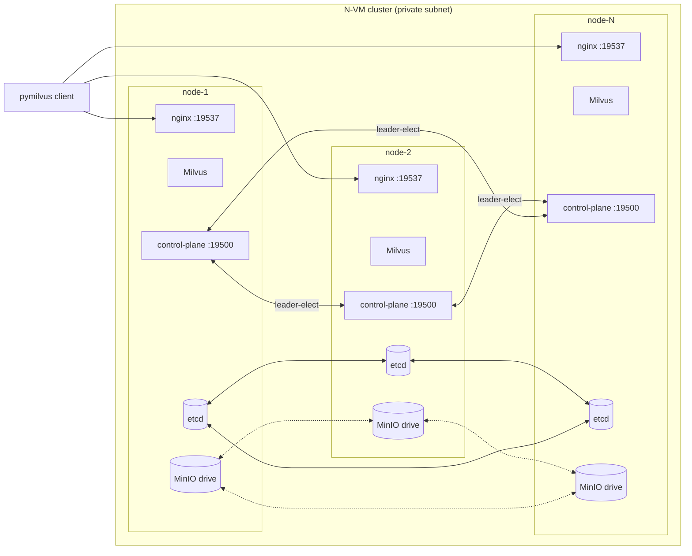
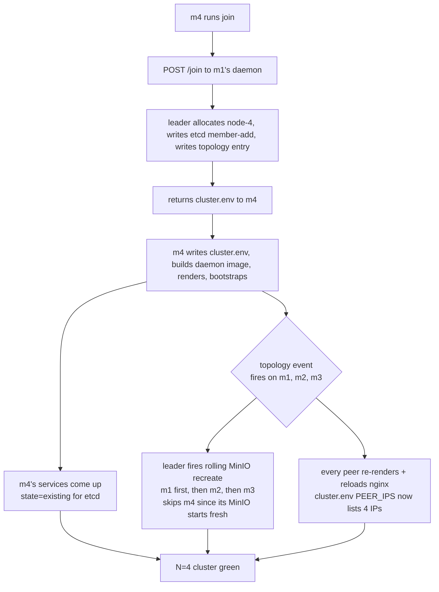
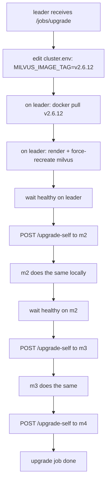
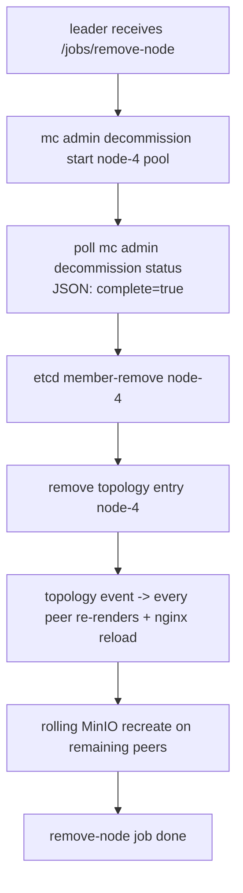

# milvus-onprem — end-to-end tutorial

A walked-through guide that exercises every shipped feature of
milvus-onprem v1.2 on a real 4-VM cluster, both Milvus 2.5 and 2.6.
Each section is small and stands alone — you can read top-to-bottom
or jump to the operation you need.

> **Audience:** an operator who has Docker installed on N Linux VMs
> in the same private subnet and wants HA Milvus without Kubernetes.
> No prior milvus-onprem knowledge assumed.

> **Hardware-validated:** every command in this tutorial was run on
> a 4-VM cluster (10.0.0.2 / 10.0.0.3 / 10.0.0.4 / 10.0.0.5) before
> being written here. Any output samples shown are real (timestamps
> from the 2026-04-28 validation pass on Milvus 2.6.11 + 2.5.4).

## Table of contents

1. [Concepts (5 min read)](#1-concepts)
2. [Phase A — bootstrap a 3-node cluster (Milvus 2.6)](#2-phase-a--bootstrap-26-n3)
3. [Phase B — add a 4th node online](#3-phase-b--add-a-4th-node-online)
4. [Phase C — verify across all 4 peers](#4-phase-c--verify-across-all-4-peers)
5. [Phase D — backup pipeline](#5-phase-d--backup-pipeline)
6. [Phase E — rolling Milvus version upgrade](#6-phase-e--rolling-milvus-version-upgrade)
7. [Phase F — remove a node](#7-phase-f--remove-a-node)
8. [Phase G — watchdog drills](#8-phase-g--watchdog-drills)
9. [Phase H — failover drills](#9-phase-h--failover-drills)
10. [Phase I — Milvus 2.5 path (per-component containers, Pulsar)](#10-phase-i--milvus-25-path)
11. [Cheat sheet](#cheat-sheet)
12. [What's next](#whats-next)

---

## 1. Concepts

### What this tool is

A bash CLI + a small Python control-plane daemon that deploys and
operates HA Milvus on N Linux VMs. No Kubernetes, no Operator. The
shipped versions are Milvus 2.5.x and 2.6.x.

### Topology in 30 seconds



Per node, you get the Milvus container(s), an etcd member, a MinIO
drive, an nginx LB, and the milvus-onprem control-plane daemon. Etcd
runs Raft consensus across all peers. MinIO runs in distributed
erasure-coded mode. Nginx layer-4-load-balances the gRPC entry port.

### Two big choices when you start

1. **`MILVUS_VERSION` (2.5 vs 2.6).** 2.6 is the recommended path —
   embedded Woodpecker WAL, no Pulsar, simpler topology (4 containers
   per node). 2.5 needs a Pulsar broker (singleton SPOF for writes
   unless you wire HA Pulsar separately) and runs 5 milvus-* sibling
   containers per node (mixcoord/proxy/querynode/datanode/indexnode).
   Use 2.5 only if you have existing 2.5 data or library compat
   constraints.
2. **`CLUSTER_SIZE` (1, 3, 5, 7, 9).** 1 = standalone, no HA. 3 is
   the smallest HA size (Raft quorum). Even sizes (2, 4, 6) are
   accepted with a warning — they tolerate the same failures as
   the next-lower odd size, so 4 ≈ 3 from a fault-tolerance angle.

### Two modes

- **`init --mode=standalone`** — single-VM. No daemon. Just docker
  compose. Use for dev / smoke / single-host deploys.
- **`init --mode=distributed`** — N-VM HA. Boots the control-plane
  daemon. Use for everything beyond a single VM. **This tutorial
  uses distributed mode throughout.**

---

## 2. Phase A — bootstrap 2.6 N=3

You're logged into m1 (the bootstrap node). The repo is cloned at
`~/milvus-onprem` on each VM. Docker is running. Inter-node TCP is
open on at least 2379/2380/9000/9091/19500/19530/19537.

### A.1 Init on m1 — distributed, Milvus 2.6

```bash
cd ~/milvus-onprem
./milvus-onprem init --mode=distributed --milvus-version=v2.6.11
```

What this does, in order:

1. Writes `cluster.env` with cluster-wide secrets and defaults.
2. Generates `CLUSTER_TOKEN` (256-bit random) — the bearer token every
   peer uses to authenticate to the control plane.
3. Builds the daemon image locally (`milvus-onprem-cp:dev`).
4. Renders `rendered/node-1/{docker-compose.yml,milvus.yaml,nginx.conf}`.
5. Stages 1-7 of bootstrap: hosts dirs, pulls images, etcd up, MinIO
   up, daemon up, milvus up, bucket created.

End-of-output prints the join command for peers:

```
./milvus-onprem join 10.0.0.2:19500 <CLUSTER_TOKEN>
```

Save that one-liner — you'll paste it on m2/m3.

### A.2 Verify m1 came up clean

```bash
./milvus-onprem status        # all 4 local services should be [OK]
./milvus-onprem ps            # 4 containers: milvus, milvus-etcd, milvus-minio, milvus-nginx, milvus-onprem-cp
docker logs milvus-onprem-cp 2>&1 | tail -20
```

The `daemon` log should show `acquired leadership (lease=…)`. m1 is
now leader of a cluster-of-1.

### A.3 Join m2

On m2:

```bash
cd ~/milvus-onprem
./milvus-onprem join 10.0.0.2:19500 <CLUSTER_TOKEN>
```

What this does:

1. POSTs to m1's `/join` endpoint with m2's IP.
2. m1's daemon allocates `node-2`, writes etcd member-add, returns
   a fully-baked `cluster.env` for m2.
3. m2 writes that `cluster.env`, runs `host_prep`, builds the daemon
   image locally, renders templates, runs bootstrap with
   `ETCD_INITIAL_CLUSTER_STATE=existing` so etcd joins (rather than
   trying to bootstrap a fresh Raft).
4. The join takes ~30-60s; output ends with `joined as node-2 (leader=10.0.0.2)`.

When m2's daemon comes up, m1's daemon notices the new topology entry
and fires its handlers: re-renders m1's compose with the new PEER_IPS,
reloads m1's nginx, and starts the rolling MinIO recreate so m1 picks
up the new pool layout. **Watch m1's daemon log:**

```bash
docker logs -f milvus-onprem-cp 2>&1 | grep -E 'topology|render|nginx|minio|rolling'
```

You'll see `rolling MinIO recreate: starting on self (node-1)` —
that's the leader-driven sequencing. Real output from the
validation cluster (3→4 grow, 2.5 cluster, ~93s total):

```
20:46:41 topology change handler: kind=ADDED
20:46:42 rolling MinIO recreate: starting on self (node-1)
20:47:13 rolling MinIO recreate: -> node-2 @ 10.0.0.3
20:47:44 rolling MinIO recreate: node-2 done
20:47:44 rolling MinIO recreate: -> node-3 @ 10.0.0.4
20:48:15 rolling MinIO recreate: node-3 done
20:48:15 rolling MinIO recreate: skipping new peer node-4 (its MinIO starts with the right layout)
20:48:15 rolling MinIO recreate: complete
```

~30s per peer; the cluster has at most 1 MinIO down at any moment,
so distributed-mode quorum holds throughout.

### A.4 Join m3

Same command on m3:

```bash
cd ~/milvus-onprem
./milvus-onprem join 10.0.0.2:19500 <CLUSTER_TOKEN>
```

Now you have 3 etcd members (Raft quorum), 3 MinIO drives (erasure-
coded), 3 Milvus instances behind 3 nginxes, and 3 daemons (one
leader + 2 followers).

### A.5 Verify the 3-node cluster

```bash
./milvus-onprem status
```

Expected: every peer reachable via etcd / minio / milvus from m1.
`peers: 10.0.0.2,10.0.0.3,10.0.0.4` in the header.

### A.6 First write — `smoke`

```bash
./milvus-onprem smoke
```

The smoke test creates a `smoke_test` collection, inserts 1000
random vectors with HNSW(cosine), loads with `replica_number=2`,
runs an ANN top-5, runs a hybrid (vector + scalar) filter, verifies
row_count, drops the collection. End-to-end in ~5s on a healthy
cluster. **PASSED line at the bottom = you're live.**

### A.7 Replication-proof

The smoke test already showed end-to-end. To prove all peers serve
identical results (read consistency + index replicas):

```bash
# Set up a 1000-row collection that survives smoke
python3 test/tutorial/02_create.py
python3 test/tutorial/03_insert.py
python3 test/tutorial/04_load.py

# Hit each peer's :19530 directly (bypassing the LB) and compare
python3 test/tutorial/05_prove_replication.py
```

Expected output: all 3 peers return the **same top hit** with the
same distance. That's the replication invariant.

---

## 3. Phase B — add a 4th node online

The cluster's running, you want N=4 without downtime. m4
(`10.0.0.5`) is a fresh VM with the repo cloned, Docker running,
nothing else.

### B.1 On m4 — same join command

```bash
cd ~/milvus-onprem
./milvus-onprem join 10.0.0.2:19500 <CLUSTER_TOKEN>
```

That's it. No "add-node" command needed — the daemon-driven `/join`
flow handles everything:



The `--existing` etcd state is automatic (the leader's `/join`
response sets it) — you don't need to pass `--existing` explicitly.

### B.2 Watch the rolling MinIO sweep

On m1, before running join on m4:

```bash
docker logs -f milvus-onprem-cp 2>&1 | grep -E 'rolling MinIO|recreate-minio'
```

You'll see (after the topology event fires):

```
rolling MinIO recreate: starting on self (node-1)
minio recreated; waiting for healthy
rolling MinIO recreate: -> node-2 @ 10.0.0.3
rolling MinIO recreate: node-2 done
rolling MinIO recreate: -> node-3 @ 10.0.0.4
rolling MinIO recreate: node-3 done
rolling MinIO recreate: skipping new peer node-4 (its MinIO starts with the right layout)
rolling MinIO recreate: complete
```

Total: ~90s for a 3→4 grow on a small dataset. The cluster keeps
3-of-4 MinIOs healthy throughout.

### B.3 Verify N=4

```bash
./milvus-onprem status
```

`cluster size: 4 (peers: 10.0.0.2,10.0.0.3,10.0.0.4,10.0.0.5)`.
You'll see a warning: `CLUSTER_SIZE=4 is even — Raft tolerates this
but capacity is worse than the next-lower odd size`. Expected; harmless.

---

## 4. Phase C — verify across all 4 peers

```bash
# Same replication-proof, now over 4 peers
python3 test/tutorial/02_create.py        # if you cleaned up earlier
python3 test/tutorial/03_insert.py
python3 test/tutorial/04_load.py
python3 test/tutorial/05_prove_replication.py
```

Expected: all 4 peers return the same top hit. The new m4 is fully
serving reads.

---

## 5. Phase D — backup pipeline

Backups go through the daemon's job system. Three commands:

| Command | What it does |
|---|---|
| `backup-etcd` | Snapshot etcd's state (cluster metadata only — collections, schemas, segment registry). Tiny, fast. |
| `create-backup --name=<n>` | Full Milvus backup via the official `milvus-backup` binary. Stores in MinIO under `backup/<n>`. |
| `export-backup --name=<n> --to=<host-path>` | Copy a `create-backup` artifact off MinIO to a host directory. |
| `restore-backup --name=<n>` (or `--from=<host-path>`) | Inverse of create + load into Milvus. |

### D.1 etcd snapshot

```bash
./milvus-onprem backup-etcd
```

Output: `OK etcd snapshot at /data/etcd/snapshots/<timestamp>.db`.
This is your "metadata insurance" — it doesn't capture data, just
collection definitions, segments references, etc.

### D.2 Full backup

```bash
./milvus-onprem create-backup --name=tutorial_backup
./milvus-onprem jobs list                    # see the running job
./milvus-onprem jobs show <job-id>           # tail the output
```

The job runs on the leader. While it runs, you can check progress
from any peer (`jobs show` reads from etcd, no leader gating).

### D.3 Export to host filesystem

```bash
./milvus-onprem export-backup --name=tutorial_backup --to=/tmp/tutorial_backup
ls /tmp/tutorial_backup/
```

This `docker cp`s out of `milvus-minio` (which can't see host paths
directly) and lands the backup on host disk. Useful for shipping to
another cluster, archive, or DR site.

### D.4 Restore

```bash
./milvus-onprem restore-backup --name=tutorial_backup --rename=tutorial_docs_restored --load
python3 -c "
from pymilvus import connections, Collection
connections.connect(host='10.0.0.2', port='19530')
print(Collection('tutorial_docs_restored').num_entities)
"
```

`--rename` lets you restore alongside the original (otherwise the
restore would fail with `collection already exist`). `--load` loads
the restored collection immediately — without it, it's stored but
not queryable until you load it.

---

## 6. Phase E — rolling Milvus version upgrade

Bump within a major (e.g. 2.6.11 → 2.6.12). **Cross-major upgrades
need backup + restore — see [docs/OPERATIONS.md](OPERATIONS.md)**.

```bash
./milvus-onprem upgrade --milvus-version=v2.6.12
```

The leader runs the upgrade as a job:



Each peer goes down briefly while its milvus container recreates;
nginx routes traffic away from it (passive health checks). The
cluster never has more than 1 milvus down at a time — N-1 peers
serve throughout. Total time: ~90s/peer.

```bash
./milvus-onprem version       # confirm everywhere is v2.6.12
./milvus-onprem smoke         # confirm functional
```

---

## 7. Phase F — remove a node

Permanent shrink (e.g. retiring m4 at `10.0.0.5`):

```bash
./milvus-onprem remove-node --ip=10.0.0.5
```

The job:



The MinIO decommission step is the slow one — it migrates m4's
shards to surviving peers. Time scales with how much data you have
on m4. While running:

```bash
./milvus-onprem jobs show <job-id>     # progress
```

Empty cluster: ~30s. With ~1 GB of data: ~5min.

After the job, m4's containers are still running its old data; you
can `teardown --full --force` on m4 to reclaim. The cluster is now
N=3 again.

---

## 8. Phase G — watchdog drills

The watchdog runs inside every peer's daemon. Two kinds of alerts:
**peer-down** (one peer can't reach another) and **component-restart**
(a local container's healthcheck fails N times → docker restart →
loop guard at 3 restarts in 5 min).

### G.1 Peer-down drill

Stop m3's daemon:

```bash
ssh m3 'docker stop milvus-onprem-cp'
```

On m1, watch:

```bash
docker logs -f milvus-onprem-cp 2>&1 | grep PEER_
```

After ~60s (6 missed probes × 10s):

```
PEER_DOWN_ALERT ts=<unix> node=node-3 ip=10.0.0.4 consecutive_failures=6
```

Bring m3 back:

```bash
ssh m3 'docker start milvus-onprem-cp'
```

Within ~10s:

```
PEER_UP_ALERT ts=<unix> node=node-3 ip=10.0.0.4 was_down_for_s=N
```

### G.2 Component-restart drill (loop guard)

On any peer, spawn a throwaway `milvus-*` container with a
deliberately failing healthcheck:

```bash
docker run -d --name milvus-wdtest \
  --health-cmd 'exit 1' --health-interval=5s --health-retries=2 \
  --health-timeout=2s alpine sleep 86400
```

Watch the local daemon:

```bash
docker logs -f milvus-onprem-cp 2>&1 | grep COMPONENT_
```

You'll see, in order, over the next ~3 minutes:

```
COMPONENT_RESTART      ts=… container=milvus-wdtest reason=unhealthy attempt=1
COMPONENT_RESTART      ts=… container=milvus-wdtest reason=unhealthy attempt=2
COMPONENT_RESTART      ts=… container=milvus-wdtest reason=unhealthy attempt=3
COMPONENT_RESTART_LOOP ts=… container=milvus-wdtest restarts_in_5m=3
```

After the LOOP fires the watchdog backs off (logs a warning every
tick, "leaving alone for operator"). Cleanup:

```bash
docker rm -f milvus-wdtest
```

### G.3 Switch the local watchdog to monitor mode

Edit `cluster.env`:

```bash
WATCHDOG_MODE=monitor
```

Re-render and recreate the daemon (just the daemon — no other
service):

```bash
./milvus-onprem render
docker compose -f rendered/$(./milvus-onprem status | awk '/this node/{print $3; exit}')/docker-compose.yml \
  up -d --force-recreate --no-deps control-plane
```

Now the local watchdog logs `mode=monitor` at startup and only emits
alerts — no auto-restart. Useful when you suspect a healthcheck is
mis-tuned and want to inspect first.

---

## 9. Phase H — failover drills

### H.1 Stop a Milvus container — does the cluster keep serving?

On m2:

```bash
docker stop milvus
```

From m1, run a query loop:

```python
from pymilvus import connections, Collection
import time
connections.connect(host='10.0.0.2', port='19537')   # via the LB
c = Collection('tutorial_docs')
c.load()
for _ in range(20):
    try:
        hits = c.search(data=[[0.1]*768], anns_field='embedding', limit=1, param={'metric_type':'COSINE'})
        print(hits[0][0].id, hits[0][0].distance)
    except Exception as e:
        print('ERR:', e)
    time.sleep(1)
```

Expected on Milvus 2.6: every query succeeds, no `code=106`. Why:
2.6's per-node standalone binary co-locates coord+worker, so
remaining peers serve through their own coord without a
channel-rebalance window. The nginx LB also routes traffic away
from m2's failed health check.

Real validation output (2.6 N=4 cluster, m4's milvus stopped for
~15s, query loop running on m1):

```
queries: ok=15 err=0
```

Zero errors during the outage.

Bring m2 back:

```bash
docker start milvus
./milvus-onprem wait
```

### H.2 Same drill on Milvus 2.5 (different shape)

On 2.5, stopping a Milvus *querynode* triggers querycoord to
reassign DML channels. Default tunings give a ~50s `code=106` window;
the tunings in `templates/2.5/milvus.yaml.tpl` (session.ttl=10,
checkNodeSessionInterval=10) drop it to ~15-20s. See
[docs/FAILOVER.md](FAILOVER.md).

The retry helper in `test/tutorial/_shared.py` handles this:

```python
from _shared import retry_on_recovering
hits = retry_on_recovering(lambda: c.search(...))
```

It only retries known recovery-class messages (default budget 120s).

### H.3 mixcoord active-standby (2.5 only)

```bash
ssh m2 'docker stop milvus-mixcoord'
ssh m1 'docker logs milvus-mixcoord --since=10s | grep STANDBY'
# observed: "querycoord quit STANDBY mode, this node will become ACTIVE"
ssh m2 'docker start milvus-mixcoord'
```

On hardware drill, promotion happens in ~500ms thanks to
`enableActiveStandby: true` on all 4 coords. Without that flag the
losers panic and `restart: always` cycles them — see
[docs/TROUBLESHOOTING.md § Milvus 2.5: milvus-mixcoord panics with
CompareAndSwap](TROUBLESHOOTING.md#milvus-25-milvus-mixcoord-panics-with-panic-function-compareandswap-error--for-key-querycoord-multi-mixcoord-cycle).

---

## 10. Phase I — Milvus 2.5 path

If you need 2.5 specifically, the deploy path is identical except
for the version flag and the resulting topology:

### I.1 Bootstrap 2.5

Tear down 2.6 first (you can't switch image tag in place — the
docker-compose service shape differs):

```bash
./milvus-onprem teardown --full --force        # on every peer
```

Then on m1:

```bash
./milvus-onprem init --mode=distributed --milvus-version=v2.5.4
```

On m2/m3/m4:

```bash
./milvus-onprem join 10.0.0.2:19500 <CLUSTER_TOKEN>
```

### I.2 What's different about 2.5

After bootstrap, `./milvus-onprem ps` shows **9-10 containers per
node** instead of 4-5:

```
milvus-mixcoord       (rootcoord+datacoord+querycoord+indexcoord, leader-elected)
milvus-proxy          (gRPC entry on :19530, what nginx routes to)
milvus-querynode      (search worker)
milvus-datanode       (ingest worker)
milvus-indexnode      (index-build worker)
milvus-pulsar         (only on PULSAR_HOST = node-1; SPOF for writes)
milvus-etcd
milvus-minio
milvus-nginx
milvus-onprem-cp
```

Each per-component container has its own healthcheck (mixcoord curl
on `/healthz` would be misleading because it's leader-only — we use
TCP probe on rootcoord port 53100; workers TCP-probe their own gRPC
port via bash `/dev/tcp`).

### I.3 The Pulsar SPOF

Milvus 2.5 needs Pulsar. Our singleton runs on `PULSAR_HOST`
(default `node-1`). If that node dies, **writes stop** (reads from
loaded collections continue). Three fixes:

1. **Use Milvus 2.6 instead** — recommended.
2. **Point at an external Pulsar cluster** — set
   `PULSAR_HOST=<external-ip>` and remove the local Pulsar service.
3. **Run Pulsar HA in-cluster** — design captured in
   [docs/PULSAR_HA.md](PULSAR_HA.md), implementation deferred.

### I.4 Run Phases C-G again

Smoke, tutorial, replication-proof, backup, upgrade, remove-node,
watchdog drills — all work identically on 2.5. The remove-node
flow is slightly slower (multiple milvus-* containers to stop per
peer); upgrade is same speed.

---

## Cheat sheet

```bash
# Lifecycle
./milvus-onprem init --mode=distributed --milvus-version=v2.6.11
./milvus-onprem join <leader-ip>:19500 <token>           # on each new peer
./milvus-onprem join <leader-ip>:19500 <token> --resume  # SSH dropped mid-join? resume
./milvus-onprem teardown --full --force                  # everything (data + cluster.env)
./milvus-onprem teardown --force                         # containers only, keep data

# Day-2
./milvus-onprem status            # local + peer health
./milvus-onprem ps                # docker ps filtered to milvus-*
./milvus-onprem urls              # connection URLs to share with clients
./milvus-onprem version           # CLI + image tag versions
./milvus-onprem logs <component> --tail=200
./milvus-onprem smoke             # functional test
./milvus-onprem wait              # block until cluster green

# Backup
./milvus-onprem backup-etcd
./milvus-onprem create-backup --name=daily_backup
./milvus-onprem export-backup --name=daily_backup --to=/tmp/daily_backup
./milvus-onprem restore-backup --name=daily_backup --rename=docs_restored --load

# Scale + upgrade + remove
./milvus-onprem upgrade --milvus-version=v2.6.12
./milvus-onprem remove-node --ip=10.0.0.5

# Jobs (long-running ops)
./milvus-onprem jobs list
./milvus-onprem jobs show <job-id>
./milvus-onprem jobs cancel <job-id>
./milvus-onprem jobs types

# Watchdog (it just runs — no install step)
docker logs -f milvus-onprem-cp 2>&1 | grep -E 'PEER_(DOWN|UP)_ALERT|COMPONENT_'
```

## What's next

- [docs/CONFIG.md](CONFIG.md) — every cluster.env knob (ports, image
  tags, watchdog tuning, retention).
- [docs/OPERATIONS.md](OPERATIONS.md) — operational runbook (failures,
  rotations, backups).
- [docs/TROUBLESHOOTING.md](TROUBLESHOOTING.md) — symptoms / fixes
  for known issues.
- [docs/FAILOVER.md](FAILOVER.md) — failure-mode reference and
  retry helper.
- [docs/CONTROL_PLANE.md](CONTROL_PLANE.md) — internals of the
  daemon (leader election, jobs, watchdog).
- [docs/PULSAR_HA.md](PULSAR_HA.md) — design for in-cluster Pulsar HA
  on 2.5 (not yet implemented).
