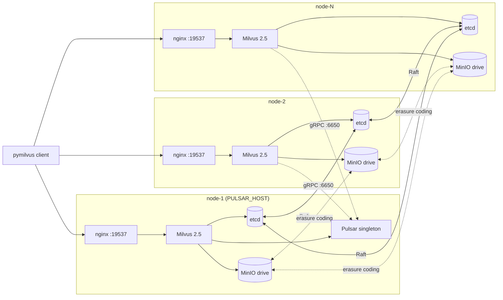

# templates/2.5 — Milvus 2.5.x

Templates that render the per-node configuration files for a Milvus 2.5
deployment. Selected automatically by `lib/render.sh` when
`MILVUS_IMAGE_TAG` is `v2.5.*`.

> ⚠ **2.5 has a single point of failure for writes** — see
> [SPOF caveat](#spof-caveat-the-pulsar-singleton) below. If you can,
> use 2.6 instead (Woodpecker WAL eliminates the SPOF).

## What this version's deploy looks like

The structure is the same as 2.6 with one addition: **a Pulsar singleton
on the PULSAR_HOST node**. All Milvus instances on all nodes connect to
this single broker for the message queue.

Containers per node:

- **node-1 (PULSAR_HOST):** etcd, MinIO, Milvus, nginx, **Pulsar** (5 total)
- **node-2 ... node-N:** etcd, MinIO, Milvus, nginx (4 total — same as 2.6)

## SPOF caveat: the Pulsar singleton

Milvus 2.5 requires Pulsar (or Kafka, but we don't ship a Kafka path) for
its message queue. Running a *real* HA Pulsar cluster requires 3 brokers,
3 BookKeeper nodes, and 3 ZooKeeper nodes — 9 extra containers across
the cluster. Out of scope for v0.

Instead, this template runs a single Pulsar broker on one node.
Consequences:

- **If the Pulsar host node dies, writes stop.** Reads from already-loaded
  collections continue to work (QueryNode RAM), but new writes fail until
  Pulsar comes back.
- **Failover is manual.** Move PULSAR_HOST to a surviving node, re-render,
  redeploy Pulsar. There's no automation for this in v0.

If you can accept this trade-off (e.g. dev / staging, batch-only ingest
workloads, write outage tolerable), this is fine. If you need true HA on
2.5, the right answer is to **point at an external Pulsar cluster** — set
`PULSAR_HOST=<external-pulsar-ip>` and remove the local Pulsar service
from your compose. (Or, as the project lead recommends: use Milvus 2.6 +
Woodpecker, where this whole problem disappears.)

## Files

| File | What it is |
|---|---|
| [`docker-compose.yml.tpl`](docker-compose.yml.tpl) | Five services on the Pulsar host, four on every other node. |
| [`_pulsar-service.yml.tpl`](_pulsar-service.yml.tpl) | The Pulsar service block, conditionally inlined into the host node's compose by `lib/render.sh`. The leading underscore is a convention — `render_all` skips `_*.tpl` files when rendering, so this fragment is only used as included content. |
| [`milvus.yaml.tpl`](milvus.yaml.tpl) | Milvus config — `mq.type=pulsar`, points at PULSAR_HOST_IP. |
| [`nginx.conf.tpl`](nginx.conf.tpl) | Same TCP load balancer as 2.6 (Milvus version doesn't matter here). |

## Tested patch versions

| Milvus version | Status |
|---|---|
| `v2.5.4` (default) | **Untested in this build** — templates derived from milvusDeploy patterns + Milvus 2.5 config schema. Please file issues if you hit them. |
| Other 2.5.x patches | Untested. Patch-level upgrades expected to work; bump `MILVUS_IMAGE_TAG` and re-render. |

## What changes between 2.5 and 2.6

| Concern | 2.5 | 2.6 |
|---|---|---|
| Default WAL / MQ | Pulsar (required) | Woodpecker (embedded, default) |
| Coordinators | Separate (rootcoord, datacoord, querycoord, indexcoord) | Consolidated into `mixcoord` |
| Singleton SPOF | Pulsar broker | None (Woodpecker is embedded) |
| Containers per node | 4 + Pulsar on one | 4 |
| Cross-version upgrade | Backup + restore (cross-major) | — |

If you're starting fresh, **strongly prefer 2.6** unless you have an
external constraint (e.g. existing 2.5 data, library compatibility).

## Cross-major upgrade (2.5 → 2.6)

Cross-major upgrades require a planned migration:

1. `milvus-onprem create-backup --name=pre-2.6-upgrade` on your live 2.5 cluster.
2. Export the backup off-cluster (`mc cp -r local/milvus-bucket/backup/pre-2.6-upgrade/ /safe/path/`).
3. `milvus-onprem teardown --full --force` on every node.
4. Edit `cluster.env` on the bootstrap node: `MILVUS_IMAGE_TAG=v2.6.11`,
   delete the `MQ_TYPE=pulsar` line so the default (woodpecker) applies.
5. Re-deploy from scratch as 2.6: `init` (with `--overwrite`) → `pair` →
   peers `join` → `bootstrap` on bootstrap node.
6. `milvus-onprem restore-backup --from=/safe/path/pre-2.6-upgrade` on
   the bootstrap node. Pulsar's gone; Woodpecker takes over.

Plan a maintenance window — this is a hard cutover, not a rolling upgrade.
