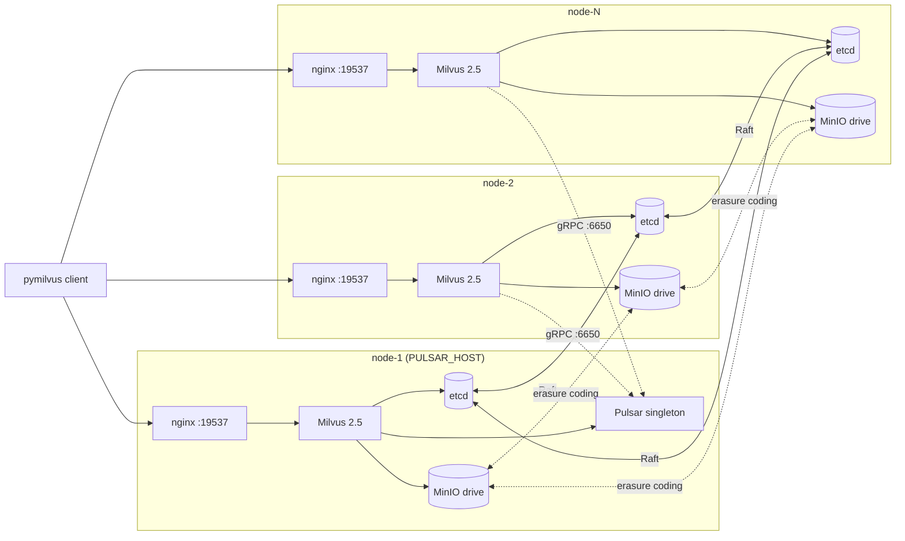

# templates/2.5 — Milvus 2.5.x

Templates that render the per-node configuration files for a Milvus 2.5
deployment. Selected automatically by `lib/render.sh` when
`MILVUS_IMAGE_TAG` is `v2.5.*`.

> Runs on any Linux VM with Docker — cloud, on-prem, or bare metal.
> No cloud APIs are called. See the top-level
> [README's "Supported environments"](../../README.md#supported-environments)
> for the full list.

> ⚠ **Single point of failure for writes** — see
> [SPOF caveat](#spof-caveat-the-pulsar-singleton) below.

## What this version's deploy looks like



Every Milvus instance on every node connects to the **Pulsar singleton
on the PULSAR_HOST node** for the message queue.

The "Milvus 2.5" box in the diagram is actually 5 sibling containers
per node (`milvus-mixcoord`, `milvus-proxy`, `milvus-querynode`,
`milvus-datanode`, `milvus-indexnode`) — Milvus 2.5 doesn't run
multi-instance HA in single-binary `milvus run standalone` mode, so
each role is its own container. See "Why coord-mode-cluster" below.

Containers per node (coord-mode-cluster topology):

- **node-1 (PULSAR_HOST):** etcd, MinIO, mixcoord, proxy, querynode,
  datanode, indexnode, nginx, control-plane daemon, **Pulsar**
  (10 total)
- **node-2 ... node-N:** same minus Pulsar (9 total)

The mixcoord containers run all 4 coords (rootcoord/datacoord/
querycoord/indexcoord) co-resident with `enableActiveStandby: true`
on each — the loser of the etcd-CAS leader election watches the
lease and promotes on TTL expiry. Drilled <500ms failover on
3-node hardware. See [docs/FAILOVER.md § 2.5 mixcoord active-standby](../../docs/FAILOVER.md).

## SPOF caveat: the Pulsar singleton

Milvus 2.5 requires Pulsar (or Kafka, but we don't ship a Kafka path) for
its message queue. Running a *real* HA Pulsar cluster requires 3 brokers,
3 BookKeeper nodes, and 3 ZooKeeper nodes — 9 extra containers across
the cluster. Out of scope for v0.

Instead, this template runs a single Pulsar broker on one node.
Consequences:

- **If the Pulsar host node dies, writes stop.** Reads from already-loaded
  collections continue to work (QueryNode RAM), but new writes fail until
  Pulsar comes back.
- **Failover is manual.** Move PULSAR_HOST to a surviving node, re-render,
  redeploy Pulsar. There's no automation for this in v0.

If you can accept this trade-off (e.g. dev / staging, batch-only
ingest workloads, write outage tolerable), this is fine. If you need
true HA writes, point at an external Pulsar cluster: set
`PULSAR_HOST=<external-pulsar-ip>` and remove the local Pulsar
service from your compose. Your Pulsar SRE team handles HA;
milvus-onprem just connects.

## Why coord-mode-cluster

Milvus 2.5 cannot run multi-node HA in `milvus run standalone` —
multiple standalone instances panic on rootcoord election when they
share an etcd. So this template deploys the components separately:

- `milvus-mixcoord` runs all 4 coordinators (rootcoord + datacoord +
  querycoord + indexcoord) co-resident with `enableActiveStandby: true`
  on each. One per node; etcd-CAS picks the active leader, the others
  stand by and watch the lease.
- `milvus-proxy` is the gRPC entry on `${MILVUS_PORT}` (default
  `19530`); what nginx LBs across peers.
- `milvus-querynode` is the query/search worker.
- `milvus-datanode` is the ingest worker.
- `milvus-indexnode` is the index-build worker.

The container running the consolidated coord uses `milvus run mixture`
(the 2.5 CLI name for the consolidated role), and needs the four
`-rootcoord/-datacoord/-querycoord/-indexcoord=true` flags passed
explicitly even though `--help` claims they default to true. Without
them the mixture process starts but never opens the coord gRPC ports.

## Files

| File | What it is |
|---|---|
| [`docker-compose.yml.tpl`](docker-compose.yml.tpl) | Five services on the Pulsar host, four on every other node. |
| [`_pulsar-service.yml.tpl`](_pulsar-service.yml.tpl) | The Pulsar service block, conditionally inlined into the host node's compose by `lib/render.sh`. The leading underscore is a convention — `render_all` skips `_*.tpl` files when rendering, so this fragment is only used as included content. |
| [`milvus.yaml.tpl`](milvus.yaml.tpl) | Milvus config — `mq.type=pulsar`, points at PULSAR_HOST_IP. |
| [`nginx.conf.tpl`](nginx.conf.tpl) | TCP load balancer with all peers as upstreams. |

## Tested patch versions

| Milvus version | Status |
|---|---|
| `v2.5.4` (default) | **Validated end-to-end on real hardware** — 3-node bootstrap, smoke + 10-step tutorial + cross-peer replication-proof, mixcoord active-standby (<500ms failover drill), per-component healthchecks + watchdog auto-restart drill, Pulsar pre-flight + skip_flush path, backup round-trip, rolling upgrade drill. |
| Other 2.5.x patches | Untested. Patch-level upgrades expected to work; bump `MILVUS_IMAGE_TAG` and re-render. |

## Failover behavior

Recovery from a single-node loss takes ~15-20s with the tunings shipped
in `milvus.yaml.tpl`:

```yaml
common:
  session:
    ttl: 10                         # was 30 — etcd lease expires faster
queryCoord:
  checkNodeSessionInterval: 10      # was 60 — detect dead node sooner
  heartbeatAvailableInterval: 5000  # was 10000 — shorter heartbeat window
```

In-flight reads during the window get `code=106 collection on
recovering`. Use the `retry_on_recovering` helper from
`test/tutorial/_shared.py` — it's load-bearing on this version. See
[`docs/FAILOVER.md`](../../docs/FAILOVER.md) for the full drill writeup.
