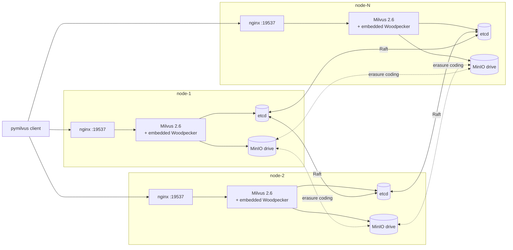

# templates/2.6 — Milvus 2.6.x

Templates that render the per-node configuration files for a Milvus 2.6
deployment. Selected automatically by `lib/render.sh` when
`MILVUS_IMAGE_TAG` is `v2.6.*` (the major.minor is regex-extracted).

> Runs on any Linux VM with Docker — cloud, on-prem, or bare metal.
> No cloud APIs are called. See the top-level
> [README's "Supported environments"](../../README.md#supported-environments)
> for the full list.

## What this version's deploy looks like



Four containers per node, all on host networking:

- **nginx** — TCP load balancer on `:19537`. Round-robins across all Milvus
  instances with passive health checks (`max_fails=3 fail_timeout=30s`).
  Clients connect to *any* node's nginx and get a healthy backend.
- **Milvus 2.6.x** — runs `milvus run standalone`. With shared etcd and
  shared MinIO, multiple "standalone" instances form a cluster via etcd
  service discovery and leader election (`mixcoord`).
- **etcd member** — joins the N-node Raft cluster via
  `--initial-cluster=node-1=...,node-2=...,node-N=...`.
  Tolerates `floor((N-1)/2)` member failures.
- **MinIO drive** — participates in the distributed MinIO cluster via
  `server http://node-1:9000/data http://node-2:9000/data ...`.
  Erasure-coded across all peers.

## What's special about 2.6

- **Woodpecker is the default WAL.** Milvus 2.6 introduced an embedded
  write-ahead log called Woodpecker; the templates wire it up via
  `mq.type: woodpecker` in `milvus.yaml`. **No separate Pulsar / Kafka
  cluster is deployed** — keeps the operational surface small.
- **Coordinator consolidation.** 2.6 runs all four coordinator roles
  (rootcoord/datacoord/querycoord/indexcoord) inside the single
  `milvus run standalone` binary. The templates don't touch this
  directly but it's why a single binary works as a clustered process.
- **`cloudProvider: aws` for MinIO.** 2.6 dropped `minio` as a valid
  value for `cloudProvider` — the segcore filesystem only accepts
  `aws`, `gcp`, `azure`, `aliyun`, or `tencent`. Since MinIO speaks
  the S3 API, `aws` works correctly. We hard-pin this in the template.

## Files

| File | What it is |
|---|---|
| [`docker-compose.yml.tpl`](docker-compose.yml.tpl) | Four services per node — etcd, MinIO, Milvus, nginx — on host networking. |
| [`milvus.yaml.tpl`](milvus.yaml.tpl) | Overlay overrides for Milvus, mounted at `/milvus/configs/user.yaml`. |
| [`nginx.conf.tpl`](nginx.conf.tpl) | Stream-mode TCP load balancer with all peers as upstreams. |

Variables substituted at render time come from `cluster.env`. See
[../../docs/CONFIG.md](../../docs/CONFIG.md) for the full config schema.

## Tested patch versions

| Milvus version | Status |
|---|---|
| `v2.6.11` | Tested end-to-end on the milvusDeploy 2-VM cluster (smoke + tutorial pass). |
| `v2.6.10` and earlier 2.6.x | Untested but expected to work — same major.minor, same config schema. |
| `v2.6.12` and later 2.6.x | Untested — patch-level upgrades should be safe; bump the tag and re-render. |

To bump to a newer 2.6 patch:

```bash
# in cluster.env:
MILVUS_IMAGE_TAG=v2.6.12

# then on each node:
milvus-onprem render && milvus-onprem up
```

If a future `v2.6.x` introduces a config-key change that breaks this
template, please open an issue or PR with the fix.

## Failover behavior

Single-node loss is invisible to the SDK — bare reads keep working,
no recovery window observed in our drills. Each node's `milvus run
standalone` binary co-locates its own coord + querynode +
streamingnode (Woodpecker WAL), so when a node dies the surviving
nodes' replicas keep serving without waiting for a centralized
querycoord to re-shuffle channel ownership. See
[`docs/FAILOVER.md`](../../docs/FAILOVER.md) for the drill writeup.
